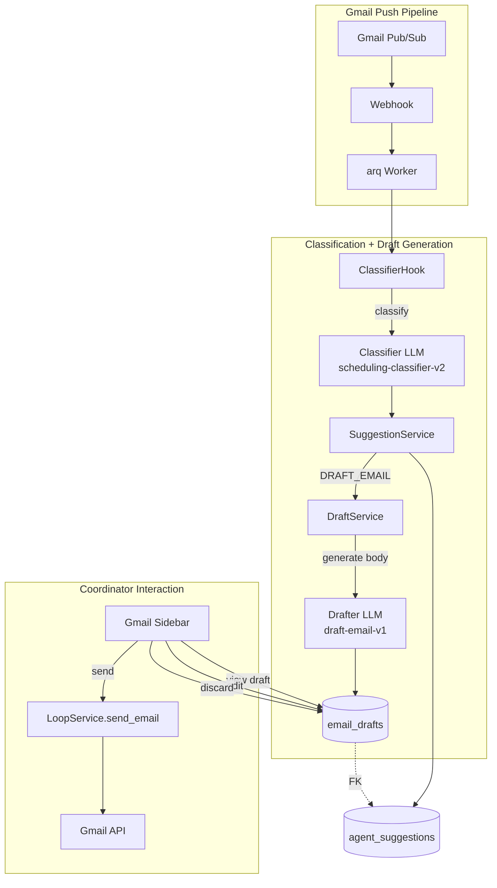
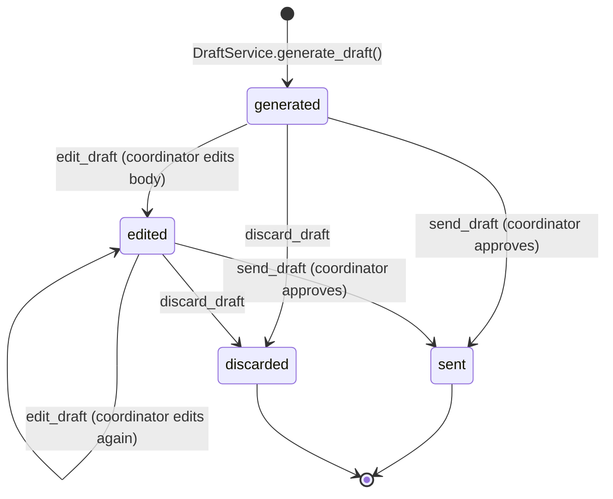

# RFC: AI Email Draft Generation

| Field          | Value                                      |
|----------------|--------------------------------------------|
| **Author(s)**  | Kinematic Labs                             |
| **Status**     | Draft                                      |
| **Created**    | 2026-04-15                                 |
| **Updated**    | 2026-04-15                                 |
| **Reviewers**  | LRP Engineering, LRP Coordinator team      |
| **Decider**    | Nadav Sadeh                                |
| **Issue**      | #16                                        |

## Context and Scope

The email classification agent (RFC, PR #15) classifies incoming emails and persists structured suggestions to the `agent_suggestions` table — including `DRAFT_EMAIL` suggestions that indicate the coordinator should send an email. Today, `DRAFT_EMAIL` is a stubbed enum value: the classifier can suggest it, but nothing acts on it. Coordinators still manually compose every scheduling email, even though ~80% of them follow a small set of formulaic patterns (forward thread to recruiter, share availability with client, confirm interview time).

This RFC proposes the **email draft generation pipeline**: when the classifier outputs a `DRAFT_EMAIL` suggestion, a second LLM call generates the email body, persists it to a new `email_drafts` table, and makes it available for coordinator review, editing, and one-click sending from the Gmail sidebar. Draft generation is eager (happens immediately on classification, not lazily when the sidebar opens) and all interaction happens in-sidebar.

## Goals

- **G1: Generate email drafts automatically when the classifier suggests one.** When a `DRAFT_EMAIL` suggestion is created, the system immediately generates a draft email body, persists it, and makes it available for the coordinator. No manual composition required for common scheduling patterns.
- **G2: Match the tone and formatting coordinators use today.** Drafts must be professional, terse (often one-liners), and format availability in the specific `Candidate Name – Availability (ET):` format that clients expect. A coordinator should be able to send most drafts without editing.
- **G3: Support in-sidebar review, editing, and sending.** The coordinator sees the draft in the Gmail sidebar, can edit the body inline, and sends with one click. The UX is: open sidebar → review → click send. No switching to Gmail compose, no copy-paste.
- **G4: Maintain the human-in-the-loop constraint.** No email is ever sent without explicit coordinator approval. The draft pipeline generates and stores; only a coordinator action triggers the send.
- **G5: Data model supports future API access.** While this iteration only surfaces drafts through the Gmail sidebar add-on, the `email_drafts` table must be cleanly queryable for a future REST API — no 17-table joins required to display a draft with its context.

## Non-Goals

- **Polymorphic action framework** — we are not building an abstract "actions" table or executor registry. `email_drafts` is a standalone table with a FK to `agent_suggestions`. When we build the second action type (calendar invites, ATS updates), we'll see the real shape of the abstraction and can extract a shared interface then. *Rationale:* the codebase already has a lightweight dispatch pattern in `_ACTION_HANDLERS`. Designing the framework before we have two concrete action types would be speculative engineering with high risk of rework.
- **REST API for drafts** — no new HTTP endpoints for listing, fetching, or managing drafts. The sidebar add-on is the only client. *Rationale:* the add-on calls directly into `LoopService` and `DraftService` via the action handler dispatch. A REST API can be added later against the same data model without restructuring.
- **Recruiter-facing draft generation** — messages to recruiters are typically empty forwards of the client thread. The drafter does not generate body text for these; it sets `body=""` and the forward happens via existing `send_email` flow. *Rationale:* generating text for empty forwards adds LLM cost with no value. The coordinator's workflow for recruiter messages is already one click ("Forward to Recruiter").
- **Draft regeneration on edit** — if a coordinator edits a draft, the system does not re-generate or offer alternatives. The edit is final until they send or discard. *Rationale:* regeneration requires a round-trip to the LLM and a more complex UI (diff view, accept/reject). This can be added later if coordinators request it.
- **Multi-recipient drafts** — each draft targets a single recipient (or recipient group on the same thread). Scheduling scenarios that require emailing both the client and recruiter produce two separate suggestions with two separate drafts. *Rationale:* the classifier already supports multiple suggestions per email. Each suggestion → one draft keeps the model simple.

## Background

### What Coordinators Email Today

Scheduling emails fall into a small number of patterns:

| Pattern | Recipient | Typical Content | Frequency |
|---------|-----------|----------------|-----------|
| Request availability | Recruiter | Forward of client request, often with no body | Very high |
| Share availability | Client | Candidate name + time slots in ET format | High |
| Confirm interview | Client | Confirmation + logistics (phone number, Zoom link) | Medium |
| Follow up | Client or Recruiter | Gentle nudge for response | Medium |
| Reschedule | Client | Updated availability or new times | Low |

The "share availability" and "confirm interview" patterns have strict formatting requirements. Availability must be presented as:

```
Candidate Name – Availability (ET):
Monday 3/2: 8am-11am, 2pm-4pm
Tuesday 3/3: 10:30am-11:30am, 2pm onward
Wednesday 3/4: any time
```

Real coordinator emails are terse:

> "Hi Haley, Claire is available (in ET): Wednesday (3/18): 12-2pm. Thank you,"

> "Confirmed and shared with Chris! Nick is available (in ET): Tomorrow (3/19): 9:45-11am, 2:30-4pm. Friday (3/20): 10-11:30am, 1:30-3:30pm. Thank you, Fiona"

### Existing Infrastructure

The classifier pipeline and email sending are both production-ready. This RFC connects them.

| Component | Location | Status |
|-----------|----------|--------|
| `SuggestedAction.DRAFT_EMAIL` | `classifier/models.py:34` | Enum value exists, unused |
| `EventType.EMAIL_DRAFTED` / `EMAIL_SENT` | `scheduling/models.py:66-67` | In state machine |
| `GmailClient.create_draft()` / `send_draft()` | `gmail/client.py` | Implemented |
| `LoopService.send_email()` | `scheduling/service.py:435` | Production, with auto-advance |
| `ClassifierHook.on_email()` | `classifier/hook.py:67` | Where draft trigger goes |
| `_ACTION_HANDLERS` | `addon/routes.py:607` | Dispatch pattern for sidebar |
| `llm_endpoint()` factory | `ai/endpoint.py:52` | Typed LLM endpoint pattern |

### Two LLM Calls, Two Concerns

The classifier and drafter are fundamentally different tasks:

| Concern | Classifier | Drafter |
|---------|-----------|---------|
| **Prompt** | `scheduling-classifier-v2` | `draft-email-v1` (new) |
| **Input** | Email + thread + loop state | Suggestion + loop context + entities |
| **Output** | Structured JSON (`ClassificationResult`) | Plain text (email body) |
| **Eval criteria** | Precision/recall on action selection | Tone, formatting, correctness |
| **Failure mode** | Wrong action suggested | Bad email sent to client |
| **Cost** | Every incoming email | Only `DRAFT_EMAIL` suggestions |

Keeping these separate lets us iterate on drafting quality (prompt tuning, few-shot examples, eval datasets) without risking classifier regressions.

## Proposed Design

### Overview

When the classifier creates a `DRAFT_EMAIL` suggestion, the `ClassifierHook` calls a new `DraftService.generate_draft()` method. This method resolves the recipient using hardcoded stage-state rules, calls the `draft-email-v1` LLM endpoint to generate the email body, and persists the result to a new `email_drafts` table. The draft is immediately available in the Gmail sidebar, where coordinators can review, edit inline, and send with one click. Sending resolves the parent suggestion as `accepted` and fires via the existing `LoopService.send_email()` path, which auto-advances the stage state machine.

### System Context Diagram



### Detailed Design

#### 1. Draft Generation Trigger

After the `ClassifierHook` persists a suggestion with `action=DRAFT_EMAIL`, it calls `DraftService.generate_draft()`. This happens inline in the same arq worker task, immediately after suggestion persistence.

```python
# In ClassifierHook._classify_and_persist(), after persisting each suggestion:
if item.action == SuggestedAction.DRAFT_EMAIL and self._draft_service:
    await self._draft_service.generate_draft(
        suggestion=suggestion,
        loop=linked_loop,
        thread_messages=thread_messages,
    )
```

**Trade-off: eager vs. lazy generation.** We chose eager (generate immediately) over lazy (generate when sidebar opens). Eager wastes an LLM call if the coordinator rejects the suggestion, but these drafts are short and cheap (~200 tokens output). Lazy would add 1-3 seconds of latency to the sidebar open — unacceptable for the "open sidebar, click send" UX. At current classifier volume (~50 emails/day per coordinator, ~30% getting `DRAFT_EMAIL`), the wasted cost is negligible.

#### 2. Recipient Routing

Recipients are determined by stage state, matching existing logic in `_handle_compose_email` (addon/routes.py:396-424):

| Stage State | Recipient | Subject Pattern |
|-------------|-----------|-----------------|
| `NEW` | `loop.recruiter.email` | `Re: {loop.title} - Availability Request` |
| `AWAITING_CANDIDATE` | `loop.client_contact.email` | `Re: {loop.title} - Candidate Availability` |
| `AWAITING_CLIENT` | `loop.client_contact.email` | `Re: {loop.title} - Follow Up` |
| `SCHEDULED` | `loop.client_contact.email` | `Re: {loop.title} - Confirmed` |

The routing logic lives in `DraftService._resolve_recipient()` — a pure function that takes a `Loop` and `Stage` and returns `(to_emails, cc_emails, subject)`. This centralizes recipient routing so that both the add-on's manual compose and the AI drafter use the same rules.

**Key decision: recruiter emails skip LLM generation.** When the recipient is a recruiter (stage `NEW`), the draft body is empty — these are forwards. `DraftService` creates the `email_drafts` row with `body=""` and skips the LLM call entirely. The sidebar shows this as "Forward to {recruiter name}" with a one-click send button.

#### 3. Draft Content Generation (LLM Endpoint)

A new typed LLM endpoint following the established `llm_endpoint()` pattern:

```python
# drafts/endpoint.py

class GenerateDraftInput(BaseModel):
    """Template variables for the draft-email-v1 prompt."""
    classification: str          # e.g., "availability_response"
    recipient_type: str          # "client" or "recruiter"
    recipient_name: str          # e.g., "Haley"
    candidate_name: str          # e.g., "Claire"
    coordinator_name: str        # e.g., "Fiona"
    stage_state: str             # e.g., "awaiting_candidate"
    extracted_entities: str       # JSON of availability, phone numbers, etc.
    thread_summary: str          # Recent thread context for reply coherence
    loop_context: str            # Loop title, participants, stage info

class DraftOutput(BaseModel):
    """LLM output — the generated email body."""
    body: str
    reasoning: str               # Why this content was chosen (for debugging)

generate_draft_content = llm_endpoint(
    name="generate_draft",
    prompt_name="draft-email-v1",
    input_type=GenerateDraftInput,
    output_type=DraftOutput,
)
```

The `draft-email-v1` LangFuse prompt enforces:
- Professional, terse tone (one-liners preferred)
- Availability in the exact `Candidate Name – Availability (ET):` format
- Coordinator's name in the sign-off
- No fluff, no "I hope this email finds you well"

Few-shot examples from real coordinator emails are embedded in the prompt. The `reasoning` field is not shown to coordinators — it's stored for debugging and eval.

#### 4. DraftService

```python
# drafts/service.py

class DraftService:
    def __init__(
        self,
        db_pool: AsyncConnectionPool,
        llm: LLMService,
        langfuse: Langfuse,
        loop_service: LoopService,
    ):
        ...

    async def generate_draft(
        self,
        suggestion: Suggestion,
        loop: Loop,
        thread_messages: list[Message] | None = None,
    ) -> EmailDraft:
        """Generate and persist an email draft for a DRAFT_EMAIL suggestion."""
        stage = self._resolve_stage(suggestion, loop)
        to_emails, cc_emails, subject = self._resolve_recipient(loop, stage)

        # Skip LLM for recruiter forwards (empty body)
        if stage.state == StageState.NEW:
            body = ""
            reasoning = "Recruiter forward — no body needed"
        else:
            result = await generate_draft_content(
                llm=self._llm, langfuse=self._langfuse,
                data=self._build_input(suggestion, loop, stage, thread_messages),
            )
            body = result.body
            reasoning = result.reasoning

        return await self._persist_draft(
            suggestion=suggestion, loop=loop, stage=stage,
            to_emails=to_emails, cc_emails=cc_emails,
            subject=subject, body=body,
        )

    async def get_draft(self, draft_id: str) -> EmailDraft | None: ...
    async def get_draft_for_suggestion(self, suggestion_id: str) -> EmailDraft | None: ...
    async def get_pending_drafts(self, coordinator_email: str) -> list[EmailDraft]: ...
    async def update_draft_body(self, draft_id: str, body: str) -> EmailDraft: ...
    async def mark_sent(self, draft_id: str) -> None: ...
    async def mark_discarded(self, draft_id: str) -> None: ...
```

#### 5. Sidebar Integration

Four new action handlers added to `_ACTION_HANDLERS`:

**`view_draft`** — Shows a card with the draft preview: recipient, subject, and body as a read-only text paragraph. Three buttons: Send, Edit, Discard.

**`edit_draft`** — Replaces the read-only body with a `TextInput` widget pre-filled with the current body. Save button persists the edit and returns to the preview card. The draft status changes from `generated` to `edited`.

**`send_draft`** — Calls `LoopService.send_email()` with the draft's to/subject/body and the loop's `gmail_thread_id` for threading. Marks the draft as `sent`, resolves the parent suggestion as `accepted`, and returns the loop detail card. Auto-advance logic (same as existing `_handle_send_email`) advances the stage state machine.

**`discard_draft`** — Marks the draft as `discarded`, resolves the parent suggestion as `rejected`, and returns to the drafts tab.



#### 6. Feature Flag

Draft generation is gated on a new `DRAFT_GENERATION_ENABLED` environment variable, checked in `ClassifierHook` before calling `DraftService`. When disabled, `DRAFT_EMAIL` suggestions are still created by the classifier but no draft is generated. This allows us to:
- Roll out classification and drafting independently
- Disable drafting if quality is poor without disrupting classification
- A/B test draft generation by enabling per-coordinator (future)

### Data Storage

New `email_drafts` table (migration `0005_email_drafts.py`):

```sql
CREATE TABLE email_drafts (
    id                  TEXT PRIMARY KEY,        -- drf_{nanoid}
    suggestion_id       TEXT NOT NULL REFERENCES agent_suggestions(id),
    loop_id             TEXT NOT NULL REFERENCES loops(id),
    stage_id            TEXT NOT NULL REFERENCES stages(id),
    coordinator_email   TEXT NOT NULL,
    to_emails           TEXT[] NOT NULL,
    cc_emails           TEXT[] NOT NULL DEFAULT '{}',
    subject             TEXT NOT NULL,
    body                TEXT NOT NULL DEFAULT '',
    gmail_thread_id     TEXT,                    -- for reply threading
    status              TEXT NOT NULL DEFAULT 'generated',
    sent_at             TIMESTAMPTZ,
    created_at          TIMESTAMPTZ NOT NULL DEFAULT now(),
    updated_at          TIMESTAMPTZ NOT NULL DEFAULT now()
);

CREATE INDEX idx_drafts_suggestion ON email_drafts(suggestion_id);
CREATE INDEX idx_drafts_coordinator_status
    ON email_drafts(coordinator_email, status);
CREATE INDEX idx_drafts_loop ON email_drafts(loop_id);
```

**Design decisions on the data model:**

- **`suggestion_id` is NOT NULL** — every draft is tied to a suggestion. No orphan drafts. This is the primary join path for the sidebar: `agent_suggestions JOIN email_drafts` gives you everything you need to display a suggestion with its draft.
- **Denormalized `loop_id`, `stage_id`, `coordinator_email`** — these exist on `agent_suggestions` too, but denormalizing avoids a join for the most common queries (e.g., "get all pending drafts for this coordinator"). This trade-off is intentional per Goal G5: the sidebar should be able to fetch drafts with a single query, and a future REST API should be able to list drafts with a single `WHERE coordinator_email = $1 AND status = 'generated'`.
- **`gmail_thread_id` on the draft** — stored for convenience when sending. Avoids joining through `agent_suggestions → loop_email_threads` to get the thread ID at send time.
- **No `gmail_draft_id`** — we considered syncing drafts to Gmail's native draft system (for in-Gmail editing), but the product decision is in-sidebar editing only. If we add Gmail native editing later, this column can be added.
- **`status` as text enum, not Postgres enum** — consistent with the existing `agent_suggestions.status` pattern. Values: `generated`, `edited`, `sent`, `discarded`.

### Key Trade-offs

**Eager generation vs. lazy generation.** We generate the draft immediately when the classifier creates the suggestion, rather than waiting for the coordinator to open the sidebar. This wastes ~15% of LLM calls (estimated rejection rate), but eliminates sidebar latency. At ~15 drafts/day/coordinator and ~$0.002/draft, the waste is ~$0.005/day — a rounding error. The UX benefit of instant drafts in the sidebar is significant.

**Separate `email_drafts` table vs. JSONB column on `agent_suggestions`.** We could store draft data as a JSONB column on `agent_suggestions` — simpler, no new table. But this conflates suggestion lifecycle with draft lifecycle (a suggestion can be superseded while its draft is still sending), makes indexing harder, and doesn't extend cleanly to future action types. The FK-linked table is a better foundation.

**Hardcoded recipient routing vs. classifier-determined recipients.** The classifier could output a `recipient_email` in `extracted_entities`. But recipient routing is deterministic from stage state + loop contacts — there's no ambiguity for the LLM to resolve. Hardcoding is simpler, testable without LLM, and doesn't risk the classifier hallucinating an email address.

**In-sidebar editing vs. Gmail native drafts.** Gmail's draft compose window is a richer editor, but creating a draft there means we lose tracking — we can't detect when the coordinator edits or sends it. In-sidebar editing gives us full lifecycle control, which is essential for metrics and the human-in-the-loop guarantee.

## Alternatives Considered

### Alternative 1: Polymorphic Action Framework

Build an abstract `actions` table with a discriminator column and an executor registry. Each action type (email draft, calendar invite, ATS update) registers a handler. When a suggestion is accepted, the framework dispatches to the appropriate executor.

**Trade-offs:** This is the architecture we'd want if we had 3-4 action types today. It provides a uniform interface for the sidebar to render any action type and a clean extension point for new actions. However, we only have one action type (email drafts), and the second type (calendar invites) has unknown requirements. Building the framework now means designing an abstraction from a single data point — a recipe for leaky abstractions that need rework.

**Why not:** YAGNI. The existing `_ACTION_HANDLERS` dict dispatch (addon/routes.py:607-626) is already a lightweight polymorphic pattern. A new action type adds a new handler function, a new table, and a new card builder — none of which require a framework. If we build two more action types and see a repeated pattern, we can extract the framework then with real evidence of what it should look like.

### Alternative 2: Lazy Draft Generation (On Sidebar Open)

Instead of generating drafts eagerly when the classifier runs, generate them on-demand when the coordinator opens the sidebar and views a `DRAFT_EMAIL` suggestion. The sidebar calls `DraftService.generate_draft()` on first view, caches the result, and displays it.

**Trade-offs:** Lazy generation wastes no LLM calls on rejected suggestions (saves ~15% of draft LLM spend). But it adds 1-3 seconds of latency to the sidebar open — the coordinator clicks a suggestion and waits for the LLM to respond. This contradicts the "open sidebar, click send" UX philosophy. It also complicates the sidebar code: the action handler needs to distinguish between "draft exists, show it" and "draft doesn't exist, generate it, then show it."

**Why not:** The UX cost exceeds the compute savings. At current volumes, the wasted LLM spend is under $2/month across all coordinators. The sidebar latency would be noticed on every interaction.

### Alternative 3: Gmail Native Drafts

Instead of persisting drafts to our database and rendering in the sidebar, create Gmail native drafts via `GmailClient.create_draft()`. The coordinator sees the draft in their Gmail Drafts folder and edits/sends using Gmail's native compose UI.

**Trade-offs:** This gives coordinators the full Gmail compose experience (formatting, attachments, spell check). But we lose lifecycle tracking — there's no reliable way to detect when a Gmail draft is edited, sent, or deleted. We'd need to poll the Gmail Drafts API to reconcile state, which is fragile and rate-limit-sensitive. We also can't show draft previews in the sidebar (the draft lives in Gmail, not our DB), breaking the "everything in the sidebar" UX.

**Why not:** Loss of lifecycle tracking undermines Goal G4 (human-in-the-loop guarantee) and makes it impossible to measure draft acceptance rates (Goal G1 success criterion). The sidebar-based approach gives us full control at the cost of a simpler editor.

### Do Nothing / Status Quo

Coordinators continue composing all scheduling emails manually. The classifier suggests `DRAFT_EMAIL` but no draft is generated.

**What happens:** Coordinators spend 2-5 minutes per email on formulaic composition. At ~15 scheduling emails/day/coordinator, this is 30-75 minutes/day of low-value work. The classifier's `DRAFT_EMAIL` suggestions would show up in the sidebar with no actionable content — "we think you should send an email" without actually drafting it. This is worse than not showing the suggestion at all, because it sets an expectation the system doesn't fulfill.

**When this is acceptable:** If draft quality is unacceptably low after prompt tuning (see failure criteria), reverting to status quo is the right call. The feature flag makes this a one-line configuration change.

## Success and Failure Criteria

### Definition of Success

| Criterion | Metric | Target | Measurement Method |
|-----------|--------|--------|--------------------|
| Drafts generated for scheduling emails | % of `DRAFT_EMAIL` suggestions that produce a draft | > 95% | `email_drafts` count / `DRAFT_EMAIL` suggestion count |
| Draft acceptance rate | % of generated drafts sent without editing | > 60% | `email_drafts` where `status='sent'` and was never `edited` / total sent |
| Draft send rate | % of generated drafts ultimately sent (with or without edits) | > 75% | `status='sent'` / total generated |
| Availability formatting accuracy | % of availability drafts using correct ET format | > 95% | Manual review of LangFuse traces (sample 50/week) |
| Draft generation latency | p95 time from suggestion creation to draft persistence | < 3s | LangFuse span duration for `generate_draft` |
| Coordinator time saved | Reduction in manual email composition time | > 50% | Pre/post time study (coordinator self-report) |

### Definition of Failure

- **Draft acceptance rate below 30% after 2 weeks of prompt tuning.** If coordinators edit or discard >70% of drafts, the drafts are not matching their expectations. We should disable generation and investigate before iterating further.
- **Draft generation failure rate above 5%.** If LLM calls fail (timeouts, parse errors) on >5% of `DRAFT_EMAIL` suggestions, the pipeline is unreliable. The feature flag should be disabled until the root cause is fixed.
- **Coordinator complaints about tone or content.** If coordinators report that drafts are embarrassing, unprofessional, or contain hallucinated information (wrong candidate names, fabricated availability), this is a quality failure that warrants immediate rollback via feature flag.
- **Noticeable sidebar latency.** If coordinators report the sidebar feels slower (draft data adds overhead to the status board query), the denormalized data model needs optimization.

### Evaluation Timeline

- **T+1 week:** Check draft generation success rate, LLM error rate, and p95 latency. Review a sample of 50 generated drafts for tone and formatting quality.
- **T+2 weeks:** Measure draft acceptance rate and send rate. Conduct coordinator feedback session. Tune prompt based on patterns in edited/discarded drafts.
- **T+1 month:** Full success evaluation against all metrics. Decision on whether to keep, iterate, or disable draft generation.

## Observability and Monitoring Plan

### Metrics

| Metric | Source | Dashboard | Alert Threshold |
|--------|--------|-----------|-----------------|
| Draft generation success rate | `email_drafts` count vs `DRAFT_EMAIL` suggestions | LangFuse | < 90% over 1 hour |
| Draft generation latency (p95) | LangFuse `generate_draft` span | LangFuse | > 5s for 10 min |
| Draft LLM error rate | LangFuse error traces | LangFuse | > 5% over 1 hour |
| Draft acceptance rate (rolling 7d) | `email_drafts` status transitions | Postgres query / Metabase | < 40% (weekly check, not alert) |
| Draft send rate (rolling 7d) | `email_drafts` where `status='sent'` | Postgres query / Metabase | < 50% (weekly check) |

### Logging

- `DraftService.generate_draft()`: INFO log with draft_id, suggestion_id, loop_id, recipient, generation_time_ms
- LLM failures: ERROR log with suggestion_id, error type, raw response (if parse failure)
- Draft state transitions (edit, send, discard): INFO log with draft_id, old_status, new_status, actor_email
- All logs use structured JSON format consistent with existing pipeline logging

### Alerting

LangFuse trace alerts for LLM error rate and latency. No pager — these are Slack channel alerts for the engineering team. The feature flag provides the rollback mechanism; alerts trigger investigation, not incident response.

### Dashboards

- **LangFuse dashboard (engineering):** Draft generation traces — latency distribution, error rate, prompt version comparison for A/B testing prompt changes
- **Metabase dashboard (product + coordinators):** Draft acceptance rate over time, edits by type (minor text change vs. full rewrite), time saved estimates

## Agent-Specific: Evaluation Criteria

### Agent Behavior Specification

The draft generation agent produces email body text for scheduling-related communications. It operates within strict boundaries:

- **MUST:** Generate terse, professional email bodies matching coordinator tone
- **MUST:** Format availability in the exact `Candidate Name – Availability (ET):` template
- **MUST:** Use only information present in the loop context and extracted entities (no fabrication)
- **MUST NOT:** Generate content for non-scheduling emails
- **MUST NOT:** Include candidate contact information in client-facing emails (recruiter owns the relationship)
- **MUST NOT:** Hallucinate availability slots, names, or other entities not present in the input

Human-in-the-loop checkpoint: every generated draft requires explicit coordinator action (send/edit/discard) before any email is sent.

### Evaluation Metrics

| Metric | Definition | Target | Measurement Method |
|--------|-----------|--------|--------------------|
| Content accuracy | % of drafts with no factual errors (names, times, contacts) | > 98% | Manual review of LangFuse traces, weekly sample of 50 |
| Tone match | % of drafts rated "appropriate" by coordinators | > 85% | Coordinator feedback survey + edit rate as proxy |
| Format compliance | % of availability drafts using correct ET format | > 95% | Automated regex check on `email_drafts.body` |
| Hallucination rate | % of drafts containing fabricated information | < 2% | Manual review, cross-referenced against loop/suggestion data |
| Cost per draft | Average LLM cost per generated draft | < $0.005 | LangFuse cost tracking |
| Latency | p95 draft generation time | < 3s | LangFuse span |

### Test Scenarios

| Scenario | Input | Expected Behavior | Pass Criteria |
|----------|-------|-------------------|---------------|
| Availability share (happy path) | AWAITING_CANDIDATE stage, classifier extracts 3 time slots | Draft to client with candidate name + formatted availability | Correct format, all slots present, terse tone |
| Confirmation email | SCHEDULED stage, time slot confirmed | Draft confirming time + logistics | Correct time, no hallucinated details |
| Recruiter forward | NEW stage | Empty body, correct recipient | `body=""`, `to=recruiter.email` |
| Missing availability entities | AWAITING_CANDIDATE, `extracted_entities` has no time slots | Draft asks coordinator for input or generates generic follow-up | Does NOT fabricate availability slots |
| Wrong candidate name in context | Loop has "Claire" but thread mentions "Clara" | Uses loop's canonical name ("Claire") | No name confusion |
| Non-English availability text | Availability in thread is in different format (24h, non-ET) | Converts to ET format or flags for coordinator review | Does NOT silently pass through unconverted times |
| Multiple stages on same loop | Loop has Round 1 (SCHEDULED) and Round 2 (NEW) | Draft targets the correct stage (Round 2 NEW → recruiter) | Correct stage and recipient |

### Baseline and Comparison

**Baseline:** Coordinator manually composes all emails. Average composition time is 2-5 minutes per email (self-reported). Draft quality baseline is "100% accurate" since the human writes it, but at the cost of time.

**Comparison:** The draft agent should match human accuracy (>98%) while reducing composition time to ~15 seconds (review + click send). The acceptance rate (>60% sent without edits) is the primary proxy for "is the draft as good as what the human would have written?"

### Guardrails and Safety

| Guardrail | Trigger | Behavior |
|-----------|---------|----------|
| Feature flag | `DRAFT_GENERATION_ENABLED=false` | Skip draft generation entirely; suggestions still created |
| No autonomous send | Always | Drafts are never sent without coordinator clicking "Send" |
| LLM failure fallback | `generate_draft_content` raises any exception | Create draft with `body=""` and `status='generated'`, log error. Coordinator sees empty draft and can compose manually. |
| Content length limit | Generated body > 2000 chars | Truncate and append "[Draft truncated — please review]". Scheduling emails should be short; long output indicates hallucination. |
| No candidate PII to clients | Always (prompt-level) | Prompt instructs: never include candidate phone/email in client-facing drafts. Validated in eval scenarios. |
| Suggestion superseded | Suggestion status changes to `superseded` while draft is `generated` | Draft status set to `discarded` on next sidebar load. Coordinator sees it disappear. |

## Cross-Cutting Concerns

### Security

- **Email content in database.** Draft bodies are stored in Postgres. This is the same security posture as `agent_suggestions.summary` and `loop_events.data` — all contain email-derived content. No new attack surface.
- **LLM prompt injection.** Email body content is passed to the drafter LLM as input. A malicious email could attempt prompt injection. Mitigation: the drafter prompt uses the `extracted_entities` (structured data from the classifier) rather than raw email text as the primary input. Thread summary is included for context but the prompt instructs the model to generate based on entities, not to follow instructions in the thread.
- **Coordinator impersonation.** Drafts are sent via `LoopService.send_email()` using the coordinator's Gmail OAuth token. The same auth model as existing manual email sending — no escalation.

### Privacy

- Draft bodies may contain candidate names and availability (PII under some frameworks). These are already present in `loop_events`, `agent_suggestions`, and Gmail itself. No new PII collection; just a new storage location for data the system already processes.

### Scalability

- **LLM concurrency.** At ~15 drafts/day/coordinator across 5 coordinators, this is ~75 LLM calls/day — trivial. The arq worker pool handles concurrency. No batching or rate limiting needed at this scale.
- **Database.** The `email_drafts` table grows at ~75 rows/day. With indexes on `coordinator_email+status` and `suggestion_id`, query performance is not a concern for years.

### Rollout and Rollback

1. **Phase 1:** Deploy migration `0005_email_drafts.py` with `DRAFT_GENERATION_ENABLED=false`. Migration is additive (new table only), safe to deploy without code changes.
2. **Phase 2:** Deploy `DraftService`, drafter endpoint, and sidebar action handlers. Feature flag remains off. Verify no regressions in existing classifier flow.
3. **Phase 3:** Enable `DRAFT_GENERATION_ENABLED=true` for one coordinator. Monitor LangFuse traces for 48 hours. Check draft quality manually.
4. **Phase 4:** Enable for all coordinators. Begin measuring success criteria.

**Rollback:** Set `DRAFT_GENERATION_ENABLED=false`. Existing drafts remain in the database but stop appearing in the sidebar (the draft card only renders when the feature is enabled). No data migration needed for rollback.

## Open Questions

- **How should superseded drafts be handled in the UI?** When a coordinator sends a manual email that supersedes a pending suggestion (and its draft), should the draft disappear immediately or show as "superseded"? Currently the suggestion gets `superseded` status via `ClassifierHook._handle_outgoing_state_sync()`, but we need to decide whether to cascade this to the draft. *Owner: product team.*
- **Should we track edit diffs?** When a coordinator edits a draft, should we store the original body alongside the edited version? This would enable measuring "how much did coordinators change?" which is a richer quality signal than binary "edited or not." Adds a `original_body` column. *Owner: engineering — decide during implementation.*
- **What about CC recipients?** The data model supports `cc_emails`, but the recipient routing rules above only specify `to`. Should the client manager be CC'd on client emails? Should anyone be CC'd on recruiter forwards? *Owner: product team / coordinator feedback.*

## Milestones and Timeline

| Phase | Description | Estimated Duration |
|-------|-------------|--------------------|
| Phase 1 | Migration + `EmailDraft` model + `DraftService` + aiosql queries | 0.5 day |
| Phase 2 | `draft-email-v1` LangFuse prompt + `generate_draft_content` endpoint | 1-2 days |
| Phase 3 | `ClassifierHook` integration + feature flag | 0.5 day |
| Phase 4 | Sidebar cards (view_draft, edit_draft, send_draft, discard_draft) + action handlers | 1-1.5 days |
| Phase 5 | Tests (unit + integration) + eval dataset | 1 day |
| Phase 6 | Rollout (one coordinator → all) + monitoring setup | 1 day |
| **Total** | | **~5-7 days** |
