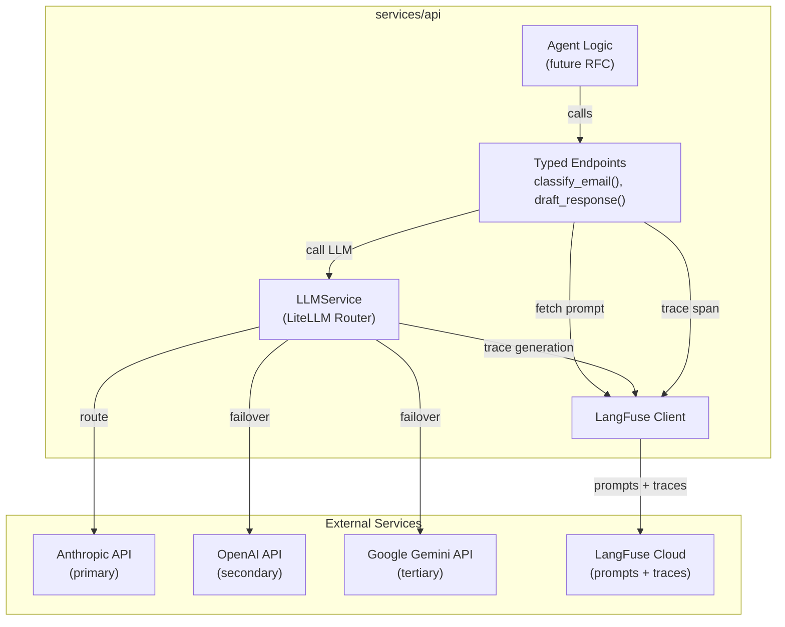

# RFC: AI Infrastructure — LangFuse, Multi-Provider LLM API, and Typed Endpoints

| Field         | Value                                 |
| ------------- | ------------------------------------- |
| **Author(s)** | Kinematic Labs                        |
| **Status**    | Draft                                 |
| **Created**   | 2026-04-14                            |
| **Updated**   | 2026-04-14                            |
| **Reviewers** | LRP Engineering                       |
| **Decider**   | Nim Sadeh                             |
| **Issue**     | #9                                    |

## Context and Scope

The scheduling agent needs an LLM reasoning engine to classify emails, draft responses, and determine next actions in scheduling loops. Before building any agent logic, we need the plumbing: prompt management, LLM provider integration with failover, observability, and a developer-friendly API for defining typed LLM endpoints.

This RFC covers the AI infrastructure layer only — the foundational services that agent code will call. It does not cover any agent behavior, email classification, draft generation, or sidebar integration. Those are downstream consumers of this infrastructure and will be covered in a separate RFC (see the canceled RFC for #2 for the full agent design, which will be revised once this infrastructure exists).

## Goals

- **G1: Prompt management via LangFuse.** Prompts and model configuration (model name, temperature, max_tokens) are stored in LangFuse, versioned, and fetchable at runtime. Prompt changes do not require code deploys.
- **G2: Full LLM call tracing.** Every LLM call — including prompt, response, token counts, latency, cost, and provider — is traced to LangFuse. Traces are hierarchical (a parent operation can contain multiple LLM calls).
- **G3: Multi-provider failover.** LLM calls route through a primary provider (Anthropic) with automatic failover to secondary (OpenAI) and tertiary (Google Gemini) providers. Total wall-clock budget for any single LLM call is bounded.
- **G4: Typed LLM endpoints.** Developers can define use-case-specific LLM functions (e.g., `classify_email`, `draft_response`) with typed inputs/outputs. The infrastructure handles prompt fetching, template compilation, provider routing, error handling, and response parsing.

## Non-Goals

- **Agent behavior or business logic.** This RFC provides the LLM calling infrastructure; what to call and when is the agent RFC's concern. _Rationale:_ separating infrastructure from behavior lets us test and stabilize the plumbing independently.
- **Eval framework setup.** LangFuse supports evals, but configuring eval datasets, scoring rubrics, and the eval flywheel is part of agent development, not infrastructure. _Rationale:_ evals are meaningless without agent behavior to evaluate.
- **Fine-tuning or model training.** We use off-the-shelf models with prompt engineering. _Rationale:_ the approved proposal specifies structured rules, not model changes.
- **LangFuse self-hosting.** We use LangFuse Cloud. _Rationale:_ self-hosting adds operational burden disproportionate to our scale.
- **Claude Agent SDK integration.** The agent SDK will be layered on top of this infrastructure in a future RFC. _Rationale:_ the SDK's LangFuse integration path is fragile (see Background) and should be evaluated separately after the base infrastructure is stable.

## Background

### Why LangFuse

LangFuse provides three things we need in one tool: prompt management (version prompts without deploys), tracing (observe every LLM call in production), and evals (measure agent quality over time). The alternative is assembling this from separate tools (e.g., prompts in config files, tracing via OpenTelemetry, evals via custom scripts), but LangFuse's integrated flywheel — where production traces feed directly into eval datasets — is the key advantage for rapid agent iteration.

### Why Multi-Provider

No LLM provider has perfect availability. Anthropic, OpenAI, and Google all experience outages, rate limits, and payment-related disruptions. For a scheduling agent that processes email in near-real-time, even a 15-minute outage means dozens of emails go unprocessed and coordinators lose the "suggestion ready before you open the email" benefit. A multi-provider setup keeps the agent operational during single-provider incidents.

### The Claude Agent SDK Tracing Problem

The PRD assumes that integrating the Claude Agent SDK with LangFuse "will be easy." It is not straightforward. The Claude Agent SDK does not emit OpenTelemetry traces natively. The only documented integration path is:

```
claude-agent-sdk → langsmith[claude-agent-sdk] (OTel instrumentation)
                 → langsmith[otel] (OTel export)
                 → LangFuse (as OTel collector endpoint)
```

This requires pulling in the LangSmith SDK as a production dependency purely for its instrumentation layer. There is also an active regression (langsmith-sdk issue #2091) where subagent tool call spans intermittently drop from traces — relevant if we use multi-agent patterns later.

**Decision:** Accept the LangSmith dependency as plumbing. It is unusual but functional. We will revisit if/when the Claude Agent SDK adds native OTel support. This RFC does not implement the Agent SDK integration — it only establishes the LangFuse + direct-provider infrastructure that the Agent SDK will layer onto.

### LiteLLM as Provider Router

We considered three approaches to multi-provider routing:

1. **Hand-rolled try/except** — simplest for two providers, but we anticipate three (Anthropic, OpenAI, Gemini).
2. **LiteLLM Router** — mature open-source library with fallback chains, retry policies, cooldown periods, and per-error-type handling. Supports 100+ providers via a unified interface.
3. **Portkey** — AI gateway/proxy service. Stronger enterprise features but less open-source friendly and adds a network hop.

LiteLLM is the right choice for three providers. The key risk is **failover latency accumulation**: with default settings (3 retries × 10s timeout), you can wait 30+ seconds on the primary before failover fires. We address this with aggressive timeout tuning (see Detailed Design).

## Proposed Design

### Overview

Three new components are added to `services/api`:

1. **LangFuse client** — initialized at app startup, provides prompt fetching with caching and LLM call tracing via the `@observe()` decorator.
2. **LLM service** — a `LLMService` class built on LiteLLM that routes calls through a configured provider chain (Anthropic → OpenAI → Gemini) with bounded latency, exponential backoff, and automatic failover.
3. **Typed endpoint factory** — a pattern for defining use-case-specific LLM functions that combine a LangFuse prompt reference, input/output Pydantic models, and the LLM service into a single callable.

No existing code changes. These are new modules under `src/api/ai/`.

### System Context Diagram



### Detailed Design

#### 1. Module Structure

```
src/api/ai/
├── __init__.py          # Public API: LLMService, llm_endpoint, init_ai
├── langfuse_client.py   # LangFuse initialization, prompt fetching
├── llm_service.py       # LiteLLM-based provider routing
├── endpoint.py          # Typed endpoint factory
└── errors.py            # AI-specific exceptions
```

#### 2. LangFuse Client (`langfuse_client.py`)

**Initialization:** The LangFuse client is created during app startup in `main.py`'s lifespan context manager, alongside the existing Postgres pool and Redis connection. It requires three environment variables: `LANGFUSE_PUBLIC_KEY`, `LANGFUSE_SECRET_KEY`, and `LANGFUSE_HOST`.

**Prompt fetching:** Prompts are fetched via `langfuse.get_prompt(name, label="production")`. The SDK caches prompts after the first fetch — if LangFuse becomes unreachable, the cached version is used. The returned prompt object includes:
- `.prompt` — the template text with `{{variable}}` placeholders
- `.config` — arbitrary JSON (we store `model`, `temperature`, `max_tokens` here)
- `.compile(**kwargs)` — renders the template with provided variables
- `.is_fallback` — boolean indicating if the cached/fallback version was used

**Cold-start behavior:** If LangFuse is unreachable on first fetch (no cache exists), the SDK raises an exception. We do **not** ship fallback prompts in the repo — maintaining two sources of truth risks silent prompt divergence, which is worse than a loud failure. Instead:
- The service logs an error and the health check reports degraded status
- The agent hook skips LLM processing (emails queue in the push pipeline and are processed once LangFuse recovers)
- Sentry fires an alert for the LangFuse connectivity failure
- Railway's `restartPolicyType: ON_FAILURE` will retry, and the LangFuse SDK's retry logic handles transient failures

This is a deliberate choice: **fail loudly on cold start rather than silently serve stale or divergent prompts.**

**Tracing:** LangFuse's `@observe()` decorator wraps functions to create trace spans. We use `@observe(as_type="generation")` for LLM calls. The decorator works with async functions and supports nesting for hierarchical traces.

**Flush requirement:** In request/response contexts (FastAPI handlers) and background workers (arq), spans may be lost if the process exits before the async flush completes. We add `langfuse.flush()` to the arq worker shutdown hook and as FastAPI middleware for request-scoped traces.

#### 3. LLM Service (`llm_service.py`)

The `LLMService` wraps LiteLLM's `Router` to provide multi-provider LLM calls with bounded latency.

**Provider chain:**

| Priority | Provider  | Use Case                      |
| -------- | --------- | ----------------------------- |
| Primary  | Anthropic | Default for all calls         |
| Secondary| OpenAI    | Failover on Anthropic failure |
| Tertiary | Google    | Failover on OpenAI failure    |

Any model available from a configured provider can be used — the specific model is defined in the LangFuse prompt config's `model` field (e.g., `claude-sonnet-4-20250514`, `gpt-4o`, `gemini-2.5-pro`). The provider chain above only determines failover priority; it does not restrict which models are available.

**Latency budget:** Total wall-clock time for any single LLM call (including all retries and failovers) is capped at **15 seconds**. The budget is allocated as:

| Phase             | Timeout | Retries | Max Time |
| ----------------- | ------- | ------- | -------- |
| Primary attempt   | 5s      | 1       | 10s      |
| Secondary attempt | 4s      | 0       | 4s       |
| Tertiary attempt  | 4s      | 0       | 4s       |

If the primary returns a 500 or times out on both attempts, LiteLLM immediately routes to the secondary. If the secondary also fails, the tertiary fires. If all three fail, the call raises `LLMUnavailableError`.

**Retry policy:** Only transient errors trigger retries on the same provider. Non-transient errors (auth failures, invalid requests) immediately fail over to the next provider.

| Error Type         | Behavior                                   |
| ------------------ | ------------------------------------------ |
| Timeout            | Retry once on same provider, then failover |
| 500 / Server Error | Retry once on same provider, then failover |
| 429 / Rate Limit   | Immediate failover (don't wait for backoff window) |
| 401 / Auth Error   | Immediate failover + Sentry alert          |
| 400 / Bad Request  | No retry, no failover — caller error       |

**LiteLLM configuration:**

```python
from litellm import Router

router = Router(
    model_list=[
        {
            "model_name": "default",  # logical name
            "litellm_params": {
                "model": "anthropic/claude-sonnet-4-20250514",
                "api_key": os.environ["ANTHROPIC_API_KEY"],
            },
        },
        {
            "model_name": "default",
            "litellm_params": {
                "model": "openai/gpt-4o",
                "api_key": os.environ["OPENAI_API_KEY"],
            },
        },
        {
            "model_name": "default",
            "litellm_params": {
                "model": "gemini/gemini-2.0-flash",
                "api_key": os.environ["GOOGLE_AI_API_KEY"],
            },
        },
    ],
    fallbacks=[{"default": ["default"]}],
    timeout=5,
    num_retries=1,
    retry_after=0,  # Don't wait between retries
    allowed_fails=1,
    cooldown_time=60,  # Cool down failed providers for 60s
)
```

**Model resolution:** The LangFuse prompt config specifies the model to use (e.g., `claude-sonnet-4-20250514`). The LLMService passes this to LiteLLM, which resolves the provider from the model name prefix and routes accordingly. If that provider is down, LiteLLM fails over to the next configured provider using the fallback model mapping.

**Fallback model mapping:** When a provider fails, the service needs to know which model on the next provider is the appropriate substitute. This mapping is configured at startup:

| Primary Model | Secondary Fallback | Tertiary Fallback |
| ------------- | ------------------ | ----------------- |
| Any Claude Sonnet/Opus | gpt-4o | gemini-2.5-pro |
| Any Claude Haiku | gpt-4o-mini | gemini-2.0-flash |

LiteLLM standardizes the request/response format across providers (parameter names, response envelopes, etc.), so the calling code doesn't need to know which provider handled the request.

**Prompt config defaults:** If a LangFuse prompt's `config` doesn't specify a `model`, the service falls back to `claude-sonnet-4-20250514`. This matches the PRD requirement.

#### 4. Typed Endpoint Factory (`endpoint.py`)

A typed endpoint is a thin wrapper that combines a LangFuse prompt, input/output types, and the LLM service into a single async callable. This is the developer-facing API.

**Pattern:**

```python
from pydantic import BaseModel
from api.ai import llm_endpoint, LLMService

class ClassifyEmailInput(BaseModel):
    subject: str
    body: str
    sender: str
    thread_context: str

class ClassifyEmailOutput(BaseModel):
    classification: str
    confidence: float
    reasoning: str

# Define the endpoint
classify_email = llm_endpoint(
    name="classify_email",
    prompt_name="scheduling-classify-email",  # LangFuse prompt name
    input_type=ClassifyEmailInput,
    output_type=ClassifyEmailOutput,
)

# Call it
result: ClassifyEmailOutput = await classify_email(
    llm=llm_service,
    input=ClassifyEmailInput(
        subject="Interview with John Smith",
        body="I'd like to schedule a first round...",
        sender="jhirsch@acmecap.com",
        thread_context="...",
    ),
)
```

**What `llm_endpoint` does under the hood:**

1. Fetches the prompt from LangFuse by `prompt_name` (with caching)
2. Reads model config from the prompt's `.config` field (`model`, `temperature`, `max_tokens`)
3. Compiles the prompt template with the input fields as template variables
4. Calls `LLMService.complete()` with the compiled prompt and model config
5. Parses the LLM response into `output_type` (Pydantic model)
6. Wraps the entire operation in a LangFuse `@observe()` span with the endpoint `name`
7. On parse failure, retries once with a "fix your JSON" follow-up message before raising

**Config precedence:** LangFuse prompt config is the primary source of truth for model and parameters. Code-level overrides (passed as kwargs to the endpoint call) take precedence when provided, serving as escape hatches for testing or one-off adjustments.

**Structured output parsing:** The endpoint instructs the LLM to return JSON matching the output Pydantic model's schema. The schema is included in the system prompt. On parse failure, the endpoint makes one retry with the parsing error appended to the conversation, asking the LLM to fix the output. If the retry also fails, `LLMParseError` is raised.

#### 5. Error Hierarchy (`errors.py`)

```python
class AIError(Exception):
    """Base class for all AI infrastructure errors."""

class LangFuseUnavailableError(AIError):
    """LangFuse is unreachable and no cached prompt exists."""

class PromptNotFoundError(AIError):
    """The requested prompt name does not exist in LangFuse."""

class LLMUnavailableError(AIError):
    """All LLM providers failed within the latency budget."""

class LLMParseError(AIError):
    """LLM response could not be parsed into the expected output type."""

class LLMBudgetExceededError(AIError):
    """Token budget or spend limit exceeded."""
```

These exceptions integrate with the existing error handling pattern (see `gmail/exceptions.py`). The agent hook (future RFC) will catch `LLMUnavailableError` and skip processing, letting the push pipeline retry on the next poll cycle.

#### 6. Initialization and Lifecycle

The AI infrastructure initializes during app startup in `main.py`'s lifespan context manager:

```python
@asynccontextmanager
async def lifespan(app: FastAPI):
    # ... existing pool, gmail, loop_service init ...

    # AI infrastructure
    langfuse = init_langfuse()  # None if keys not set
    llm_service = init_llm_service()  # None if no provider keys

    app.state.langfuse = langfuse
    app.state.llm_service = llm_service

    yield

    # Cleanup
    if langfuse:
        langfuse.flush()
        langfuse.shutdown()
```

Both services degrade gracefully: if environment variables are missing, the service is `None` and downstream code (the agent hook) checks before calling. This means the app runs fine without AI infrastructure configured — useful for development and the existing manual workflow.

### Key Trade-offs

**LiteLLM vs. hand-rolled routing.** LiteLLM adds a substantial dependency (~15k LOC, its own config format, internal state tracking) for what could be a 50-line try/except chain. We accept this complexity because: (a) three providers justify the abstraction, (b) LiteLLM handles model name normalization across providers (Anthropic and OpenAI have different parameter names), and (c) it gives us cooldown tracking (don't hammer a provider that just failed). The risk is that LiteLLM itself becomes a failure mode — we mitigate by pinning the version and testing failover in CI.

**Fail-fast vs. fallback prompts on cold start.** We choose to fail loudly when LangFuse is unreachable on cold start rather than shipping fallback prompts in the repo. This means a LangFuse outage during a fresh Railway deploy will prevent the agent from starting. We accept this because: (a) LangFuse Cloud has strong uptime, (b) prompt divergence between repo and LangFuse is a worse failure mode (silently wrong agent behavior), and (c) the manual scheduling workflow continues to work — the agent being down is an inconvenience, not a catastrophe.

**LangFuse prompt config as source of truth for model selection.** Storing model names in LangFuse rather than code means model changes don't require deploys. The trade-off is that a bad config push in LangFuse (e.g., typo in model name) can break production without a code change. We mitigate by: (a) LangFuse's production/staging label system (test in staging first), and (b) the LLM service falling back to defaults when config is missing.

**OTel span filtering cost.** Enabling LangFuse's OTel-based tracing means any OTel-instrumented library in the stack (httpx, psycopg) may emit spans that LangFuse captures and bills for. We need explicit OTel exporter configuration to only export LLM-related spans, adding configuration complexity.

## Alternatives Considered

### Alternative 1: Direct Provider SDKs Without LiteLLM

Use the Anthropic and OpenAI Python SDKs directly with a hand-rolled `try/except` failover wrapper. No LiteLLM dependency.

**Trade-offs:** Dramatically simpler dependency tree. Full control over timeout and retry behavior. But: requires manual request/response normalization across providers (different parameter names, response envelopes), no built-in cooldown tracking, and adding a third provider means extending custom code rather than adding a config entry.

**Why not:** Three providers (Anthropic, OpenAI, Gemini) tip the balance toward a routing library. If we were only doing two providers, hand-rolled would be the right call.

### Alternative 2: Portkey AI Gateway

Use Portkey as a managed AI gateway/proxy that handles routing, failover, caching, and observability.

**Trade-offs:** Managed service means less operational burden for routing. Built-in observability (but separate from LangFuse, creating two observability systems). Adds a network hop to every LLM call (latency). Vendor lock-in to Portkey's API format.

**Why not:** We already need LangFuse for prompt management and evals. Adding Portkey means two observability systems. The network hop adds latency we can't afford in the 15-second budget. LiteLLM gives us the routing without the extra hop or vendor.

### Alternative 3: Build Prompt Management In-Repo

Store prompts as Markdown or YAML files in a `prompts/` directory. Version them with git. No LangFuse dependency for prompt storage.

**Trade-offs:** Full git history for prompt changes. No external dependency for prompts. CI can validate prompt schema. But: prompt changes require code deploys (slow iteration), no built-in A/B testing of prompt versions, no connection between production traces and the prompt that generated them, and the eval flywheel (trace → dataset → eval → improve prompt) requires manual data movement.

**Why not:** The speed of prompt iteration is the critical factor. Deploying to Railway for every prompt tweak — even minor wording changes — is too slow for the eval flywheel. LangFuse's prompt management with staging/production labels gives us deploy-free iteration with built-in traceability.

### Do Nothing / Status Quo

Don't build AI infrastructure. Continue with the manual scheduling workflow.

**What happens:** Coordinators continue to manually classify emails, determine next actions, and compose response drafts. The push pipeline (being built in the current PR) processes emails but has no agent to react to them — it fires a logging hook. The scheduling agent project stalls until infrastructure exists.

**Why not:** The entire product roadmap depends on agent capabilities. The manual workflow works but doesn't scale — it takes coordinators 5–10 minutes per scheduling action that the agent could reduce to a single approval click. Delaying this infrastructure delays the agent, which delays the product value.

## Success and Failure Criteria

### Definition of Success

| Criterion                  | Metric                                      | Target           | Measurement Method         |
| -------------------------- | ------------------------------------------- | ---------------- | -------------------------- |
| Prompt fetch reliability   | % of prompt fetches that succeed (cache hit or network) | > 99.5%          | LangFuse SDK metrics       |
| LLM call success rate      | % of calls that return a valid response within budget   | > 99%            | LangFuse trace completion  |
| Failover latency           | p95 time for a call that requires failover              | < 12s            | LangFuse trace latency     |
| Happy-path latency         | p95 time for a call that succeeds on primary            | < 3s             | LangFuse trace latency     |
| Structured output parse rate | % of LLM responses that parse into the target Pydantic model | > 95% (before retry) | LangFuse span success rate |
| Trace completeness         | % of LLM calls with complete traces in LangFuse        | 100%             | LangFuse trace count vs. call count |

### Definition of Failure

- **LLM call success rate drops below 95% for 24 hours.** Indicates a systemic provider or configuration issue, not a transient outage. Investigate LiteLLM config, provider status, and API key validity.
- **Happy-path p95 latency exceeds 8 seconds for a week.** The infrastructure is too slow for near-real-time email processing. Investigate model selection, prompt size, and network latency.
- **LangFuse traces are missing for > 5% of LLM calls over 48 hours.** Observability gap defeats the purpose of the infrastructure. Investigate flush timing, OTel configuration, and worker lifecycle.
- **Developers cannot define a new typed endpoint in under 30 minutes.** The API is too complex. Simplify the endpoint factory or improve documentation.

### Evaluation Timeline

- **T+1 week:** Verify all three providers route correctly. Confirm traces appear in LangFuse. Measure happy-path latency with a test prompt.
- **T+2 weeks:** First typed endpoint (email classification) built by agent RFC. Measure parse success rate and failover behavior under simulated provider failure.
- **T+1 month:** Full agent running on production email traffic. Evaluate all success metrics against targets.

## Observability and Monitoring Plan

### Metrics

| Metric                     | Source   | Dashboard/Alert              | Threshold for Alert         |
| -------------------------- | -------- | ---------------------------- | --------------------------- |
| LLM call success rate      | LangFuse | AI Infrastructure Health     | < 97% over 15 min          |
| LLM call p95 latency       | LangFuse | AI Infrastructure Health     | > 5s for 10 min             |
| Failover rate              | LangFuse | AI Infrastructure Health     | > 20% of calls in 1 hour   |
| LangFuse prompt cache miss | App logs | AI Infrastructure Health     | > 50% of fetches in 1 hour |
| Provider-specific error rate| LangFuse | Per-Provider Status          | > 10% for any provider in 15 min |
| Trace completeness         | LangFuse | Observability Health         | < 95% over 1 hour          |

### Logging

- **LLM calls:** Logged at INFO level with model, provider, latency, token count, and whether failover occurred. Response content is NOT logged (sent to LangFuse traces only).
- **Failover events:** Logged at WARNING level with the failed provider, error type, and the fallback provider selected.
- **LangFuse connectivity:** Logged at ERROR level when prompt fetch fails with no cache. Logged at WARNING when serving from cache (`is_fallback=True`).
- **Parse failures:** Logged at WARNING level with the endpoint name and error. Raw LLM response is sent to LangFuse, not application logs.

### Alerting

| Alert                        | Condition                              | Channel        | Escalation                |
| ---------------------------- | -------------------------------------- | -------------- | ------------------------- |
| All providers down           | 3 consecutive `LLMUnavailableError`    | Sentry + Slack | Page on-call engineer     |
| Primary provider degraded    | Failover rate > 50% for 30 min         | Sentry         | Notify engineering Slack  |
| LangFuse unreachable         | Prompt fetch fails with no cache       | Sentry         | Notify engineering Slack  |
| Latency regression           | p95 > 8s for 30 min                   | LangFuse alert | Notify engineering Slack  |

### Dashboards

**AI Infrastructure Health** (audience: engineering team)
- LLM call volume, success rate, and latency (time series)
- Provider breakdown (which provider is handling calls)
- Failover rate over time
- Token usage and estimated cost
- LangFuse prompt cache hit rate

## Cross-Cutting Concerns

### Security

**API key management:** Three new API keys (`ANTHROPIC_API_KEY`, `OPENAI_API_KEY`, `GOOGLE_AI_API_KEY`) plus two LangFuse keys (`LANGFUSE_PUBLIC_KEY`, `LANGFUSE_SECRET_KEY`) are stored as Railway environment variables, never in code or config files. LiteLLM receives keys at initialization, not per-call.

**Data sent to LLM providers:** Email content (subject, body, sender) is sent to third-party LLM APIs for classification and drafting. This is inherent to the product. Coordinators are aware that email content is processed by AI. No SSNs, credit card numbers, or other regulated PII should appear in scheduling emails, but we add a PII scanning guardrail in the agent RFC as defense in depth.

**LangFuse data retention:** Traces contain prompt text, LLM responses, and email metadata. LangFuse Cloud's data retention and access controls apply. We configure trace retention to 90 days.

### Privacy

Email content sent to LLM providers and stored in LangFuse traces constitutes processing of coordinator and client email data. This is covered by LRP's existing data processing agreements with coordinators. LangFuse traces should not contain candidate personal data beyond what's in the scheduling email (name, availability times).

### Scalability

The current scale is small: ~5 coordinators, ~50 emails/day across all coordinators, ~20 scheduling-relevant emails/day. At this scale, rate limits and costs are negligible. The LiteLLM Router supports per-deployment rate limit tracking if we need to distribute load across multiple API keys later.

**Cost estimate at current scale:** 20 classification calls/day (Haiku, ~$0.001/call = $0.02/day) + 8 draft calls/day (Sonnet, ~$0.01/call = $0.08/day) = ~$3/month. Even at 10x scale, LLM costs are under $30/month.

### Rollout and Rollback

**Rollout:** The AI infrastructure is initialized conditionally — if API keys are not set, the services are `None` and the app runs without AI capabilities. This means we can deploy the code before configuring provider keys. Rollout sequence:

1. Deploy code with AI modules (no keys set — no-op)
2. Configure LangFuse keys in Railway → prompts become fetchable
3. Configure Anthropic key → primary LLM calls work
4. Configure OpenAI + Google keys → failover enabled

**Rollback:** Remove API keys from Railway environment variables. The AI services become `None`, the agent hook skips LLM processing, and the manual workflow continues. No data migration needed — LangFuse traces are in LangFuse Cloud, not our database.

## Open Questions

1. **LiteLLM's own failure modes.** LiteLLM is a substantial dependency with internal state (cooldown timers, deployment health tracking). What happens when LiteLLM itself has a bug? We should pin the version aggressively and test failover in CI, but have we accepted that LiteLLM is a single point of failure in the routing layer? — _Engineering team to discuss._

2. **OTel span filtering.** How exactly do we configure the OTel exporter to only send LLM-related spans to LangFuse? The LangFuse docs suggest setting up a filtered exporter, but the configuration depends on which other OTel-instrumented libraries are in our stack (httpx, psycopg). — _Resolve during implementation._

3. **LangFuse cost at scale.** LangFuse Cloud pricing is based on trace volume. At current scale (~20 traces/day) this is negligible. At what trace volume does self-hosting become worth the operational cost? — _Revisit at 10x scale (200 traces/day)._

## Milestones

| Phase   | Description                                              |
| ------- | -------------------------------------------------------- |
| Phase 1 | LangFuse client + prompt fetching + `@observe()` tracing |
| Phase 2 | LLMService with LiteLLM Router + failover + latency budget |
| Phase 3 | Typed endpoint factory + error hierarchy                 |
| Phase 4 | Integration with app lifespan + health checks + dashboards |

## Appendix

### Environment Variables (New)

| Variable             | Required | Description                             |
| -------------------- | -------- | --------------------------------------- |
| `LANGFUSE_PUBLIC_KEY` | Yes*    | LangFuse project public key             |
| `LANGFUSE_SECRET_KEY` | Yes*    | LangFuse project secret key             |
| `LANGFUSE_HOST`       | No      | LangFuse host (default: cloud endpoint) |
| `ANTHROPIC_API_KEY`   | Yes*    | Anthropic API key                       |
| `OPENAI_API_KEY`      | No      | OpenAI API key (enables failover)       |
| `GOOGLE_AI_API_KEY`   | No      | Google AI API key (enables failover)    |

*Required for AI infrastructure to initialize. App runs without AI if not set.

### Dependencies (New)

| Package    | Version | Purpose                    |
| ---------- | ------- | -------------------------- |
| `langfuse` | ^2.x    | Prompt management + tracing|
| `litellm`  | ^1.x    | Multi-provider LLM routing |
| `anthropic`| ^0.x    | Anthropic SDK (LiteLLM peer dep) |
| `openai`   | ^1.x    | OpenAI SDK (LiteLLM peer dep) |
| `google-generativeai` | ^0.x | Gemini SDK (LiteLLM peer dep) |
