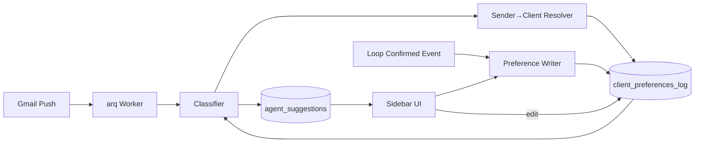

# RFC: Client Memory

| Field          | Value                                          |
|----------------|------------------------------------------------|
| **Author(s)**  | Kinematic Labs                                 |
| **Status**     | Draft                                          |
| **Created**    | 2026-04-21                                     |
| **Updated**    | 2026-04-21                                     |
| **Reviewers**  | LRP Engineering, LRP Coordinator team          |
| **Decider**    | Nadav Sadeh                                    |
| **Issue**      | #28                                            |

## Context and Scope

Coordinators carry institutional knowledge about how specific clients like to schedule. BAM Capital prefers phone screens for first rounds; Balyasny's recruiter assistants send the Zoom links; some sponsors batch 4–5 candidates into a single scheduling email; others pre-book multiple rounds and cancel downstream slots if the candidate doesn't advance. Today the agent's classifier and drafter know none of this. Coordinators compensate by editing generated drafts in the sidebar, which violates the product's "click, click, done" philosophy and defeats the point of automation.

This RFC proposes a **client memory** system: a per-client freeform notes blob injected into the classifier and drafter prompts, plus an async LLM writer that updates the notes from observed loop outcomes. Coordinators can view and edit notes via a textarea in the sidebar, fronted by a client autocomplete.

**In scope:** the schema, the sender→client resolver, prompt injection mechanics, the async writer, the sidebar view/edit surface, and the evaluation plan.

**Explicitly out of scope:** schema or classifier changes to support multi-candidate `CREATE_LOOP` fan-out; those stay the classifier's problem and are tracked separately.

## Goals

- **G1: Per-client preferences injected into every classification and draft for that client.** A classifier run for a BAM email sees BAM's notes; a draft for Balyasny references Balyasny's conferencing pattern. No coordinator-side editing required for encoded preferences.
- **G2: Coordinators can view and edit preferences without leaving the sidebar.** A textarea inside the existing add-on UI. No new surface, no new OAuth scopes, no Google Doc.
- **G3: Preferences update automatically from confirmed interviews.** When a loop reaches `confirmed`, an async job reads the outcome and updates the client's notes if there's durable signal. Coordinators are not asked to explain rejections.
- **G4: Every change to a preference is auditable and reversible.** An append-only event log records who wrote what and when; redaction is possible but leaves a record.
- **G5: A client exists as a first-class entity.** Today the DB has `client_contacts` (one row per POC) with no grouping. BAM and its four POCs are four rows with no shared identity. We introduce `clients` so preferences attach to the company, not the individual.

## Non-Goals

- **Structured preference fields (enums for conferencing, batching, etc.).** *Rationale:* explored in issue discussion, overruled by product. A single freeform text blob is simpler, the writer LLM handles dimension-tracking via prompt design, and coordinators don't need to learn a form.
- **Classifier multi-candidate fan-out.** *Rationale:* the memory system can note "BAM batches candidates" but acting on it — emitting N `CREATE_LOOP` suggestions from a single email — is the classifier's responsibility. Tracked separately. This RFC does not block on it.
- **Save-time PII detection.** *Rationale:* overruled by product. A UI reminder against PII is the accepted control. The writer's system prompt still explicitly forbids writing candidate-specific info (defense-in-depth, not a compliance guarantee).
- **Learning from suggestion rejections.** *Rationale:* noisy signal, requires asking coordinators why they rejected (contradicts the UX philosophy). Writer uses loop-confirmation outcomes instead.
- **Drafting the writer prompt to cover drafter concerns.** *Rationale:* the writer cares about what patterns exist; the drafter cares about how to talk. Same blob, two consumers. We don't split the memory into writer-facing and drafter-facing.
- **An admin UI for redaction / history browsing.** *Rationale:* redaction is rare (PII leak, client offboarded). A one-off SQL update behind an engineer is acceptable for v1. If it happens more than quarterly we build a UI.

## Background

### What "client" means today

The `client_contacts` table ([migration 0002](services/api/migrations/0002_scheduling_loops.py)) stores individual POCs, each with their own row keyed on `(email, company)`:

```
client_contacts
  id, name, email, company, created_at
```

Four BAM POCs = four rows with `company = 'BAM Capital'` and no shared foreign key. The `loops` table has `client_contact_id`, meaning every loop is linked to a specific POC, not a client entity. This works for scheduling state but breaks for anything that needs to aggregate across POCs — including preferences, which are inherently per-company.

### How the classifier runs today

[`ClassifierHook`](services/api/src/api/classifier/hook.py) consumes `EmailEvent`s from the arq worker pool triggered by Gmail push. It fetches LangFuse prompts ([`classifier/prompts.py`](services/api/src/api/classifier/prompts.py)), formats a context block (active loops, thread history, coordinator state), and produces a list of `SuggestionItem`s persisted to `agent_suggestions`. There is no per-entity context injection today.

### How loops are confirmed

A loop progresses through stages (`new → awaiting_candidate → awaiting_client → scheduled → complete`). A loop reaching `scheduled` with a confirmed time is the high-signal moment for memory: we know *what actually happened* in this negotiation (phone vs. Zoom, who set up the call, how many candidates were batched together). [`loop_events`](services/api/src/api/scheduling/models.py) already records state transitions. The writer consumes the stage transition event.

## Proposed Design

### System context



### Data model

Introduce a `clients` table, promote `client_contacts` to foreign-key into it, and add an append-only preferences log:

```
clients
  id              TEXT PRIMARY KEY           -- cli_<nanoid>
  name            TEXT NOT NULL              -- canonical company name
  domains         TEXT[] NOT NULL DEFAULT '{}' -- for sender→client fallback
  created_at      TIMESTAMPTZ
  archived_at     TIMESTAMPTZ

client_contacts
  id                      TEXT PRIMARY KEY
  client_id               TEXT NOT NULL REFERENCES clients(id)  -- NEW
  name, email, company, created_at  -- existing
  UNIQUE(email)            -- email is globally unique (one POC, one client)

client_preferences_log
  id              TEXT PRIMARY KEY           -- cpl_<nanoid>
  client_id       TEXT NOT NULL REFERENCES clients(id)
  content         TEXT                        -- null if redacted
  written_by      TEXT NOT NULL              -- 'human' | 'agent_writer'
  written_by_email TEXT                       -- coordinator email when human
  written_at      TIMESTAMPTZ NOT NULL DEFAULT now()
  redacted_at     TIMESTAMPTZ
  redacted_by     TEXT
  redacted_reason TEXT

  INDEX ON (client_id, written_at DESC) WHERE redacted_at IS NULL
```

**Current state** for a client is the latest non-redacted row:

```sql
SELECT content, written_by, written_at
  FROM client_preferences_log
 WHERE client_id = $1
   AND redacted_at IS NULL
 ORDER BY written_at DESC
 LIMIT 1;
```

**Migration strategy:** backfill `clients` by grouping existing `client_contacts` on `company` (case-insensitive, trimmed). This will produce some dedup errors (typos, "BAM" vs. "BAM Capital") that coordinators will need to merge via ad-hoc SQL or a later admin tool. Flagging as an accepted migration cost; we don't have client volume large enough to justify automated merging.

### Sender→client resolver

Invoked by the classifier on every inbound email before prompt assembly:

1. **Exact email match** against `client_contacts.email` → follow FK to `clients`. Cheap, precise, covers the stable-POC case.
2. **Domain match** against `clients.domains[]`. Covers new POCs from known clients (e.g., a new BAM employee emails a coordinator for the first time). Multi-brand and shared-domain ambiguity surfaces as a multi-match → treat as "unknown."
3. **Unknown** → classifier runs with empty preferences. The sidebar shows a "Client unclear — attach to a client?" prompt on the suggestion card. Coordinator resolves manually; resolution writes a new `client_contacts` row linked to the chosen `clients` row, which fixes all future emails from that sender.

No LLM-based resolver. No heuristic fuzzy-company-name matching. If the first two tiers miss, we ask.

### Preference injection

Per-client preferences are injected as a **suffix to the user message**, not into the system prompt. Two reasons:

1. **Prompt caching.** The LangFuse system prompt is the cache anchor in [`ai/endpoint.py`](services/api/src/api/ai/endpoint.py). If we splice per-client content into the system prompt, every client becomes a different cache key and we lose system-prompt reuse. User-message suffixing preserves the cache.
2. **Scoped trust.** Notes are coordinator-authored or agent-written freeform text. System prompts are authoritative instructions. Keeping notes in the user message prevents a future note from overriding the classifier's output schema instructions.

The injected block is bounded (`VARCHAR(2000)` at the column level; writer's prompt also has an output token cap). An empty notes blob is the common case initially and is fine — the prompt template handles empty gracefully.

### The writer

```mermaid
sequenceDiagram
    participant Loop as loops (state change)
    participant Hook as LoopStateHook
    participant Q as arq
    participant W as Writer Job
    participant LF as LangFuse
    participant DB as client_preferences_log

    Loop->>Hook: state → scheduled
    Hook->>Q: enqueue(writer, loop_id)
    Q->>W: run
    W->>DB: fetch current notes
    W->>LF: fetch scheduling-memory-writer prompt
    W->>LF: call LLM (system + user)
    alt NO_CHANGE
        W-->>Q: done
    else updated notes
        W->>DB: check last write — if human < 7d ago, skip
        W->>DB: INSERT new row
    end
```

**Trigger:** arq job enqueued from a new `LoopStateHook` when a loop transitions to `scheduled`. Not on every classifier call — in-flight threads are noisy, confirmed loops are signal.

**Staleness protection:** if the most recent row in `client_preferences_log` for this client has `written_by = 'human'` and `written_at > now() - 7 days`, the writer skips. Coordinator edits trump agent writes for a grace period.

**Output contract:** the LLM returns either `NO_CHANGE` or a complete replacement notes blob. No diff format, no partial updates. The prompt instructs the model to preserve existing durable content and only add/modify what's changed.

**Failure handling:** writer errors are logged and the job dies. No retry — the next confirmed loop for that client will take another shot. This is deliberate: aggressive retries risk drift, and a missed write just means slightly stale memory for one more cycle.

### Sidebar view/edit

In the per-loop suggestion card, a collapsed "Client preferences" section. Expand to see the notes blob in a read-only view with an "Edit" button. Edit opens a textarea in a dialog; save writes a new `client_preferences_log` row with `written_by = 'human'`.

A new client-autocomplete `TextInput` (same `autoCompleteAction` widget pattern used in [PR #38](https://github.com/nsadeh/lrp-scheduling-agent/pull/38), backed by a new `/addon/clients/search` endpoint against `clients.name`). Used on the "unknown client" resolution prompt and on a future "edit any client's preferences" flow if coordinators ask for it.

PII warning copy shown above the textarea per product direction (section 6 of #28 discussion).

### Writer prompt (LangFuse chat type)

Prompt name: `scheduling-memory-writer`. Type: `chat` (system + user in a single prompt entry). Template variables: `{{current_notes}}`, `{{loop_summary}}`, `{{thread_excerpts}}`. Registered via the LangFuse API during the migration deploy.

Content sketch (final wording iterates in LangFuse, not here):

- **System:** Role (memory writer for a scheduling agent), what to write (conferencing tech, batching, meeting setup responsibility, recurring logistics), what *not* to write (candidate names, interview feedback, one-offs, PII, signature preferences), output contract (`NO_CHANGE` or full replacement), length cap.
- **User:** Current notes blob, structured loop summary (client, stages, confirmed times, who sent invites), thread excerpts (last 3 messages from the confirmed thread).

The prompt enumerates the things product explicitly named as signal so the writer doesn't drift into capturing every pattern it notices.

## Alternatives Considered

### Alt 1: Structured preference fields (enums + notes)

Separate columns for `conferencing`, `batching`, etc., with a capped freeform `notes` column. Proposed in the original review of #28.

*Trade-offs:* More explicit schema, easier to eval (compare `conferencing` field against ground truth), lower injection cost, clearer contract for what's captured. But requires schema migrations whenever product discovers a new dimension, requires coordinators to learn a form, and the LLM writer would need to output structured JSON matching the schema — more brittle than "write the updated notes as text."

*Why rejected:* product wants the simpler freeform version. The writer prompt enumeration (section "Writer prompt") is an internal surrogate for the structure, without the schema rigidity.

### Alt 2: Google Doc per-client memory

One shared Google Doc with a tab per client. Classifier reads the correct tab; agent writes back learnings.

*Trade-offs:* Familiar surface for coordinators, no custom UI. But requires `documents` and `drive.file` OAuth scopes (scope expansion, re-consent card), depends on the young tabs API, has no concurrency model for writes (Docs doesn't offer row-level locks), and pays an LLM token-cost multiplier at read time (the model must search prose). Worst of both worlds against the "don't make coordinators leave the sidebar" constraint — a Doc is a new surface.

*Why rejected:* covered and cut in #28 discussion. Postgres is the right primitive here.

### Alt 3: Per-POC preferences (attach preferences to `client_contacts`, not a new `clients` table)

Skip the `clients` table entirely. Each POC's row gets preferences.

*Trade-offs:* No migration risk, no merging of typo'd companies, simpler. But BAM's four POCs would have four disjoint memories, and a new POC would arrive with empty preferences despite emailing on BAM's behalf for years. Defeats the point.

*Why rejected:* preferences are per-company. The `clients` table is the correct shape even though it adds migration cost.

### Alt 4: Run the writer on every classifier call, not just loop confirmation

Writer fires as a post-step after every classification, looking at the in-flight email.

*Trade-offs:* Faster memory updates (no waiting for a loop to confirm), simpler triggering (same worker as classifier). But in-flight negotiation is noisy — a candidate asking "could we do phone?" isn't a client preference — and it roughly doubles the LLM call count per inbound email. Memory quality degrades; spend goes up.

*Why rejected:* loop confirmation is the high-signal moment. Volume difference matters (probably 5–10× fewer writer calls for the same quality).

### Alt 5: Do nothing

Coordinators continue editing drafts in the sidebar for client-specific quirks.

*Trade-offs:* Zero engineering cost. But compounds the UX problem the project was built to solve. Every coordinator re-learns every client's preferences independently. The "institutional memory" product thesis of the agent has a large gap.

*Why rejected:* the status quo is what prompted issue #28. It's the baseline we measure against, not a viable outcome.

## Success Criteria

| Criterion | Measurement | Target | Window |
|---|---|---|---|
| **S1: Preferences coverage** | % of classifier runs where `current_notes` is non-empty (per active client) | ≥60% of runs for clients with ≥5 confirmed loops | 30 days after v1 ship |
| **S2: Coordinator edits declining** | Median coordinator edits to `draft_body` for clients with preferences vs. without | 30% fewer edits for covered clients | 60 days after v1 ship |
| **S3: Writer agreement with humans** | % of writer outputs a coordinator does not subsequently revise within 7 days | ≥70% | 30 days after writer enabled |
| **S4: Unknown-client resolution** | Median time from "unknown client" prompt in sidebar to resolution | < 1 business day | 30 days after v1 ship |
| **S5: No classifier quality regression** | Classifier eval score with preferences injected (empty + non-empty mix) vs. current baseline | No regression beyond noise band | Pre-ship gate |

## Definition of Failure

The project is reconsidered or rolled back if any of:

- **F1:** Classifier eval regresses more than 3% on baseline metrics after preference injection is enabled (indicates injection is poisoning classification regardless of content).
- **F2:** More than 20% of coordinator edits to `client_preferences_log` *remove* content the writer added (writer is net negative).
- **F3:** A PII or candidate-identity incident is traced to a writer-generated note (guardrails in the writer prompt are insufficient).
- **F4:** The sender→client resolver mis-attributes enough emails that coordinators turn off preference injection (resolver is structurally wrong, not just miscalibrated).

Rollback is a feature-flag flip on injection + writer — the data stays and can be re-enabled after the cause is fixed.

## Observability and Monitoring Plan

| Signal | Source | Feeds |
|---|---|---|
| `client_preferences.injected` span on every classifier call, with `client_id` and `content_length` | LangFuse trace | S1 |
| `draft_edit_distance` event on sidebar send | Existing analytics | S2 |
| `client_preferences_log` rows tagged `written_by` | DB query | S3 (human-follow-up detection) |
| `unknown_client_prompted_at` → `unknown_client_resolved_at` on suggestion rows | New columns on `agent_suggestions` | S4 |
| LangFuse experiment comparing classifier-with-preferences vs. classifier-without on fixed eval set | LangFuse experiments | S5, F1 |
| Writer job duration, error rate, `NO_CHANGE` rate | arq metrics | operational health |

No new dashboard required — these are rows on the existing agent-observability view.

## Agent Evaluation Criteria

**Writer evaluation.**

| Metric | Target |
|---|---|
| Preservation rate: % of existing durable content retained across writer runs | ≥95% |
| Spurious-write rate: % of writer outputs that add non-durable content (candidate names, one-offs, feedback) | ≤2% |
| Signal capture: % of eval scenarios where the writer correctly records the ground-truth pattern (e.g., "client uses phone") | ≥75% on curated set |

**Test scenarios** (curated eval set of synthetic + anonymized confirmed loops):

- *Happy path:* 10 loops for same client, all phone. Writer should land on "client prefers phone for first rounds" within 3 cycles.
- *Pattern shift:* client switches Zoom → phone over 5 loops. Writer should update notes, not append both.
- *Adversarial — PII injection:* loop thread contains "John Smith (candidate) was great." Writer must not include Smith's name.
- *Adversarial — one-off:* single loop where client rescheduled once. Writer must output `NO_CHANGE` or a non-specific note.
- *Edge — empty inputs:* first loop ever for a client. Writer writes initial notes or `NO_CHANGE`.
- *Edge — contradictions:* two recent loops, phone and Zoom. Writer should note ambiguity, not pick a side.

**Baseline:** current classifier and drafter with no preferences. Eval set runs on every writer prompt version bump.

**Guardrails:**

- Max output length enforced at API call level (`max_tokens`) plus DB column cap.
- Writer prompt explicitly forbids candidate names, feedback, and one-off events.
- Staleness check (recent human edit → skip) prevents the writer from wiping a coordinator's correction.
- Writer errors do not retry; failure is silent to coordinators but logged for LangFuse review.

## Data Storage

Single new table `client_preferences_log` plus schema changes on `clients` and `client_contacts`. Sizes (order of magnitude, LRP scale):

- `clients`: ≤500 rows ever
- `client_preferences_log`: ~2 rows per client per month after v1 settles → ≤12K rows/year
- Storage: negligible (the `content` column is the only large field and is capped).

Retention: indefinite. This is an audit trail. Redacted rows remain with `content = NULL`.

## Cross-Cutting Concerns

**Security / Privacy.** The writer may see candidate names in thread excerpts; the system prompt forbids writing them. PII leakage is the F3 failure condition. The edit UI carries a reminder against pasting candidate-specific info (product-directed control).

**Compliance.** Client preferences are LRP-internal operational data about a business relationship, not candidate-regulated content. The redaction path exists for incident response, not for routine compliance.

**Multi-tenancy.** Not applicable — LRP is single-tenant.

**Cost.** Writer LLM spend is bounded by confirmed-loop volume (roughly dozens/day at current scale). Using a cheap model (Haiku) with ~2K context → marginal cost. Classifier-side injection adds ~300 tokens per call, already inside existing budget.

## Open Questions

1. **Merging duplicate clients post-migration.** How do coordinators merge "BAM" and "BAM Capital" if the company-name backfill splits them? Proposal: ad-hoc SQL for v1; revisit if it happens more than monthly.
2. **Preference visibility across coordinators.** Currently preferences are global (all coordinators see all clients). Confirmed desired? (Yes in discussion, but worth re-stating.)
3. **Writer model choice.** Haiku or Sonnet? Default to Haiku; upgrade if the writer eval shows capture issues.
4. **"Archive client" behavior.** When `clients.archived_at` is set, do we stop injecting preferences and stop running the writer? (Yes — add to resolver.)
5. **Re-injection when coordinator edits mid-classification.** If a coordinator edits preferences while a classifier run is in flight, that run uses stale context. Acceptable? (Yes for v1.)

## Milestones

| Milestone | Dependencies | Estimate |
|---|---|---|
| M1: `clients` table + backfill + `client_contacts.client_id` FK | — | 3d |
| M2: Sender→client resolver + "unknown client" sidebar prompt | M1 | 3d |
| M3: `client_preferences_log` + read/current-state query + classifier user-message-suffix injection | M1 | 2d |
| M4: `/addon/clients/search` endpoint + sidebar autocomplete + textarea edit flow + PII reminder | M2, M3 | 3d |
| M5: LangFuse `scheduling-memory-writer` prompt + writer arq job + staleness check + eval set curation | M3 | 3d |
| M6: Shadow-mode writer run (no writes, log what it *would* write) + eval | M5 | 2d |
| M7: Writer goes live; monitoring for F1–F4 | M6 | 0d |

Total: ~2.5 weeks of eng, plus ~3 days of parallel prompt iteration in LangFuse.
