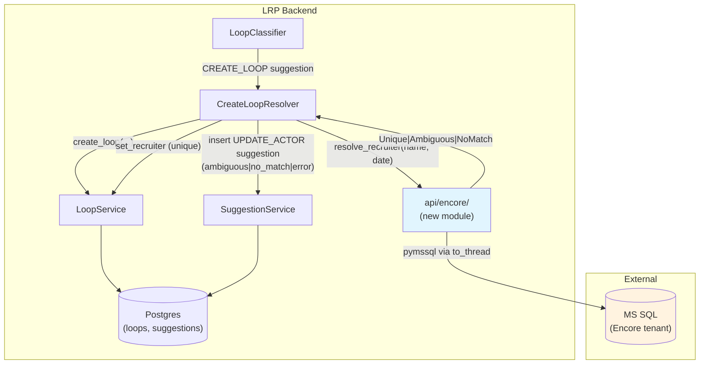
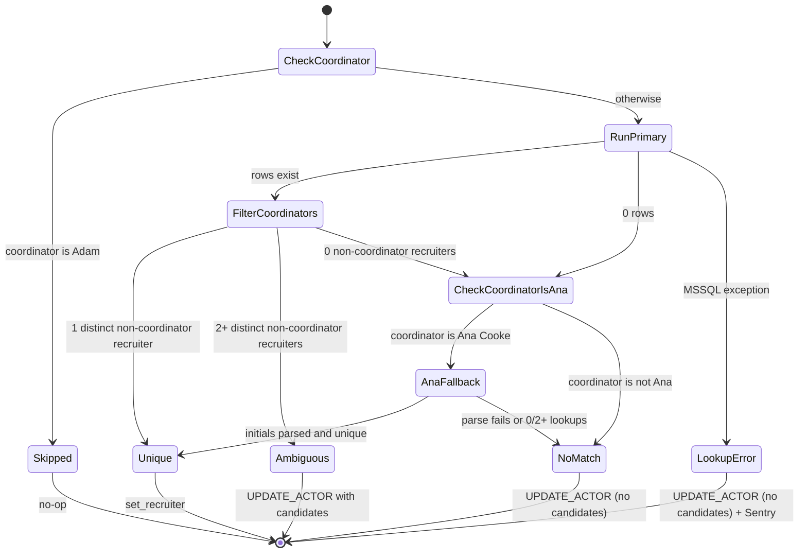

# RFC: Encore Recruiter Resolution — Auto-disambiguate Loop Recruiters from ATS

| Field         | Value                                          |
| ------------- | ---------------------------------------------- |
| **Author(s)** | Kinematic Labs                                 |
| **Status**    | Draft                                          |
| **Created**   | 2026-05-20                                     |
| **Updated**   | 2026-05-20                                     |
| **Reviewers** | LRP Engineering, LRP Coordinator team          |
| **Decider**   | Nim Sadeh                                      |
| **Issue**     | [#31 — Disambiguate candidate and recruiter from Encore data](https://github.com/long-ridge-partners/scheduling-agent/issues/31) |

## Context and Scope

Today, when the classifier creates a scheduling loop from an unlinked Gmail thread, the recruiter is set only if the LLM extraction surfaces a `recruiter_email` directly from the email body — which is rare for client-initiated requests. The fallback is `UPDATE_ACTOR`: the next-action agent emits a suggestion asking the coordinator to fill the recruiter manually, which they resolve through the sidebar autocomplete. This is one of the highest-frequency manual interventions in the coordinator workflow and one of the largest contributors to "unknown actor" noise in downstream prompts.

LRP has now granted read-only access to the backing Microsoft SQL Server database for their Encore (Cluein) ATS instance. The same candidate name that the classifier already extracts can be looked up directly in Encore to find the most likely recruiter — the LRP employee who last submitted a candidate by that name. This RFC proposes the access layer, the lookup protocol, and the integration point inside the loop-creation pipeline.

## Goals

- **G1:** Execute arbitrary read-only MS SQL queries against the LRP Encore database from the Python API, with async-safe behavior under the existing arq worker that drives classification.
- **G2:** After every successful loop creation, run the recruiter-resolution query for that candidate and either (a) set the loop's recruiter when a unique match is found, or (b) emit a deterministic `UPDATE_ACTOR` suggestion for the coordinator to pick from in the sidebar — without a second trip to the LLM.
- **G3:** Reduce `UPDATE_ACTOR` (role=recruiter) suggestions surfaced to coordinators by ≥50% over a four-week measurement window.
- **G4:** Add no new manual coordinator workflow — the sidebar UX is unchanged: open, click click click, done. Recruiter just shows up populated more often.
- **G5:** Fail closed and silently: if Encore is unreachable, slow, or returns ambiguous data, the loop is still created. The fallback path is the status quo.

## Non-Goals

- **Write access to Encore.** _Rationale:_ explicitly excluded by the issue and out of scope for the read-only credentials we've been granted. A future RFC may revisit this when LRP's ops team is ready.
- **Agent-driven Encore queries from the LLM tool layer.** _Rationale:_ this RFC sets up the access layer, but the LLM does not get a `search_encore` tool. The query runs deterministically post-classification, not as a model decision. Exposing it as a tool widens the prompt-injection surface and is unnecessary for the current use case.
- **Candidate-side disambiguation** (e.g., resolving a `tPeople.GUID` for the loop). _Rationale:_ we are only solving for the recruiter today. Storing the Encore candidate ID on the loop is a sensible follow-up but adds schema and reconciliation work that this RFC doesn't need.
- **Cross-client recruiter ownership rules.** _Rationale:_ the issue notes we may not even be able to filter by client in the query. Modeling "this recruiter owns this candidate for this client" is a separate problem; we punt to "most recent non-coordinator updater wins."
- **Backfilling existing loops with recruiters.** _Rationale:_ scope is forward-only. A separate one-shot script can backfill if we want it later — out of this RFC.
- **Sync with Encore as the source of truth for the LRP employee directory.** _Rationale:_ recruiters continue to flow through `find_or_create_contact(role="recruiter")` keyed on email. We do not migrate the `contacts` table to point at `tUser.GUID`.

## Background

### Where the recruiter lands today

[`CreateLoopResolver.resolve`](services/api/src/api/classifier/resolvers.py) (services/api/src/api/classifier/resolvers.py:124) reads a `CreateLoopExtraction` from the classifier suggestion and conditionally calls `find_or_create_contact(role="recruiter")` only if `extraction.recruiter_email` is non-empty. The vast majority of client-originated emails — the ones that kick off a loop — do not name the recruiter at all, so `recruiter_id` lands as `NULL`. The next-action agent then sees an actor gap and emits an `UPDATE_ACTOR(role=recruiter)` suggestion, which the coordinator resolves manually.

### What we know about the Encore data

From issue #31 and the prototype queries (see Appendix A):

- **`tPeople`** — candidates, keyed by `GUID`, with `FirstName` / `LastName`. There are name collisions: 21 distinct `tPeople` rows exist for "Daniel Kim" today.
- **`tGenie`** — activity log entries on candidate records. Most recently-edited Genie is a reasonable proxy for "current owner of this candidate."
- **`tGenieType`** — dictionary; we filter to `'General Information'` and `'Submit to Client'`.
- **`tUserEmail`** — LRP employee emails. Two rows per user (one `*microsoft*` domain we filter out).
- **`tUser.Login`** — typically the recruiter's initials; we believe these are globally unique within LRP staff.

The unfortunate-but-tractable shape of the data:

1. The candidate's first name in Encore can disagree with the classifier-extracted name (Dan vs. Daniel) — first-name superset matching is necessary.
2. Multiple historical recruiters may have touched the same candidate name across years. A `Daniel Kim` lookup returns 8 distinct recruiters across 2013–2025 today.
3. Four LRP coordinators show up in Genies but are not the recruiter (they submit on behalf of recruiters). One of them — Ana Cooke — submits using a notes format starting with the recruiter's initials, which we must parse. Another — Adam L'esperance — is occasionally a recruiter himself, so we cannot mechanically exclude him; we just don't try to resolve his loops at all (he knows who his recruiter is).

### Why a query, not an LLM tool

The query is fully deterministic and runs on every loop. Wrapping it in a model tool would (a) cost a round trip with no upside, (b) widen the prompt-injection blast radius for marginal value, and (c) make eval harder because the resolution would depend on model behavior rather than data shape. We prefer the lookup as ordinary code.

## Proposed Design

### Overview

We introduce an **Encore access layer** (`api/encore/`) that owns the MS SQL connection lifecycle and exposes a single high-level function: `resolve_recruiter(candidate_name, thread_first_email_date, coordinator_email)`. The `CreateLoopResolver` calls it inline immediately after loop creation. The function returns one of three outcomes — `Unique`, `Ambiguous`, `NoMatch` — and the resolver maps them to either a direct `set_recruiter` call or a synthesized `UPDATE_ACTOR(role=recruiter)` suggestion. The `UPDATE_ACTOR` card itself is unchanged; when the outcome is `Ambiguous`, we deterministically format a one-line summary describing the ambiguity (e.g., *"Encore found 3 candidates: Dana Chen (last activity 2026-02-10), Liam Ng (2026-01-04), Priya Shah (2025-11-22). Pick one."*) and pass it through the existing summary slot the card already renders. No card/UI changes.

The MS SQL driver is `pymssql` running inside `asyncio.to_thread`. We are at ~250 loops/day with bursty arrival; true async drivers (`aioodbc`) are overkill at this scale and add ODBC-driver pain on Railway. The thread-pool approach is bounded, correct, and matches how we already deal with sync-only Python deps elsewhere.

### System Context Diagram



### Detailed Design

#### Module layout

```
services/api/src/api/encore/
  __init__.py
  client.py        # pymssql connection lifecycle, to_thread wrapper, timeouts
  coordinators.py  # hardcoded list of LRP coordinator emails + special-case flags
  queries.sql      # raw MS SQL — loaded via aiosql with the sync `pymssql` driver
  queries.py       # aiosql.from_path wrapper, mirrors api/scheduling/queries.py
  resolver.py      # resolve_recruiter() — the high-level entry point
  models.py        # ResolverOutcome union, RecruiterCandidate, etc.
```

**Same `.sql` file pattern as the Postgres queries.** `aiosql` supports `pymssql` as a sync driver — we load `queries.sql` with `aiosql.from_path(path, "pymssql")` (mirroring [api/scheduling/queries.py:12](services/api/src/api/scheduling/queries.py:12), which uses the `"apsycopg"` async driver). Calls into the resulting query object are sync, so the resolver wraps them in `asyncio.to_thread`. Engineers get the same named-query ergonomics, syntax highlighting, and grep-ability they have on the Postgres side.

#### Connection lifecycle

A single `pymssql.Connection` per worker process, opened lazily on first use and held for the process lifetime. `pymssql` connections are not coroutine-safe, but our access pattern is single-shot reads under `asyncio.to_thread` with a `threading.Lock` around the cursor — at 250 loops/day this is dead simple and correct. Connection is reset on `OperationalError`.

Config via dotenv (per CLAUDE.md memory):

- `ENCORE_MSSQL_HOST`
- `ENCORE_MSSQL_PORT` (default 1433)
- `ENCORE_MSSQL_DATABASE`
- `ENCORE_MSSQL_USER`
- `ENCORE_MSSQL_PASSWORD`
- `ENCORE_MSSQL_QUERY_TIMEOUT_SECONDS` (default 5)

All entries land in [`references/env-vars.md`](references/env-vars.md) in the same PR.

#### The primary query

```sql
SELECT TOP 50
    g.UserEnteredGUID,
    g.TimeEntered,
    g.GenieNotes,
    gt.GenieType,
    e.EmailAddress,
    e.EmailDisplayName,
    p.FirstName,
    p.LastName
FROM tGenie g
LEFT JOIN tGenieLink   gl ON gl.GenieGUID = g.GUID
LEFT JOIN tPeople      p  ON p.GUID = gl.CPSUGUID
LEFT JOIN tGenieType   gt ON gt.GUID = g.GenieTypeGUID
LEFT JOIN tUserEmail   e  ON e.UserGUID = g.UserEnteredGUID
WHERE p.LastName = %(last_name)s
  AND p.FirstName LIKE %(first_name_like)s
  AND gt.GenieType IN ('General Information', 'Submit to Client')
  AND g.TimeEntered >= %(cutoff)s
  AND e.EmailAddress NOT LIKE '%%microsoft%%'
  AND e.EmailAddress != 'lrpinterviews@longridgepartners.com'
ORDER BY g.TimeEntered DESC;
```

Parameter shape:

- `last_name` — exact match on the classifier-extracted last name.
- `first_name_like` — the full classifier-extracted first name with `%` appended (e.g., `"Daniel%"` or `"Dan%"`). This catches the common direction (the email said "Dan" and Encore has "Daniel" → no match, but the email said "Daniel" and Encore has "Dan" → also no match — wait, that's the other direction). Concretely: the LIKE catches when the DB form is a *superset* of the emitted form. It does not catch the inverse (emitted "Daniel" + DB "Dan") and it does nothing for unrelated nicknames (Tony / Anthony, Bob / Robert). That's the accepted limit; those will fall through to `Ambiguous` or `NoMatch` and the coordinator picks. No Python-side post-filter on first name.
- `cutoff` — `thread_first_email_date - INTERVAL 12 months`. The 12-month figure is from the answered design question; revisit at eval time.

The `e.EmailAddress NOT LIKE '%microsoft%'` filter handles the dual-email-row quirk in Encore's auth (one email per user has a Microsoft auth-system domain).

#### Resolution protocol

```python
async def resolve_recruiter(
    candidate_name: str,
    thread_first_email_date: datetime,
    coordinator_email: str,
) -> ResolverOutcome: ...
```

1. **Skip if the coordinator is Adam L'esperance** (`adam@longridgepartners.com`). He's also a recruiter; we can't disambiguate his own loops from his coordinator work without far more context. Return `Skipped`.
2. **Parse the candidate name** into `first_name`, `last_name`. Reject single-word names (`Skipped`).
3. **Run the primary query.** Rows include a `UserEnteredGUID` per row.
4. **Filter coordinators out** from the result rows. The coordinator set is `{ana, sara, marissa, fiona, adam}@longridgepartners.com` (Adam is already excluded one level up via `Skipped`; he's in the set for defense-in-depth in case the skip is ever loosened). Exact emails for sara, marissa, fiona are to be supplied by LRP — placeholder constants in `coordinators.py` until then. The list lives in `coordinators.py` as a `frozenset[str]`, single source of truth for every filter site in the module.
5. **Group by recruiter `UserEnteredGUID`**, keeping each group's most recent `TimeEntered`. Sort groups by that timestamp descending.
6. **Decide:**
   - If exactly one distinct recruiter remains: **Unique**, return their email and display name.
   - If zero distinct recruiters remain *and* the authenticated coordinator is Ana Cooke: run the **Ana fallback** (see below). If it resolves, return its result. The fallback is gated on `ctx.coordinator_email`, not on Ana appearing in the Genie rows — Ana submits on behalf of recruiters, so when she is the user driving the loop creation, her initials-format notes are the recruiter signal to read. When she isn't the user, her Genies have nothing to tell us about *this* loop's recruiter.
   - If zero remain (and Ana fallback inapplicable or empty): **NoMatch**.
   - If multiple distinct recruiters remain: **Ambiguous**, return up to top 5 candidates ordered by recency. (Cap exists to keep the suggestion summary readable.)

#### Ana fallback

Ana Cooke is a coordinator who also submits candidates on recruiters' behalf. Her Genie notes begin with the recruiter's initials in a consistent format (e.g., `"DC - submission for ..."`). This branch only runs when the authenticated coordinator (`ctx.coordinator_email`) is Ana — her email lives next to Adam's in `coordinators.py`. We pull her most-recent Genie for this candidate (within the 12-month window), parse the leading initials, then look up the email:

```sql
SELECT DISTINCT e.EmailAddress, e.EmailDisplayName
FROM tUserEmail e
INNER JOIN tUser u ON u.GUID = e.UserGUID
WHERE u.Login = %(initials)s
  AND e.EmailAddress NOT LIKE '%%microsoft%%';
```

Initials are extracted by parsing the leading token of `GenieNotes` (regex: `^([A-Z]{2,3})\b`). If the regex doesn't match, or the query returns ≠1 row, the fallback resolves to `NoMatch`. Sentry-warn on regex parse failure so we can monitor format drift.

**Coordinator-rejection guard on the resolved email.** Before returning, the fallback checks the resolved email against `COORDINATOR_EMAILS`. If it's a coordinator (e.g., a coordinator's own login initials happen to match the parsed letters — `AC` would resolve to Ana herself), the fallback drops to `NoMatch(reason="resolved_to_coordinator")` and Sentry-warns. The same guard runs at the tail of the primary path on the `Unique` outcome's email — belt-and-suspenders against any case where the SQL filter misses a coordinator (e.g., a coordinator with an alias email outside the hardcoded set). The guard is the *last* check in both branches; no outcome path returns a coordinator email as a recruiter.

#### Resolver outcome shape

```python
@dataclass(frozen=True)
class UniqueRecruiter:
    email: str
    display_name: str
    source: Literal["genie", "ana_initials"]

@dataclass(frozen=True)
class AmbiguousRecruiters:
    candidates: list[RecruiterCandidate]  # 2..5 entries, most-recent first.
                                          # Used only to format the suggestion
                                          # summary string — NOT a UI payload.

@dataclass(frozen=True)
class NoMatch:
    reason: Literal[
        "no_genie_rows",
        "no_non_coordinator",
        "ana_parse_failed",
        "ana_lookup_empty",
        "resolved_to_coordinator",  # final-guard rejection on either path
    ]

@dataclass(frozen=True)
class Skipped:
    reason: Literal["coordinator_is_adam", "single_word_name"]

@dataclass(frozen=True)
class LookupError:
    exception_type: str  # for Sentry context only

ResolverOutcome = UniqueRecruiter | AmbiguousRecruiters | NoMatch | Skipped | LookupError
```

#### Wiring into `CreateLoopResolver`

**Ordering constraint:** the loop must be persisted to Postgres *before* the resolver runs. The parent `CREATE_LOOP` suggestion always has `loop_id = NULL` (it's the suggestion that creates the loop — the FK doesn't exist yet at suggestion-emit time), so the synthesized `UPDATE_ACTOR` cannot inherit its `loop_id` from the parent. The only way to attach it correctly is to take the `loop.id` returned by `ctx.loops.create_loop(...)`.

Concrete sequence inside `CreateLoopResolver.resolve`:

1. Parse `CreateLoopExtraction` from the parent suggestion (existing).
2. `find_or_create_contact` for any contacts the LLM did extract (existing).
3. **`loop = await ctx.loops.create_loop(...)`** — persists the loop, commits the transaction, returns the row with a real `id`.
4. If `extraction.recruiter_email` was non-null, the recruiter is already set on the loop — skip the rest.
5. Otherwise, `outcome = await encore.resolve_recruiter(loop.candidate_name, thread_first_email_date, ctx.coordinator_email)`.
6. Branch on the outcome (see below), passing `loop.id` into every `UPDATE_ACTOR` we synthesize.
7. `ctx.enqueue_next_action()` (existing) — runs only after the branch finishes, so the agent's first pass observes either a populated recruiter or a pending `UPDATE_ACTOR` we just inserted.

If `create_loop` raises, we never reach the resolver — no Encore work happens, no orphan `UPDATE_ACTOR` is inserted, and the parent CREATE_LOOP suggestion stays PENDING for retry. If the resolver raises after `create_loop` commits, the loop is in Postgres with a null recruiter and the next-action agent's existing path emits an `UPDATE_ACTOR` on its first pass — the status quo fallback.

Branching, only when the LLM extraction did **not** already provide a `recruiter_email`:

- `UniqueRecruiter` → `find_or_create_contact(name=display_name, email=email, role="recruiter")` and `set_recruiter`. Record an event with `source="encore_auto"`.
- `AmbiguousRecruiters` → insert an `UPDATE_ACTOR(role=recruiter)` suggestion **attached to the just-created loop via `Suggestion.loop_id = loop.id`** (this is how the addon's Save handler knows which loop to patch — same field the agent populates today). The suggestion carries a deterministically-formatted summary string describing the candidates the resolver found (e.g., *"Encore returned 3 possible recruiters for 'Daniel Kim' in the last 12 months: Dana Chen (last activity 2026-02-10, Submit to Client); Liam Ng (2026-01-04, General Information); Priya Shah (2025-11-22, Submit to Client). Pick the right one."*). The card itself is unchanged; the summary lands in the existing summary slot the `UPDATE_ACTOR` card already renders. No UI changes, no new action data fields.
- `NoMatch` → insert a plain `UPDATE_ACTOR(role=recruiter)` suggestion, also attached to `loop.id`, with a short summary noting the lookup was attempted but found nothing. Identical to today's path, just emitted by the resolver instead of the next-action agent.
- `Skipped` → do nothing. The agent will emit `UPDATE_ACTOR` later on its first pass through the thread, exactly as today.
- `LookupError` → Sentry-capture, then emit `UPDATE_ACTOR(role=recruiter)` attached to `loop.id` with a summary noting the lookup failed. We do **not** silently drop here, because the coordinator still needs to act.

**Multi-loop emails.** When a single classifier pass emits multiple `CREATE_LOOP` suggestions (different candidates in one email — per the [feedback_loop_per_candidate](memory) rule), each suggestion runs through `CreateLoopResolver` independently. The resolver therefore runs the Encore query once per loop and synthesizes a per-loop `UPDATE_ACTOR` when needed, each carrying its own `Suggestion.loop_id`. No shared state across the per-loop calls.

The synthesized `UPDATE_ACTOR` suggestion is recorded with `created_by="encore_resolver"` (new value in the existing audit column) so we can distinguish it from agent-emitted ones in observability and timeline views.

Finally, `ctx.enqueue_next_action()` runs **after** the resolution branch completes. The agent's first pass therefore sees either a populated recruiter or a pre-existing `UPDATE_ACTOR` suggestion, eliminating the duplicate-suggestion case where today the agent emits its own `UPDATE_ACTOR` even when one already exists.

### Data Storage

One narrow change:

1. **`suggestions.created_by`** — existing audit column extended with a new enum value `encore_resolver`. No migration needed if it's already free-text; otherwise a small Yoyo migration adds the value to the constraint.

No schema change to `UpdateActorData` and no UI changes. The ambiguity description lives in the suggestion's existing summary string, formatted deterministically by the resolver.

No new tables. We do not persist Encore results — re-querying is cheap and the data shape in Encore changes (recruiters update Genies) more often than we re-classify the same loop.

### Key Trade-offs

- **Inline lookup over async follow-up.** We block loop creation on a network round-trip to MS SQL, adding ~50–300ms to classifier latency in the happy path. In exchange, the loop is "complete" the moment it appears in the sidebar — no second event, no transient "unknown recruiter" state, no race between the agent's first pass and the resolver. At 250 loops/day with bursty arrival, the latency cost is invisible to coordinators.
- **`pymssql + to_thread` over `aioodbc`.** Sync driver wrapped in a thread is uglier than native async, but `pymssql` ships clean wheels, doesn't need an ODBC driver installed on the Railway image, and is battle-tested. The async wrappers around ODBC have a long tail of driver/version pain we don't want at 250 q/day.
- **Single shared connection, no pool.** Trades concurrency headroom for simplicity. Worst case is a 5-second query timeout serializing two concurrent classifications by ≤5s — acceptable. Re-evaluate if we ever push past ~5 concurrent classifications.
- **Hardcoded coordinator list over a DB table.** Per the answered design question. The list is small (4), changes rarely, and lives next to the special-case Ana / Adam logic that already needs code. A DB-backed list would require a UI to manage and adds infra for no near-term value.
- **First-name prefix matching at 3 chars.** Covers the common nickname cases (Dan/Danny/Daniel, Liz/Elizabeth) without exploding the result set. False positives on short common prefixes (Sam/Samuel/Samantha) will manifest as `Ambiguous` outcomes, falling through to the safer `UPDATE_ACTOR` path. The bias is toward "let the coordinator pick" when uncertain.
- **No prompt-injection surface.** The Encore query is parameterized and the LLM never sees Encore output before action emission. The recruiter's email and name eventually appear in the next-action prompt, but only after the resolver has set the contact — same as if the coordinator had typed it.
- **No semantic dedup of `tPeople` rows.** Encore has 21 distinct `tPeople` rows for "Daniel Kim." We accept that some loops will resolve `Ambiguous` even though only one is "really" the relevant candidate; the coordinator picks. Doing better here would require a candidate-identity step we explicitly excluded.

## Alternatives Considered

### Alternative 1: Expose the Encore lookup as an LLM tool

Add a `search_encore_recruiter(candidate_name)` tool that the next-action agent can invoke when it sees a missing recruiter, instead of emitting `UPDATE_ACTOR`.

**Trade-offs:** Reuses the existing tool-use infrastructure. Lets the model decide when the lookup is worth doing. Loses determinism — the model might skip the lookup when it'd help, or call it on linked threads where the recruiter is already known.

**Why not:** No upside over a deterministic call. Adds a tool-use round trip per loop (~3–5s). Widens prompt-injection surface — a malicious email could try to bias the model toward calling the lookup with attacker-controlled names. The query is cheap and unconditional; running it from the resolver is strictly better.

### Alternative 2: Background arq job that patches the loop after creation

Create the loop with `recruiter_id=NULL`, enqueue `run_encore_recruiter_lookup(loop_id)` on the existing arq pool, and let it write back asynchronously.

**Trade-offs:** Decouples MS SQL availability from classifier latency. If Encore is slow or down, classification still runs at full speed. Adds a second `ACTOR_UPDATED` event and a window where the loop appears in the sidebar without a recruiter, then changes. Coordinators may already have started filling in the recruiter when the job lands.

**Why not:** Violates the "open sidebar, click click click, done" UX principle. The transient "unknown recruiter → known recruiter" flicker is exactly the kind of cognitive friction the product is designed to eliminate. At 250/day, the inline approach is fine.

### Alternative 3: Use ODBC + `aioodbc` for true async

Install Microsoft's ODBC driver on the Railway image, use `aioodbc` for native async access.

**Trade-offs:** Native async, no thread-pool offload. Better story if we ever 100× the query load. Costs Dockerfile complexity (msodbc driver install), more transitive dependencies, and a class of driver/version errors that aren't fun to debug remotely.

**Why not:** We are nowhere near the load level where async drivers pay back. `to_thread` is correct at our scale, and the simpler footprint matters more.

### Alternative 4: Daily batch sync of Encore into Postgres

Mirror `tPeople`, `tGenie`, `tUserEmail`, `tUser` into Postgres tables nightly. Query our own copy at loop-creation time.

**Trade-offs:** Lookup latency drops to <10ms. Removes the MS SQL availability dependency from the hot path. Costs an ETL job, schema mirroring, and a 24h staleness window for new recruiter activity.

**Why not:** Overkill for the access pattern. The hot path runs 250 times/day; building an ETL pipeline is multiples more code than the inline query. Stale data could miss exactly the recent activity that makes the recruiter resolvable. Revisit if Encore becomes load-bearing for more features.

### Alternative 5: Do nothing / status quo

Coordinators continue to resolve `UPDATE_ACTOR(role=recruiter)` suggestions manually for every new loop.

**Trade-offs:** Zero engineering work. Continues to bloat the "things the coordinator clicks" surface. Continues to pollute next-action prompts with "unknown recruiter," which the issue notes causes downstream agent confusion.

**Why not:** This is the highest-frequency manual intervention in the workflow and the data to remove it is now accessible. Status quo means we deliberately leave a 50%+ reduction in coordinator clicks on the table.

## Success and Failure Criteria

### Definition of Success

| Criterion                                | Metric                                                                       | Target                                | Measurement Method                                |
|------------------------------------------|------------------------------------------------------------------------------|---------------------------------------|---------------------------------------------------|
| Recruiter set without coordinator action | `% of new loops where recruiter_id is populated before first sidebar render` | ≥ 60%                                 | Postgres query against `loops` and `events`       |
| Reduction in `UPDATE_ACTOR(recruiter)`   | `monthly count post-launch / monthly count baseline`                         | ≤ 0.5 (50%+ reduction)                | `suggestions` count grouped by action+role        |
| Auto-resolution precision                | `% of auto-set recruiters NOT subsequently changed via UPDATE_ACTOR override` | ≥ 95% over 4 weeks                    | Join `events.ACTOR_UPDATED` to original auto-set  |
| Classifier latency overhead              | Delta in p95 classifier-end-to-end latency vs. pre-launch baseline           | ≤ +400ms                              | Existing classifier histogram                     |
| Encore lookup error rate                 | `% of resolve_recruiter calls returning LookupError`                         | ≤ 1%                                  | Counter `encore_lookup_outcome{outcome="error"}`  |
| MSSQL query latency                      | p95 of the primary query                                                     | ≤ 300ms                               | Histogram `encore_query_duration_seconds`         |

### Definition of Failure

- **Auto-resolution precision drops below 90%** for two consecutive weeks → roll back to status quo and re-design the matching protocol. Coordinators silently fixing bad auto-sets is worse than no auto-set.
- **MSSQL query p95 exceeds 2s** for one week → either the data has scaled past what the query handles, or there's a connectivity problem. Either way, switch to async follow-up (Alternative 2) until resolved.
- **Encore is unreachable for >30 min/day on average over a week** → consider Alternative 4 (mirror to Postgres). Inline lookup is no longer the right tier.
- **Classifier p95 latency rises by >1s** post-launch → unwind the inline call and move to async follow-up.

### Evaluation Timeline

- **T+1 week:** verify no Sentry errors, no broken loops; confirm `UPDATE_ACTOR(recruiter)` count is trending down.
- **T+1 month:** measure auto-resolution precision against the 95% bar; sample 50 auto-set loops by hand to validate.
- **T+3 months:** full success/failure evaluation against the table above. Decide whether to invest in candidate-identity follow-up (storing `tPeople.GUID` on loops) or revisit the time window.

## Observability and Monitoring Plan

### Metrics

| Metric                                       | Source     | Dashboard/Alert                | Threshold for Alert            |
|----------------------------------------------|------------|--------------------------------|--------------------------------|
| `encore_lookup_outcome_total{outcome}`       | Statsd-ish | Encore Resolver dashboard      | n/a (counter)                  |
| `encore_query_duration_seconds`              | Histogram  | Encore Resolver dashboard      | p95 > 1s for 10 min            |
| `encore_lookup_error_total`                  | Counter    | Sentry + alert                 | > 5% of lookups for 10 min     |
| `encore_ana_fallback_used_total`             | Counter    | Encore Resolver dashboard      | n/a (informational)            |
| `encore_ana_initials_parse_failed_total`     | Counter    | Sentry warn                    | > 5/day                        |
| `recruiter_auto_resolved_total{source}`      | Counter    | Loop creation dashboard        | n/a (success counter)          |
| `update_actor_recruiter_emitted_total`       | Counter    | Loop creation dashboard        | Tracks G3 (reduction goal)     |
| `update_actor_recruiter_subsequently_changed_total` | Counter | Loop creation dashboard      | Tracks auto-resolution precision |

Every metric in Success Criteria maps to one of the above. Three derive directly from the existing `suggestions` and `events` tables; we add a small SQL view for the precision metric.

### Logging

- `INFO` on every `resolve_recruiter` call with outcome and timing.
- `WARN` (Sentry breadcrumb only) on Ana initials regex parse failure.
- `ERROR` (Sentry captured) on any pymssql `OperationalError` / connection failure.
- Logs include `loop_id`, `candidate_name` (already in `events`), and `coordinator_email` for incident-time debugging.
- Retention: same as the rest of the API service.

### Alerting

Two alerts only:

1. **Encore unreachable** — `encore_lookup_error_total / encore_lookup_outcome_total > 5%` over 10 min. Pages the on-call. Runbook: check MSSQL credentials, check VPN/network access from Railway, fall back to UPDATE_ACTOR-only by setting `ENCORE_RESOLVER_ENABLED=false` (env-driven kill switch).
2. **Auto-resolution precision regressing** — daily job computing `update_actor_recruiter_subsequently_changed_total / recruiter_auto_resolved_total`; pages if > 10% over a 7-day window. Indicates the matching protocol is mis-firing.

### Dashboards

One new dashboard, "Encore Resolver":

- Outcome distribution (Unique / Ambiguous / NoMatch / Skipped / Error) over time
- Query latency histogram
- Daily `UPDATE_ACTOR(recruiter)` count vs. pre-launch baseline (the goal-tracker)
- Ana fallback usage (informational — tells us when the format drifts)

Audience: Kinematic Labs engineering; LRP not expected to look at it.

## Agent-Specific: Evaluation Criteria

This RFC modifies the loop-creation pipeline that the classifier feeds into. Even though the lookup itself is deterministic (no LLM), it changes which suggestions the next-action agent sees, so agent-eval coverage is required.

### Agent Behavior Specification

- The resolver runs deterministically — no LLM involvement.
- The next-action agent must **not** emit `UPDATE_ACTOR(role=recruiter)` when a recruiter is already set on the loop (existing behavior — verify in eval).
- The next-action agent must **not** emit `UPDATE_ACTOR(role=recruiter)` when an `UPDATE_ACTOR(role=recruiter)` suggestion is already PENDING on the loop (this is a new invariant — without it, the resolver-emitted suggestion plus the agent-emitted one collide).

### Evaluation Metrics

| Metric                                   | Definition                                                                 | Target  | Measurement Method                  |
|------------------------------------------|----------------------------------------------------------------------------|---------|-------------------------------------|
| Recruiter resolution accuracy            | % of `Unique` outcomes where the chosen recruiter matches ground truth     | ≥ 95%   | Manual review of 50 sampled loops   |
| `Ambiguous` outcome rate                 | % of resolutions returning `Ambiguous`                                     | ≤ 20%   | Counter (informational)             |
| `NoMatch` outcome rate                   | % of resolutions returning `NoMatch`                                       | ≤ 25%   | Counter (informational)             |
| Duplicate `UPDATE_ACTOR` suppression     | % of next-action runs that correctly skip emitting a duplicate recruiter actor request | 100%    | Eval-set assertions                 |

### Test Scenarios

| Scenario                                                | Input                                                              | Expected Behavior                                                       | Pass Criteria                                                  |
|---------------------------------------------------------|--------------------------------------------------------------------|-------------------------------------------------------------------------|----------------------------------------------------------------|
| Unique recent recruiter                                 | Candidate with one non-coordinator updater in last 12 months       | Resolver returns `Unique`; loop's `recruiter_id` set via `find_or_create_contact` | `set_recruiter` called once; no `UPDATE_ACTOR` emitted        |
| First-name nickname (Dan vs. Daniel)                    | Classifier emits "Dan Smith"; Encore has "Daniel Smith"            | Prefix match succeeds; `Unique` outcome                                  | Recruiter set correctly                                        |
| Multiple Daniel Kims                                    | Classifier emits "Daniel Kim"; Encore returns 3 recent recruiters  | `Ambiguous` outcome with top-3 candidates                                | `UPDATE_ACTOR(role=recruiter)` emitted; summary string lists the 3 candidates with last activity dates so the coordinator can read and pick |
| Ana is the coordinator, parseable initials              | `ctx.coordinator_email` is Ana's; latest Genie has notes `"DC - submission ..."`  | Ana fallback runs; initials `DC` looked up; recruiter resolved | `Unique` outcome with `source="ana_initials"`                  |
| Ana is the coordinator, unparseable notes               | `ctx.coordinator_email` is Ana's; latest Genie has non-conforming notes  | Ana fallback fails parse; outcome is `NoMatch`             | `UPDATE_ACTOR` emitted; Sentry warn fired                      |
| Ana appears in Genies but isn't the coordinator         | Some other coordinator drives the loop; Ana shows up in Encore Genies | Ana fallback does NOT run (gated on `ctx.coordinator_email`)             | Outcome is `Ambiguous` or `NoMatch` based on remaining rows; no initials parse |
| Initials resolve to a coordinator (e.g., `"AC -"`)      | Ana is the coordinator; Genie notes start with `"AC -"`            | Ana fallback parses `AC`, `tUserEmail` lookup resolves to Ana's email; rejection guard fires | `NoMatch(reason="resolved_to_coordinator")`; Sentry warn fired; `UPDATE_ACTOR` emitted |
| Recruiter email is a coordinator (defense-in-depth)     | SQL filter somehow misses; primary `Unique` candidate's email is Sara's | Tail guard rejects                                                       | `NoMatch(reason="resolved_to_coordinator")`; Sentry warn fired |
| Adam L'esperance as coordinator                         | Loop coordinator email is Adam's                                   | Resolver returns `Skipped(coordinator_is_adam)`                          | No query executed; no `UPDATE_ACTOR` emitted by resolver        |
| LLM already extracted `recruiter_email`                 | `CreateLoopExtraction.recruiter_email` is non-null                  | Resolver does not run; existing path wins                                | No MSSQL query; LLM extraction used                            |
| MSSQL connection failure                                | Network/auth error on connection                                   | `LookupError` outcome; Sentry capture; `UPDATE_ACTOR` emitted             | Loop is created; coordinator gets manual fallback              |
| MSSQL query timeout (5s)                                | Slow query                                                         | Timeout fires; `LookupError`; `UPDATE_ACTOR` emitted                      | Classifier total latency capped at +5s                         |
| Candidate not found in `tPeople`                        | First-name + last-name has zero matches                            | `NoMatch(reason="no_genie_rows")`; `UPDATE_ACTOR` emitted                 | No false-positive recruiter assignment                         |
| All Genies are coordinator-authored, Ana absent         | Only Adam + other coordinators in last 12 months                   | `NoMatch(reason="no_non_coordinator")`                                    | `UPDATE_ACTOR` emitted                                         |
| Stale candidate (Genies older than 12 months)           | Last Genie is 18 months old                                        | Cutoff filters them out; `NoMatch`                                       | `UPDATE_ACTOR` emitted; no stale recruiter assignment           |
| Next-action agent on freshly-resolved loop              | Loop has `recruiter_id` set and no pending `UPDATE_ACTOR`           | Agent does not emit `UPDATE_ACTOR(role=recruiter)`                       | Eval assertion: no actor suggestion in output                   |
| Next-action agent with resolver-emitted UPDATE_ACTOR pending | Loop has null recruiter and a PENDING `UPDATE_ACTOR(recruiter)` from resolver | Agent does not emit a duplicate `UPDATE_ACTOR(role=recruiter)`            | Eval assertion: no duplicate                                   |

### Baseline and Comparison

- **Baseline:** the current state — `recruiter_id` populated only when the LLM extracts a `recruiter_email`. Measured over the 4 weeks preceding launch.
- **Comparison:** post-launch, the same metric over the first 4 weeks. The `update_actor_recruiter_emitted_total` counter is the headline comparator.

### Guardrails and Safety

- **Kill switch.** `ENCORE_RESOLVER_ENABLED` env var (default true). Setting false skips all Encore work; loops are created with null recruiter exactly as today. Doc'd in [`references/env-vars.md`](references/env-vars.md).
- **Per-query timeout.** 5s hard cap via pymssql `timeout` arg. Classifier latency cannot run away.
- **Connection-failure circuit breaker** — _not in V1._ At 250 q/day, manual intervention via the kill switch is faster than building circuit-breaker logic. Revisit if outage frequency warrants.
- **No raw user-controlled SQL.** All queries are parameterized. The candidate name comes from the classifier, which is itself fed by Gmail body text — we already treat that as untrusted, but the parameterization closes the injection surface.
- **No write paths.** The Encore SQL user is read-only (DBA-enforced); the codebase contains no `INSERT`/`UPDATE`/`DELETE` against Encore tables. We add a lint rule / grep check in CI to enforce this for `api/encore/queries.sql`.

## Cross-Cutting Concerns

### Security

- New secret surface: MSSQL credentials. Stored as Railway env vars, never logged, never echoed in error messages. Sentry scrubbing config updated to redact the connection string.
- Read-only DB user enforced by LRP's DBA. We add a CI grep to enforce no write SQL in `api/encore/`.
- The classifier-extracted candidate name is the only user-controlled input that touches the query, and it's parameterized.

### Privacy

- No new PII categories. Encore already holds candidate names; we are reading, not redistributing. Logs that include candidate name are at the same level as existing classifier logs and follow the same retention.
- We do not store any Encore data in our Postgres. The only side effect is that recruiter contacts get auto-created by email, which is already the existing pattern.

### Scalability

- Designed for the current scale (~250 loops/day). Single shared connection, single-threaded query path under a lock.
- If sustained traffic crosses ~5 concurrent classifications, switch to a small `pymssql` pool or move to `aioodbc`. Either is a clean follow-on RFC.
- The 12-month cutoff bounds query result sizes; Encore's index on `tGenie.TimeEntered` is required (verify with LRP's DBA).

### Rollout and Rollback

- **No feature flag.** Per CLAUDE.md memory, we don't add flags. The kill switch is the env var.
- **Phase 1 (dev-only):** local + staging only. We run the resolver in "shadow mode" — execute the query, log the outcome, but never set the recruiter or emit `UPDATE_ACTOR`. Collect a week of outcome distribution against real prod loops to calibrate.
- **Phase 2 (production):** turn on the resolver. Watch the dashboard daily for the first two weeks.
- **Rollback:** set `ENCORE_RESOLVER_ENABLED=false`. Instant, no migration to reverse. Loops that were auto-resolved stay resolved; new loops fall back to manual.
- **Railway deployment guide:** updated in the same PR with the new env vars and the MSSQL credentials provisioning step (per the CLAUDE.md convention).

## Open Questions

- **Exact emails for sara, marissa, fiona.** Adam (`adam@longridgepartners.com`) and Ana (TBD) are known; the other three coordinator emails need to be supplied by LRP before this ships. *Owner:* LRP. *Blocker?* Yes — without the full set the coordinator-rejection guard can leak through.
- **Can we add `tCompany` (client) as a filter?** — The issue explicitly flags this as uncertain. Adding a client-side filter would tighten matches but requires a reliable mapping from our `client_company` string to `tCompany.GUID`. *Owner:* Nim + LRP. *Blocker?* No — V1 ships without it; a follow-up RFC can add it if we hit the `Ambiguous` ceiling.
- **Are `tUser.Login` initials globally unique?** — The Ana fallback assumes yes. If there are collisions, the fallback could mis-assign. *Owner:* LRP DBA. Worth a one-off query before launch.
- **Is `tGenie.TimeEntered` indexed?** — The 12-month cutoff makes this a hot filter. If unindexed, p95 latency could spike on the largest candidates. *Owner:* LRP DBA.
- **What's the right time window?** — We are starting with 12 months. The success-criteria evaluation at T+1 month should tell us whether to tighten (false positives) or widen (recruiters missed because the candidate sat dormant for 14 months).
- **Should we cache outcomes per `(coordinator, candidate_name)`?** — At 250/day with low repetition per name, probably not worth it. Revisit if dashboards show repeated queries.
- **Where do we draw the line between auto-create-contact and require-coordinator-pick when Encore returns a recruiter we've never seen before?** — Today's behavior is to auto-create. We propose to keep that. *Owner:* Nim — confirm during review.
- **Do we want to record the `tPeople.GUID` of the matched candidate on the loop?** — Out of scope per non-goals, but if we expect a future `tPeople.GUID`-backed loop entity, capturing it now is cheap. *Owner:* Nim — pending product direction.

## Milestones and Timeline

| Phase   | Description                                                                                   | Estimated Duration |
|---------|-----------------------------------------------------------------------------------------------|--------------------|
| Phase 0 | DBA confirms read-only creds, index status, `tUser.Login` uniqueness                          | 1–2 days           |
| Phase 1 | Build `api/encore/` module: client, queries, resolver, coordinators list, env vars, tests     | 2–3 days           |
| Phase 2 | Wire into `CreateLoopResolver`; extend `UpdateActorData`; eval scenarios pass                  | 1–2 days           |
| Phase 3 | Shadow mode in staging; collect outcome distribution for ≥3 days                              | 3–5 days           |
| Phase 4 | Production enable; daily-watch for two weeks; iterate on time window if needed                | 2 weeks            |
| Phase 5 | T+1 month evaluation; T+3 month full evaluation                                               | ongoing            |

## Appendix

### A. Prototype queries (from issue #31)

Primary (per-candidate lookup):

```sql
SELECT g.GenieNotes, g.Duration, g.UserEnteredGUID, gt.GenieType,
       e.EmailAddress, EmailDisplayName, g.TimeEntered, c.*
FROM tGenie g
LEFT JOIN tGenieLink   gl ON gl.GenieGUID = g.GUID
LEFT JOIN tPeople      p  ON p.GUID = gl.CPSUGUID
LEFT JOIN tCompany     c  ON gl.CPSUGUID = c.GUID
LEFT JOIN tGenieType   gt ON gt.GUID = g.GenieTypeGUID
LEFT JOIN tUserEmail   e  ON e.UserGUID = g.UserEnteredGUID
WHERE FirstName = 'Antonio'
  AND LastName  = 'Prieto'
  AND e.EmailAddress NOT LIKE '%microsoft%'
  AND e.EmailAddress != 'lrpinterviews@longridgepartners.com'
  AND gt.GenieType IN ('General Information', 'Submit to Client')
ORDER BY g.TimeEntered DESC;
```

Ana fallback (initials → email):

```sql
SELECT DISTINCT (EmailAddress)
FROM tUserEmail e
INNER JOIN tUser u ON u.GUID = e.UserGUID
WHERE u.Login = 'DC'
  AND EmailAddress NOT LIKE '%microsoft%';
```

### B. Coordinator special-cases

| Coordinator        | Email                            | Role in resolver                                                                  |
|--------------------|----------------------------------|-----------------------------------------------------------------------------------|
| Sara               | _TBD — to be supplied by LRP_   | Filtered out from primary result set; rejected by tail guard if ever resolved-to  |
| Marissa            | _TBD — to be supplied by LRP_   | Same                                                                              |
| Fiona              | _TBD — to be supplied by LRP_   | Same                                                                              |
| Ana Cooke          | _TBD — to be supplied by LRP_   | Filtered out; triggers initials-parsing fallback when she is the loop coordinator |
| Adam L'esperance   | `adam@longridgepartners.com`     | Loop is `Skipped` entirely (he is also a recruiter); in coordinator set for defense |

The exact email addresses live in `api/encore/coordinators.py` and are documented in the module docstring.

### C. State diagram of the resolver outcome


