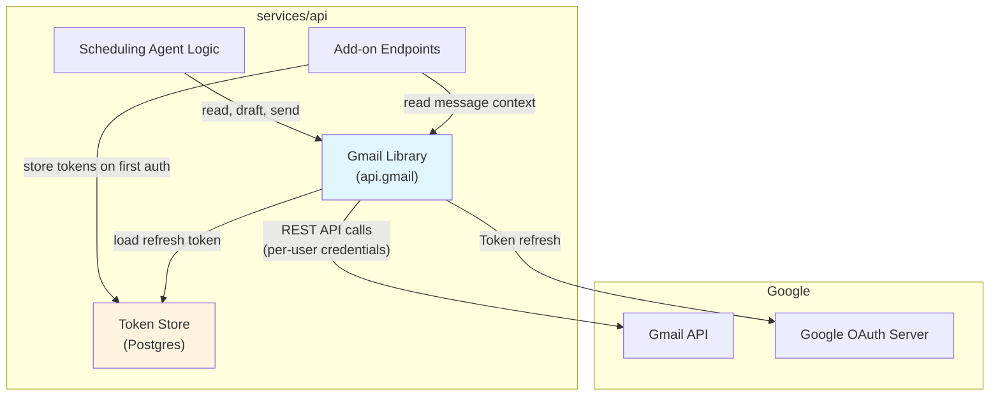
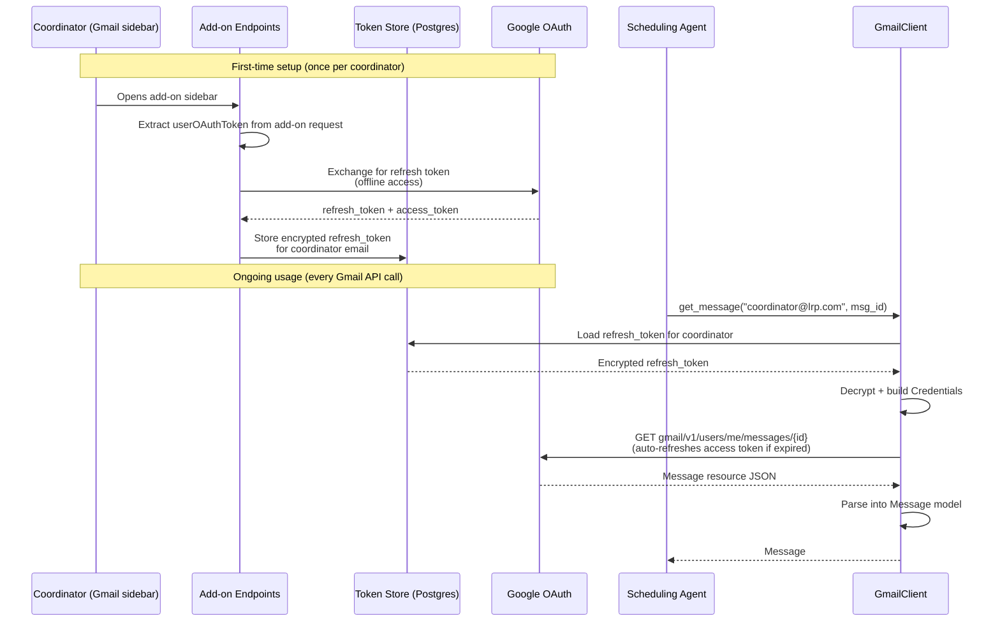

# RFC: Gmail Integration Library

| Field          | Value                                      |
|----------------|--------------------------------------------|
| **Author(s)**  | Kinematic Labs                             |
| **Status**     | Draft                                      |
| **Created**    | 2026-03-30                                 |
| **Updated**    | 2026-03-30                                 |
| **Reviewers**  | LRP Engineering                            |
| **Decider**    | Nim Sadeh                                |

## Context and Scope

The LRP Scheduling Agent needs to interact with Gmail on behalf of coordinators: reading incoming messages to classify scheduling requests, drafting replies for coordinator review, and sending approved emails. Today the backend has no Gmail API integration — the add-on sidebar (RFC: Gmail Workspace Add-on) receives message metadata from Google's add-on framework, but the backend cannot independently read mail, create drafts, or send messages.

This RFC proposes a Gmail integration library within `services/api` that provides these three capabilities via Google's Gmail API with domain-wide delegation. The library is consumed by the scheduling agent logic and the add-on endpoints — it is not a standalone service.

**Scope:** Read mail, create/update drafts, send email — all on behalf of a specified user via service account impersonation. Thread-aware operations (reply-in-thread, draft-in-thread).

**Out of scope:** Gmail push notifications (Pub/Sub watch), label management, attachment handling beyond inline text, batch operations across multiple users.

## Goals

- **G1: Read any message or thread for a delegated user.** Given a user email and a message/thread ID, return parsed message content (sender, recipients, subject, body text, timestamps). Must handle both single messages and full thread retrieval.
- **G2: Create and update drafts on a user's behalf.** Create a draft reply within an existing thread, with correct `In-Reply-To` and `References` headers so Gmail threads it properly. Support updating an existing draft before it's sent.
- **G3: Send email as a user.** Send a draft (promoting it from draft to sent) or send a new message directly. The sent message must appear in the user's Sent folder and thread correctly.
- **G4: Clean async interface.** All Gmail operations are async-first, matching the FastAPI codebase's async patterns. Synchronous Google API client calls are wrapped to avoid blocking the event loop.
- **G5: Testable in isolation.** The library exposes a clear interface that can be tested with recorded API fixtures without hitting Google's servers.

## Non-Goals

- **Gmail push notifications / Pub/Sub watch** — real-time mail watching is a separate concern with its own infrastructure (Pub/Sub topic, webhook endpoint, watch renewal). The scheduling agent will poll or be triggered by add-on interactions, not push notifications. *Rationale:* push introduces operational complexity (watch expiry, Pub/Sub topic management) that isn't needed when the add-on sidebar already triggers on message open.
- **Attachment handling** — scheduling emails are text-based. Supporting file attachments (upload, download, MIME multipart) adds complexity for a use case that doesn't exist. *Rationale:* interview scheduling communication is textual; calendar invites are handled via Calendar API, not email attachments.
- **Batch operations across users** — the library operates on one user at a time. Bulk operations (e.g., "read all unread mail for all coordinators") are not supported. *Rationale:* the agent processes one scheduling thread at a time; cross-user batch reads are an optimization for a scale we don't have.
- **HTML email composition** — drafts and sent messages use plain text. Rich HTML formatting is deferred. *Rationale:* coordinator emails are professional text correspondence, not marketing emails. Plain text is appropriate and simpler to generate from the LLM.

## Background

### Gmail API Authentication Models

Google's Gmail API supports two authentication patterns for server-side access:

1. **OAuth 2.0 with user consent (stored refresh tokens)**: Each user authorizes the app via an OAuth consent flow. The app stores per-user refresh tokens in its database. When the app needs to act on behalf of a user, it exchanges the refresh token for a short-lived access token. Standard for apps that need scoped, per-user access.
2. **Domain-wide delegation via service account**: A Google Workspace admin grants a service account permission to impersonate any user in the domain. No per-user consent needed. The service account can act as *any* user in the organization. Standard for enterprise admin tools and compliance workflows.

Both models are viable for LRP. The critical difference is **blast radius**:
- Domain-wide delegation: a compromised service account key (or a bug in the agent) can read/send email as *any user in the entire LRP domain* — not just coordinators. The scope is organization-wide, controlled only by application-level code.
- Per-user OAuth: the app can only access accounts that have explicitly authorized it. A bug or compromise is limited to those users. The scope is enforced by Google's auth infrastructure, not our code.

For an agent that drafts and sends email on behalf of humans, the per-user model's tighter blast radius is the better default. See Alternatives for the domain-wide delegation trade-off analysis.

### Gmail API Threading Model

Gmail threads messages using the `threadId` field. To reply within a thread:
1. The new message must include `In-Reply-To` and `References` headers pointing to the message being replied to
2. The subject should match (Gmail is forgiving here, but correct subjects ensure clean threading)
3. The `threadId` must be set on the message resource

Drafts are thread-aware: a draft created with a `threadId` will appear as a reply in that thread when sent.

### Async Considerations

Google's official Python client (`google-api-python-client`) uses synchronous HTTP via `httplib2`. In an async FastAPI service, blocking calls must be offloaded to a thread pool to avoid stalling the event loop. The standard pattern is `asyncio.to_thread()` wrapping synchronous API calls.

An alternative is using `aiohttp` with Google's auth credentials directly, but this bypasses the official client's request building, pagination, and error handling — more work for marginal benefit at our scale.

## Proposed Design

### Overview

A `gmail` module within `services/api/src/api/` that provides an async `GmailClient` class. The client uses **per-user OAuth credentials** (stored refresh tokens) rather than domain-wide delegation. Coordinators authorize the app once via the add-on's OAuth consent flow; the backend stores their refresh token in Postgres and uses it for all subsequent Gmail operations — including background tasks when the coordinator isn't actively in the sidebar.

This means the library can only access Gmail for users who have explicitly authorized it, bounding the blast radius to the coordinator pool rather than the entire LRP domain.

### System Context



### Module Structure

```
services/api/src/api/gmail/
├── __init__.py          # Public API: GmailClient
├── client.py            # GmailClient class — async facade
├── auth.py              # OAuth credential loading, token refresh, token storage
├── models.py            # Pydantic models for parsed messages, drafts
└── _transport.py        # Sync→async bridge (to_thread wrappers)
```

### Core Interface

```python
class GmailClient:
    """Async Gmail API client using per-user OAuth credentials."""

    def __init__(self, token_store: TokenStore):
        """Initialize with a token store for loading per-user refresh tokens.

        The token store is backed by Postgres. Each method looks up
        the user's stored credentials, refreshing if needed.
        """

    # --- Read ---
    async def get_message(self, user_email: str, message_id: str) -> Message:
        """Fetch and parse a single message."""

    async def get_thread(self, user_email: str, thread_id: str) -> Thread:
        """Fetch all messages in a thread, ordered chronologically."""

    # --- Draft ---
    async def create_draft(
        self, user_email: str, to: list[str], subject: str, body: str,
        thread_id: str | None = None, in_reply_to: str | None = None,
    ) -> Draft:
        """Create a draft. If thread_id is set, drafts as a reply."""

    async def update_draft(
        self, user_email: str, draft_id: str, to: list[str],
        subject: str, body: str,
    ) -> Draft:
        """Replace the content of an existing draft."""

    async def delete_draft(self, user_email: str, draft_id: str) -> None:
        """Delete a draft."""

    # --- Send ---
    async def send_draft(self, user_email: str, draft_id: str) -> Message:
        """Send an existing draft. Returns the sent message."""

    async def send_message(
        self, user_email: str, to: list[str], subject: str, body: str,
        thread_id: str | None = None, in_reply_to: str | None = None,
    ) -> Message:
        """Compose and send a message directly (no draft step)."""
```

### Data Models

```python
class EmailAddress(BaseModel):
    """Parsed email address with optional display name."""
    name: str | None = None
    email: str

class Message(BaseModel):
    """Parsed Gmail message."""
    id: str
    thread_id: str
    subject: str
    from_: EmailAddress = Field(alias="from")
    to: list[EmailAddress]
    cc: list[EmailAddress] = []
    date: datetime
    body_text: str          # Plain text body (decoded from MIME)
    snippet: str            # Gmail's auto-generated snippet
    label_ids: list[str] = []

class Thread(BaseModel):
    """A Gmail thread with all its messages."""
    id: str
    messages: list[Message]  # Chronologically ordered

class Draft(BaseModel):
    """A Gmail draft."""
    id: str
    message: Message         # The draft message content
```

### Authentication Flow

Token acquisition happens once per coordinator, during their first interaction with the add-on. The add-on's OAuth consent flow produces a refresh token, which the backend stores in Postgres. All subsequent Gmail operations use this stored token.



### Key Design Decisions

**Per-user OAuth over domain-wide delegation:** The most consequential decision in this RFC. Domain-wide delegation (see Alternatives) would be simpler — one service account key, no per-user token management. But it grants the ability to impersonate *any user in the LRP domain*, not just coordinators. A bug in the agent logic, a compromised key, or even a misconfigured `user_email` parameter could read or send email as the CEO, a client-facing partner, or anyone else. With per-user OAuth, the blast radius is bounded by Google's auth infrastructure: the library can only access accounts that have explicitly gone through the consent flow. Application-level bugs cannot escalate to domain-wide access.

**Stored refresh tokens for background access:** The add-on provides a `userOAuthToken` on each sidebar interaction, but the agent needs to operate asynchronously (background draft preparation, thread monitoring). Rather than treating this as a reason to adopt domain-wide delegation, we store the refresh token from the initial OAuth exchange. This gives us persistent, per-user access without the blast radius of domain-wide impersonation. The token store adds a database table and encryption requirement, but the security boundary is worth the complexity.

**Encrypted token storage:** Refresh tokens are encrypted at rest in Postgres using a symmetric key (`GMAIL_TOKEN_ENCRYPTION_KEY` env var). If the database is compromised, the tokens are not directly usable. This is defense-in-depth — the primary protection is that each token only grants access to one user's Gmail.

**Sync wrapper over native async:** We wrap `google-api-python-client`'s synchronous calls in `asyncio.to_thread()` rather than building raw HTTP requests with `aiohttp`. Trade-off: we accept thread pool overhead in exchange for the official client's built-in pagination, error handling, retry logic, and media upload support. At our scale (a handful of coordinators, tens of requests per minute), the thread pool overhead is negligible.

**Pydantic models over raw dicts:** The Gmail API returns deeply nested JSON (MIME headers, body parts, label arrays). Parsing this into typed Pydantic models at the library boundary means consumers (the agent, the add-on routes) work with clean Python objects, not raw dicts with magic string keys. The parsing logic lives in one place and is testable.

**Plain text body extraction:** Gmail messages are MIME structures. The library extracts the `text/plain` part from the message payload. If only `text/html` exists, it falls back to a simple HTML-to-text conversion. This is a pragmatic choice — scheduling emails are text-based, and the agent needs text to reason about, not HTML.

### Credential Management

#### Token Store (Postgres)

A `gmail_tokens` table stores encrypted refresh tokens per coordinator:

```sql
CREATE TABLE gmail_tokens (
    user_email   TEXT PRIMARY KEY,
    refresh_token_encrypted  BYTEA NOT NULL,
    scopes       TEXT[] NOT NULL,
    created_at   TIMESTAMPTZ NOT NULL DEFAULT now(),
    updated_at   TIMESTAMPTZ NOT NULL DEFAULT now()
);
```

#### Token Lifecycle

1. **Acquisition:** When a coordinator first interacts with the add-on, the backend receives their `userOAuthToken`. The backend exchanges this for a refresh token (requesting `access_type=offline`) and stores it encrypted.
2. **Usage:** For each Gmail API call, `auth.py` loads the encrypted refresh token from Postgres, decrypts it, and builds a `google.oauth2.credentials.Credentials` object. The `google-auth` library handles access token refresh automatically.
3. **Revocation:** If a coordinator is removed or deauthorizes the app, the stored token becomes invalid. The library detects this (`GmailAuthError`) and removes the stale token.

```python
# auth.py sketch
SCOPES = ["https://www.googleapis.com/auth/gmail.modify"]

class TokenStore:
    """Encrypted per-user refresh token storage in Postgres."""

    def __init__(self, db_pool, encryption_key: bytes): ...

    async def store_token(self, user_email: str, refresh_token: str, scopes: list[str]) -> None:
        """Encrypt and store a refresh token for a user."""

    async def load_credentials(self, user_email: str) -> Credentials:
        """Load and decrypt a user's refresh token, return as google Credentials."""

    async def delete_token(self, user_email: str) -> None:
        """Remove a user's stored token (deauthorization or cleanup)."""

    async def has_token(self, user_email: str) -> bool:
        """Check if a user has stored credentials."""
```

#### Encryption

Refresh tokens are encrypted with Fernet (symmetric, from Python's `cryptography` library) using `GMAIL_TOKEN_ENCRYPTION_KEY`. The key is stored as an environment variable, not in the database. This ensures database compromise alone does not expose usable tokens.

### Error Handling

The library raises domain-specific exceptions, not raw Google API errors:

| Exception | When | Consumer action |
|-----------|------|-----------------|
| `GmailAuthError` | Refresh token invalid, revoked, or encryption key mismatch | Prompt coordinator to re-authorize via add-on |
| `GmailUserNotAuthorizedError` | No stored token for this user — they haven't completed the OAuth flow yet | Return "please open the add-on to authorize" |
| `GmailNotFoundError` | Message/thread/draft ID doesn't exist | Handle gracefully — message may have been deleted |
| `GmailRateLimitError` | Gmail API quota exceeded | Retry with backoff |
| `GmailApiError` | Any other Gmail API error | Log and surface to caller |

### Integration with Existing Codebase

The `GmailClient` and `TokenStore` are instantiated in `main.py`'s lifespan context and stored on `app.state`:

```python
@asynccontextmanager
async def lifespan(app: FastAPI):
    from api.gmail import GmailClient
    from api.gmail.auth import TokenStore

    token_store = TokenStore(db_pool=app.state.db, encryption_key=os.environ["GMAIL_TOKEN_ENCRYPTION_KEY"])
    app.state.gmail = GmailClient(token_store)
    yield
```

Add-on routes and agent logic access it via `request.app.state.gmail`. This follows the FastAPI pattern already established in the codebase (lifespan for resource initialization).

### Dependencies

New `pyproject.toml` additions:

```toml
"google-api-python-client>=2.0",   # Gmail API client
"google-auth-httplib2>=0.2.0",     # httplib2 transport for google-auth
"cryptography>=44.0",              # Fernet encryption for stored tokens
```

`google-auth` is already a dependency. `cryptography` is a well-maintained, widely-used library.

## Alternatives Considered

### Alternative 1: Domain-Wide Delegation via Service Account

Instead of per-user OAuth with stored tokens, use a single service account with domain-wide delegation. The Workspace admin grants the service account permission to impersonate any user in the LRP domain. No per-user token storage needed.

**Trade-offs:**
- **Pro:** Simpler implementation — no token store, no encryption, no per-user OAuth flow. One service account key serves all users.
- **Pro:** No "first-time authorization" step — the library works for any user immediately.
- **Pro:** No risk of token expiry or revocation — the service account's access is always available.
- **Con: Unbounded blast radius.** The service account can impersonate *any user in the LRP domain*, not just coordinators. A bug in the agent's `user_email` parameter, a compromised key, or a logic error could read or send email as any employee — partners, executives, legal, finance. The only thing preventing this is application code, not Google's auth boundary.
- **Con:** If we add application-level authorization checks (e.g., "only allow impersonation of users in the coordinators list"), we're reimplementing an access control layer that Google's OAuth already provides. And our application-level checks are less auditable, less battle-tested, and easier to bypass than Google's.
- **Con:** Security review burden — explaining to LRP's IT/admin why a service account needs domain-wide Gmail access is a harder conversation than "coordinators authorize the app themselves."

**Why not:** The blast radius concern is decisive. For an agent that drafts and sends email on behalf of humans — where the core constraint is "no autonomous sending without approval" — the auth model should be the *tightest possible boundary*, not the most convenient one. Per-user OAuth makes the boundary a property of Google's infrastructure rather than our application logic. If the agent has a bug that tries to send as the wrong user, the API call fails with a 403 instead of succeeding silently.

### Alternative 2: Lightweight HTTP Client (aiohttp + raw Gmail REST API)

Instead of wrapping `google-api-python-client`, build a thin async client that calls the Gmail REST API directly using `aiohttp` with Google auth credentials.

**Trade-offs:**
- **Pro:** Native async — no `to_thread()` wrappers. Slightly less overhead per request.
- **Pro:** Fewer dependencies (drop `google-api-python-client` and `google-auth-httplib2`).
- **Con:** Must manually construct API URLs, handle pagination (`nextPageToken`), parse error responses, implement retry logic, and manage media uploads.
- **Con:** Must keep up with Gmail API changes (new fields, deprecated endpoints) instead of relying on Google's client to handle them.
- **Con:** More code to maintain and more surface area for bugs.

**Why not:** The engineering cost of reimplementing what `google-api-python-client` already provides is not justified by the marginal performance gain. At our scale (single-digit concurrent users), the thread pool overhead of `to_thread()` is unmeasurable. The official client is battle-tested and handles edge cases (exponential backoff, chunked uploads, discovery document caching) that we'd otherwise need to implement ourselves.

### Do Nothing / Status Quo

The backend has no Gmail API integration. The add-on sidebar can display message metadata from Google's add-on framework, but the agent cannot read message bodies, draft replies, or send emails.

**What happens:** The scheduling agent cannot function. The entire value proposition — reading scheduling requests, drafting coordinator emails, sending approved responses — requires Gmail API access. Without it, the agent is a backend with no way to interact with the email workflows it's designed to automate. This is not a deferrable feature; it's the core infrastructure the agent runs on.

## Success and Failure Criteria

### Definition of Success

| Criterion | Metric | Target | Measurement Method |
|-----------|--------|--------|--------------------|
| Read any message | Service account can fetch message body for a delegated user | Works for all coordinator accounts | Integration test against real Gmail API |
| Read full thread | Thread retrieval returns all messages in chronological order | 100% of messages in thread returned | Integration test with multi-message threads |
| Create draft in thread | Draft appears in user's Drafts folder, threaded correctly | Draft visible in Gmail UI, in correct thread | Manual verification in Gmail |
| Update existing draft | Draft content changes without creating a duplicate | Single draft with updated content in Gmail UI | Manual verification |
| Send draft | Draft moves to Sent, appears in thread, recipients receive it | Email received by test recipient within 60s | End-to-end test with test accounts |
| Send direct message | Message appears in Sent and is received | Email received by test recipient within 60s | End-to-end test |
| Threading correctness | Replies appear in the correct Gmail thread | 100% of replies thread correctly | Manual verification in Gmail UI |
| Async non-blocking | Gmail API calls do not block the FastAPI event loop | Other endpoints respond normally during Gmail ops | Load test: concurrent health checks during Gmail operations |

### Definition of Failure

- **OAuth consent flow cannot be configured** for the add-on — if Google's add-on framework doesn't support `access_type=offline` or the Workspace admin blocks the required scopes, we cannot obtain refresh tokens. Would require falling back to domain-wide delegation (with explicit application-level access controls).
- **Gmail API latency exceeds 5 seconds p95** for message reads — would make the agent feel unresponsive and stall scheduling workflows. May indicate scope creep in what we're fetching per call.
- **Threading breaks for reply chains > 5 messages** — would mean our `In-Reply-To`/`References` header construction is flawed, causing replies to fork into new threads. This would confuse coordinators who expect a single thread.
- **`gmail.modify` scope is insufficient** for any required operation — would mean we need a broader scope, requiring re-evaluation of the security posture.

## Observability and Monitoring Plan

| Metric | Source | Dashboard/Alert | Linked Success Criterion |
|--------|--------|-----------------|--------------------------|
| Gmail API call latency (p50, p95, p99) | Sentry performance spans | Sentry Performance | Async non-blocking; API latency < 5s |
| Gmail API error rate by operation | Sentry + structured logs | Sentry Issues | All read/draft/send criteria |
| Gmail API quota usage | Structured logs (count per user per minute) | Log aggregation | Send/read reliability |
| Delegation auth failures | `GmailUserError` exception count | Sentry alert on any occurrence | Read/draft/send for all coordinators |
| Draft-to-send conversion rate | Application logs | Custom Sentry metric | Create draft + send draft flow |
| Thread-miss rate (reply created new thread) | Manual QA initially; future: automated check | QA checklist | Threading correctness |

### Structured Logging

Every Gmail API call logs:
- Operation (`read_message`, `create_draft`, `send_draft`, etc.)
- User email (who we're impersonating)
- Target ID (message_id, thread_id, draft_id)
- Latency (ms)
- Success/failure + error type if failed

### Sentry Integration

Gmail API calls are wrapped in Sentry spans for distributed tracing. This connects Gmail latency to the overall request (e.g., "add-on on-message took 4s, of which 3.2s was Gmail API").

## Cross-Cutting Concerns

### Security

**Stored refresh tokens:** Each coordinator's refresh token grants access to their Gmail. Tokens are encrypted at rest (Fernet) using `GMAIL_TOKEN_ENCRYPTION_KEY`. Compromise requires both the database contents *and* the encryption key. Tokens are scoped to `gmail.modify` — they cannot modify Gmail settings, manage filters, or access other Google services.

**Blast radius:** The per-user OAuth model ensures the library can only access Gmail accounts that have explicitly authorized the app. If the agent has a bug or is compromised, the impact is limited to authorized coordinators — it cannot access other LRP employees' email. This is enforced by Google's auth infrastructure, not our application code.

**Scope minimization:** We request `gmail.modify` (read + compose + send + modify labels) rather than broader scopes. We explicitly do **not** request `gmail.settings.basic` or `gmail.settings.sharing` — the agent has no business modifying user Gmail settings.

**Per-user audit trail:** Every Gmail API call logs which user's credentials are being used. Combined with the per-user auth model, this creates a clear audit trail of what the agent did on behalf of which coordinator.

**Token revocation:** If a coordinator leaves LRP or wants to deauthorize the app, their token can be revoked via Google's account settings or deleted from the token store. No other user's access is affected.

### Privacy

The library reads email bodies. Message content is processed in-memory for agent reasoning (classifying requests, extracting availability) and is not persisted to the database beyond thread-level metadata (thread ID, state, timestamps). Full message bodies are not stored.

### Testing Strategy

**Unit tests:** Mock the Google API client at the `_transport.py` boundary. Test that `GmailClient` methods correctly parse Gmail API responses into Pydantic models, construct MIME messages correctly, and handle error responses.

**Integration tests:** Run against the real Gmail API with a test service account and test Workspace user. These tests are gated behind a `GMAIL_INTEGRATION_TEST` environment variable and are not run in CI by default (they require credentials and a real Workspace).

**Manual test scenarios:** See appendix — a checklist for a human tester to verify the library works end-to-end with real Gmail.

## Open Questions

- **Can the add-on OAuth flow produce a refresh token?** Google Workspace Add-ons provide a `userOAuthToken` — we need to confirm this can be exchanged for an offline refresh token, or whether we need a separate OAuth consent flow (e.g., via `OpenLink` to a consent page). If the add-on token flow doesn't support offline access, this is a critical blocker for the per-user approach. — **Investigate during implementation spike.**
- **GCP OAuth client configuration:** The per-user OAuth model requires an OAuth client ID (not just a service account). The GCP project needs an "Internal" OAuth consent screen with the `gmail.modify` scope approved. — **LRP admin to configure.**
- **Should we support CC/BCC on drafts and sends?** The current interface supports `to` only. CC is common in scheduling emails (e.g., CC'ing a recruiter). BCC is less common. — **Confirm with coordinator workflow.**
- **Token encryption key rotation:** If `GMAIL_TOKEN_ENCRYPTION_KEY` needs to be rotated, all stored tokens must be re-encrypted. Should we support key rotation from day one (envelope encryption) or handle it as a manual migration? — **Decide during implementation.**
- **Rate limiting strategy:** Gmail API has a per-user rate limit of 250 quota units per second. A single message read is 5 units; a send is 100 units. At our scale this is unlikely to be an issue, but should we implement client-side rate limiting proactively or wait until we hit limits? — **Decide during implementation.**

## Appendix: Manual Test Scenarios

These scenarios are designed for a human tester with access to the LRP Google Workspace and the deployed service.

### Prerequisites

- Service account with domain-wide delegation configured
- `GOOGLE_SERVICE_ACCOUNT_KEY` environment variable set
- At least two test accounts: `tester-a@longridgepartners.com` (the coordinator) and `tester-b@longridgepartners.com` (simulating a recruiter or external party)
- The API service running locally (`./scripts/dev-api.sh`)

### Scenario 1: Read a Single Message

| Step | Action | Expected Result |
|------|--------|-----------------|
| 1 | From tester-b, send an email to tester-a with subject "Test Read" and body "Hello, this is a test." | Email arrives in tester-a's inbox |
| 2 | Note the message ID from Gmail (or use the API to list messages) | — |
| 3 | Call `gmail.get_message("tester-a@lrp.com", message_id)` | Returns `Message` with correct subject, from, to, body_text |
| 4 | Verify `body_text` contains "Hello, this is a test." | Body is decoded correctly |
| 5 | Verify `from_.email` is tester-b's address | Sender parsed correctly |

### Scenario 2: Read a Full Thread

| Step | Action | Expected Result |
|------|--------|-----------------|
| 1 | tester-b sends email to tester-a: "Interview request for Candidate X" | Thread started |
| 2 | tester-a replies: "Let me check availability" | Thread has 2 messages |
| 3 | tester-b replies: "Thanks, here are my available times" | Thread has 3 messages |
| 4 | Call `gmail.get_thread("tester-a@lrp.com", thread_id)` | Returns `Thread` with 3 messages in chronological order |
| 5 | Verify messages[0] is the original, messages[2] is the latest | Order is correct |

### Scenario 3: Create a Draft Reply

| Step | Action | Expected Result |
|------|--------|-----------------|
| 1 | Use thread from Scenario 2 | — |
| 2 | Call `gmail.create_draft("tester-a@lrp.com", to=["tester-b@lrp.com"], subject="Re: Interview request for Candidate X", body="How about Tuesday at 2pm?", thread_id=thread_id, in_reply_to=last_message_id)` | Returns `Draft` with an ID |
| 3 | Open tester-a's Gmail, check Drafts folder | Draft appears, inside the correct thread |
| 4 | Click on the thread | Draft shows as a reply, not a new message |
| 5 | Verify draft content is "How about Tuesday at 2pm?" | Content matches |

### Scenario 4: Update an Existing Draft

| Step | Action | Expected Result |
|------|--------|-----------------|
| 1 | Use draft from Scenario 3 | — |
| 2 | Call `gmail.update_draft("tester-a@lrp.com", draft_id, to=["tester-b@lrp.com"], subject="Re: Interview request for Candidate X", body="Actually, how about Wednesday at 3pm?")` | Returns updated `Draft` |
| 3 | Check tester-a's Drafts in Gmail | Draft content is now "Actually, how about Wednesday at 3pm?" |
| 4 | Verify there is only one draft, not two | Update replaced, didn't duplicate |

### Scenario 5: Send a Draft

| Step | Action | Expected Result |
|------|--------|-----------------|
| 1 | Use draft from Scenario 4 | — |
| 2 | Call `gmail.send_draft("tester-a@lrp.com", draft_id)` | Returns sent `Message` |
| 3 | Check tester-a's Sent folder | Message appears in Sent, within the thread |
| 4 | Check tester-b's inbox | Email received from tester-a with correct content |
| 5 | Check tester-a's Drafts | Draft is gone (consumed by send) |
| 6 | Open the thread in tester-a's Gmail | Sent message appears as part of the thread |

### Scenario 6: Send a Direct Message (No Draft)

| Step | Action | Expected Result |
|------|--------|-----------------|
| 1 | Call `gmail.send_message("tester-a@lrp.com", to=["tester-b@lrp.com"], subject="New scheduling thread", body="Starting a new thread for scheduling.")` | Returns sent `Message` |
| 2 | Check tester-a's Sent folder | Message appears |
| 3 | Check tester-b's inbox | Email received |

### Scenario 7: Threading Correctness Under Stress

| Step | Action | Expected Result |
|------|--------|-----------------|
| 1 | Create a thread with 5+ back-and-forth messages between tester-a and tester-b | Long thread exists |
| 2 | Use the library to draft a reply to the latest message | Draft is in the thread |
| 3 | Send the draft | Sent message is in the thread |
| 4 | Have tester-b reply to the sent message | tester-b's reply is also in the same thread |
| 5 | Verify the entire conversation is a single thread in both inboxes | No thread forking |

### Scenario 8: Error Cases

| Step | Action | Expected Result |
|------|--------|-----------------|
| 1 | Call `get_message` with a non-existent message ID | Raises `GmailNotFoundError` |
| 2 | Call `send_draft` with an already-sent draft ID | Raises `GmailNotFoundError` (draft consumed) |
| 3 | Call any method with a user email not in the Workspace domain | Raises `GmailUserError` |
| 4 | Set an invalid service account key and call any method | Raises `GmailAuthError` |
| 5 | Call `delete_draft` then `send_draft` with the same draft ID | Delete succeeds, send raises `GmailNotFoundError` |
