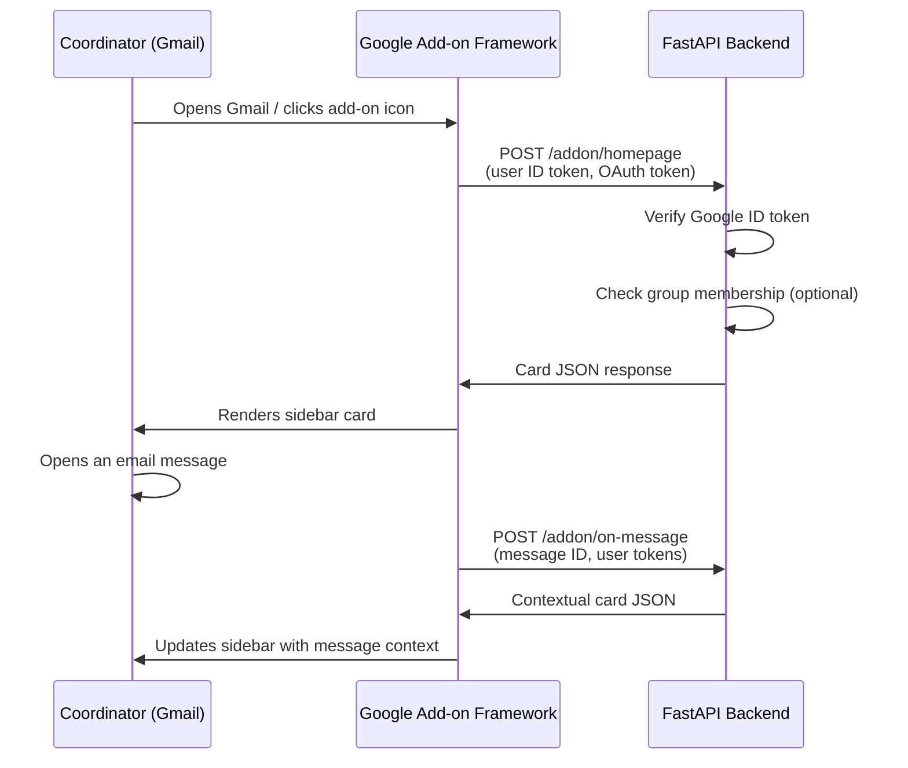
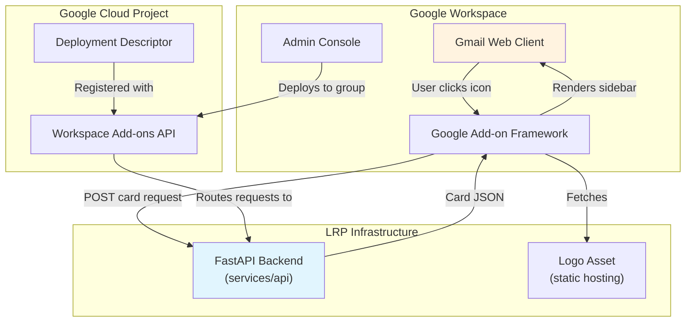
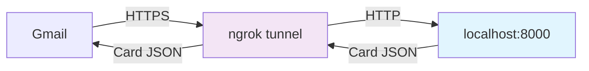

# RFC: Gmail Workspace Add-on — Sidebar MVP

| Field          | Value                                      |
|----------------|--------------------------------------------|
| **Author(s)**  | Kinematic Labs                             |
| **Status**     | Draft                                      |
| **Created**    | 2026-03-30                                 |
| **Updated**    | 2026-03-30                                 |
| **Reviewers**  | LRP Engineering, LRP Coordinator team      |
| **Decider**    | Nadav Sadeh                                |

## Context and Scope

Long Ridge Partners is building a human-in-the-loop scheduling agent that helps coordinators manage interview scheduling through Gmail. The approved proposal ([scheduling-proposal.md](../references/scheduling-proposal.md)) specifies a Gmail Workspace Add-on as the sole user interface — a sidebar that displays draft emails, status information, and action buttons when coordinators interact with scheduling threads.

This RFC covers the first deliverable: a minimal Gmail sidebar add-on that appears for authorized users, displays the LRP branding, and proves the end-to-end integration between Gmail, the add-on framework, and our FastAPI backend. It does **not** cover the scheduling agent logic, email drafting, or status board — those build on top of this foundation.

## Goals

- **G1: Sidebar appears in Gmail for authorized users.** Members of a configured Google Group see the LRP Scheduling Agent icon in Gmail's right-hand sidebar. Non-members do not.
- **G2: Sidebar displays branding and placeholder content.** Clicking the icon opens a sidebar panel showing the LRP logo, the title "LRP Scheduling Agent," and static placeholder text.
- **G3: Sidebar responds to message context.** When a coordinator has a message open, the sidebar displays the subject line of that message, proving the contextual trigger pipeline works end-to-end.
- **G4: Backend serves add-on card responses from our FastAPI service.** All card rendering happens in our Python backend, not in Apps Script, establishing the pattern for all future add-on features.

## Non-Goals

- **Email drafting or agent logic** — this is the UI shell only. Agent intelligence comes in a later phase. We need to prove the delivery mechanism before building the payload.
- **Status board tab** — the proposal describes a two-tab sidebar (drafts + status board). This RFC covers only the single-card homepage. Tabs add UI complexity without validating the integration.
- **Marketplace publishing** — the add-on will be deployed as a developer test deployment, installed via `gcloud` CLI and Admin Console. Publishing to the Workspace Marketplace involves a review process that is premature for an MVP.
- **Production hosting** — the backend will run locally with ngrok (or equivalent tunnel) during development. Railway deployment is a separate concern.

## Background

### Google Workspace Add-on Architecture

Google Workspace Add-ons come in two flavors:

1. **Apps Script-based**: Code runs in Google's Apps Script runtime (JavaScript-like). Simple to start but locked into Google's environment — no access to your own infrastructure, libraries, or databases.
2. **HTTP-based (alternative runtimes)**: Your backend is any HTTPS service. Google POSTs JSON to your endpoints, you return card JSON, Google renders it in the sidebar. This model was introduced to support add-ons built in any language.

In both models, the **frontend UI is identical** — Google renders a card-based sidebar from JSON. The difference is where the backend logic lives.

### How an HTTP Add-on Request Flows



### Card-based UI Model

The sidebar UI is built from **Google's Card v2 framework** — a declarative JSON format supporting headers, text paragraphs, images, buttons, text inputs, selection inputs, and dividers. Cards are organized into sections and support navigation (push/pop card stacks). There is no custom HTML, CSS, or JavaScript — all rendering is controlled by Google based on the card JSON.

This is a significant constraint: the sidebar cannot display arbitrary web content. All UI must be expressible as card widgets. Key limitations for future phases:

- **No push updates.** The sidebar only refreshes on user actions (button clicks, opening a new message). No WebSocket/SSE. Status data is recalculated server-side on each interaction.
- **No custom JS/HTML/CSS.** Google explicitly prohibits it. The only escape hatch is `OpenLink` to open a new browser tab.
- **Minimal color control.** Button backgrounds can be colored (RGB). Text can be colored via `<font color>` HTML tags. Card/section/header backgrounds cannot be customized.
- **No tables or timers.** Grouped lists via collapsible sections work well. Sortable tables require re-rendering via button callbacks. Live countdown timers are not possible (static server-calculated values only).

The proposed UI from the scheduling proposal (draft display, action buttons, status board with grouped lists, overdue indicators) **is achievable** within these constraints. The card framework's widget set — `TextParagraph`, `DecoratedText`, `ButtonList`, collapsible `CardSection`, Material Icons — covers the core UX. If we ever need richer interactivity, `OpenLink` can open a full web view in a separate tab.

## Proposed Design

### Overview

We add a set of `/addon/*` routes to the existing FastAPI backend. These routes accept POST requests from Google's add-on framework, verify the caller's identity, and return card JSON. A deployment descriptor registered with Google's Workspace Add-ons API points Google at these routes. Access control uses two layers: the Google Workspace admin deploys the add-on to a specific Google Group, and the backend optionally verifies group membership as defense-in-depth.

No new services are created. The add-on endpoints are part of `services/api`.

### System Context Diagram



### Detailed Design

#### FastAPI Routes

Three new routes under `/addon/`:

| Route | Trigger | Purpose |
|-------|---------|---------|
| `POST /addon/homepage` | User clicks add-on icon (no message open) | Returns branded homepage card with LRP logo and placeholder text |
| `POST /addon/on-message` | User has an email message open | Returns contextual card showing the message subject line |
| `POST /addon/action` | User clicks a button in the sidebar | Future-proofing: handles interactive actions. For MVP, unused. |

**Request verification**: Every request from Google includes an `Authorization: Bearer <id_token>` header. The backend verifies this token using Google's `google-auth` library to confirm the request originates from Google and identifies the calling user. Unverified requests receive a 401. Verification is implemented as a **FastAPI dependency on the `/addon/` router**, not per-handler — this ensures every add-on route is protected automatically and new routes cannot accidentally skip verification.

```python
# Router-level dependency handles token verification for all /addon/* routes
addon_router = APIRouter(prefix="/addon", dependencies=[Depends(verify_google_token)])
```

**Card response format**: Routes return JSON conforming to Google's `RenderActions` schema:

```python
# Sketch — not final implementation
@addon_router.post("/homepage")
async def addon_homepage(user: GoogleUser = Depends(get_current_addon_user)) -> dict:
    return {
        "action": {
            "navigations": [{
                "pushCard": {
                    "header": {
                        "title": "LRP Scheduling Agent",
                        "imageUrl": LOGO_URL,
                        "imageType": "CIRCLE"
                    },
                    "sections": [{
                        "widgets": [{
                            "textParagraph": {
                                "text": f"Welcome, {user_email}. The scheduling agent is active."
                            }
                        }]
                    }]
                }
            }]
        }
    }
```

#### Deployment Descriptor

Registered via the Google Workspace Add-ons API (`gsuiteaddons.googleapis.com`):

```json
{
    "oauthScopes": [
        "https://www.googleapis.com/auth/gmail.addons.execute",
        "https://www.googleapis.com/auth/gmail.addons.current.message.metadata"
    ],
    "addOns": {
        "common": {
            "name": "LRP Scheduling Agent",
            "logoUrl": "https://<backend-host>/static/logo.png",
            "homepageTrigger": {
                "runFunction": "https://<backend-host>/addon/homepage"
            }
        },
        "gmail": {
            "contextualTriggers": [{
                "unconditional": {},
                "onTriggerFunction": {
                    "runFunction": "https://<backend-host>/addon/on-message"
                }
            }]
        }
    }
}
```

The `<backend-host>` is the publicly accessible HTTPS URL for the backend (ngrok tunnel during development, Railway domain in production).

#### Access Control

**Layer 1 — Admin Console deployment (primary):** The Google Workspace admin installs the add-on and scopes it to a specific Google Group (e.g., `scheduling-agent-testers@longridgepartners.com`). Only members of this group see the add-on icon in Gmail. This is the standard, Google-recommended approach.

**Layer 2 — Backend group check (defense-in-depth):** The backend can optionally call the Google Directory API to verify the requesting user is a member of the authorized group before returning cards. If the check fails, it returns a "Not authorized" card instead of a 403 (since the add-on framework expects card responses, not HTTP errors).

The group identifier is configured via the `LRP_ADDON_GROUP_EMAIL` environment variable.

**Why two layers:** Admin Console deployment is the right primary control — it's what Google designed and what Workspace admins expect. Backend verification adds defense-in-depth for the case where Admin Console scoping is misconfigured or someone has direct access to the backend URLs. The cost is one additional API call per request (cacheable per user for the session duration).

#### Logo Hosting

The LRP logo needs to be accessible via a public HTTPS URL for the deployment descriptor's `logoUrl` field and for the card header's `imageUrl`. Two options:

- **Serve from the FastAPI backend** via a `/static/` mount. Simple, one fewer moving part, but ties logo availability to backend uptime.
- **Serve from a CDN/object storage.** More resilient but adds infrastructure for a single static file.

For MVP, we serve from the FastAPI backend at `/static/logo.png`. The logo file (provided by LRP) will be stored in `services/api/static/`.

#### Google Cloud Project Setup

Required one-time setup (manual, not automated):

1. Create a GCP project (or use LRP's existing one)
2. Enable the **Google Workspace Add-ons API** (`gsuiteaddons.googleapis.com`)
3. Configure the **OAuth consent screen** as "Internal" (domain-only)
4. Register the deployment descriptor via `gcloud workspace-add-ons deployments create`
5. Install for testing via `gcloud workspace-add-ons deployments install`
6. Admin Console: scope the add-on to the test Google Group

#### Local Development Workflow



Developers run the FastAPI backend locally (`./scripts/dev-api.sh`) and expose it via ngrok. The deployment descriptor is updated to point at the ngrok URL. This is a Google-documented development pattern for HTTP-based add-ons.

### Key Trade-offs

**HTTP-based add-on over Apps Script:** We gain the ability to use Python, our existing FastAPI codebase, our database, and our AI libraries. We lose the zero-config simplicity of Apps Script (no server to run, no HTTPS to manage, no token verification to implement). This is the right trade-off because the scheduling agent's backend logic (email classification, draft generation, Encore integration) must live in Python — an Apps Script add-on would need to call our backend anyway, adding an unnecessary hop.

**Routes in existing API service over separate add-on microservice:** We gain simplicity (one service to deploy, one codebase to maintain, shared database access). We lose independent scaling and deployment of the add-on endpoints. For an add-on serving a handful of coordinators, independent scaling is irrelevant. If add-on traffic ever becomes a concern, extracting the routes into a separate service is straightforward.

**Two-layer access control over admin-only:** We gain defense-in-depth at the cost of one cacheable API call per user session. Given that misdirected access to the scheduling agent could expose interview scheduling data, the additional verification is worth the small latency cost.

## Alternatives Considered

### Alternative 1: Apps Script Add-on Calling Our Backend

Build the add-on in Google Apps Script. The Apps Script code handles the Gmail sidebar UI and calls our FastAPI backend for any data or logic.

**Trade-offs:** Simpler initial setup (no token verification, no ngrok, built-in deployment). But creates a two-hop architecture: Gmail → Apps Script → FastAPI → Apps Script → Gmail. Every UI change requires editing Apps Script code in Google's web editor, separate from our main codebase. Testing requires the Apps Script debugger, not our pytest suite. Version control and CI/CD for Apps Script is awkward (clasp CLI exists but is a second-class citizen).

**Why not:** The extra hop adds latency and complexity without benefit. Since all business logic lives in Python, the Apps Script layer becomes a pass-through that we'd need to maintain in a separate language, editor, and deployment pipeline. The HTTP-based approach eliminates this intermediary entirely.

### Alternative 2: Chrome Extension Instead of Workspace Add-on

Build a Chrome extension that injects a sidebar into Gmail's web interface using DOM manipulation.

**Trade-offs:** Full control over UI (custom HTML/CSS/JS, not limited to Google's card framework). No dependency on Google's Add-on framework or API. But: fragile — Gmail's DOM changes without notice, breaking extensions. No access to Google's contextual triggers (message metadata). Requires each user to install a Chrome extension manually. Cannot be centrally managed via Admin Console. Violates Gmail's Terms of Service for enterprise Workspace accounts.

**Why not:** Chrome extensions are fragile, unmanageable at the enterprise level, and cannot access the contextual message data we need. The card framework's UI constraints are acceptable for our use case (scheduling information, draft text, action buttons).

### Do Nothing / Status Quo

Coordinators continue scheduling interviews manually — tracking threads mentally, composing emails from scratch, updating Calendar and Encore by hand. The agent project stalls at the backend with no user-facing integration point.

**What happens:** The backend scheduling logic has no delivery mechanism. Even if the agent can classify emails and draft responses, there's no way for coordinators to see or approve them. The project cannot deliver value without a UI, and the Gmail sidebar is the UI specified in the approved proposal. Delaying this work delays the entire project.

## Success and Failure Criteria

### Definition of Success

| Criterion | Metric | Target | Measurement Method |
|-----------|--------|--------|--------------------|
| Sidebar visibility | Add-on icon appears in Gmail for test group members | 100% of test group members see the icon | Manual verification by each test user |
| Sidebar load time | Time from icon click to sidebar rendered | < 3 seconds | Chrome DevTools network panel / backend request logs |
| Contextual trigger | Message subject appears in sidebar when email is open | Works for all standard email threads | Manual testing across 10+ email threads |
| Access control | Non-group members cannot see the add-on | 0% visibility for non-members | Manual verification with a non-member account |
| Backend stability | Add-on endpoints return valid card JSON | 0 errors in test session | Sentry + backend request logs |

### Definition of Failure

- **Sidebar does not appear** for any test group member after following the setup instructions — indicates a fundamental issue with our GCP project configuration or deployment descriptor.
- **Card responses take > 5 seconds** consistently — Gmail's add-on framework has a ~30s timeout, but anything over 5s is a poor user experience that would be unacceptable for the full agent.
- **Token verification cannot be implemented reliably** — if Google's token format or verification mechanism doesn't work as documented, the entire HTTP-based add-on approach is in question.
- **Google's card framework cannot display the UI elements we need** for future phases (draft text, edit buttons, status lists) — would force a reassessment of the add-on approach.

### Evaluation Timeline

- **T+1 day (after setup):** Verify sidebar appears for test group member, does not appear for non-member. Verify contextual trigger fires with message metadata.
- **T+1 week:** Full test with 2-3 coordinators using the sidebar in their daily Gmail workflow. Collect qualitative feedback on sidebar behavior and responsiveness.

## Observability and Monitoring Plan

### Metrics

| Metric | Source | Dashboard/Alert | Threshold for Alert |
|--------|--------|-----------------|---------------------|
| Add-on request latency (p95) | FastAPI request logs | Sentry Performance | > 3s for 5 minutes |
| Add-on error rate | Sentry | Sentry Issues | Any 5xx response |
| Token verification failures | Application logs | Sentry | > 0 in test period (unexpected) |
| Group membership check failures | Application logs | Sentry | > 0 for known group members |

### Logging

All `/addon/*` requests are logged with:
- User email (from verified ID token)
- Trigger type (homepage vs contextual)
- Response time
- Message ID (for contextual triggers, for debugging — not message content)

Logs are structured JSON via Python's standard logging. Retention follows the API service's default policy.

### Alerting

During MVP, alerts go to the development team via Sentry. No on-call rotation — this is a test deployment. If the add-on is down, coordinators fall back to manual scheduling (the status quo).

## Cross-Cutting Concerns

### Security

**Attack surface:** The `/addon/*` endpoints are publicly accessible HTTPS URLs. Without token verification, anyone could POST card requests and receive responses.

**Mitigation:** Every request is authenticated by verifying the Google ID token in the Authorization header. The `google-auth` library validates the token's signature, issuer (`accounts.google.com`), and audience (our GCP project's client ID). Requests with invalid or missing tokens receive a 401.

**Scope of access:** The add-on requests only `gmail.addons.execute` and `gmail.addons.current.message.metadata` scopes. It cannot read email bodies, send emails, or access other Gmail data. This is the minimum scope needed for the sidebar to function.

### Privacy

The add-on receives **message metadata only** (subject, sender, message ID) — not email bodies or attachments. The backend does not store message content. User emails are logged for request tracking and access control verification.

No data from this add-on is sent to Anthropic or any third party. The LLM integration (for draft generation in future phases) is a separate concern with its own privacy review.

### Rollout and Rollback

**Rollout:** Developer test deployment via `gcloud` CLI. Admin Console scoping to a test Google Group. No impact on users outside the group.

**Rollback:** `gcloud workspace-add-ons deployments delete` removes the add-on entirely. Admin Console can also revoke access. Since the add-on is an overlay with no data writes, removal has zero side effects.

## Open Questions

- **Which GCP project to use?** Does LRP have an existing Google Cloud project, or do we need to create one? The project must be owned by an LRP Workspace admin to enable domain-wide features. — **LRP admin to confirm.**
- **Admin Console access:** Who on the LRP side will manage add-on deployment and group membership in the Admin Console? We need an admin to scope the add-on to the test group after initial setup. — **LRP to designate.**
- **Logo format and size:** Google's card framework has specific requirements for logo images (recommended 96x96px for sidebar icons). The provided logo may need to be adapted. — **Kinematic to prepare assets.**
- **Ngrok vs. Cloudflare Tunnel for development:** Both work for exposing the local backend. Ngrok has a simpler setup; Cloudflare Tunnel has stable URLs on free tier (avoids re-registering the deployment descriptor on each restart). — **Development team to decide during implementation.**

## Milestones and Timeline

| Phase | Description | Estimated Duration |
|-------|-------------|--------------------|
| Phase 1 | GCP project setup, Workspace Add-ons API enabled, OAuth consent screen configured | 1 session (requires LRP admin) |
| Phase 2 | FastAPI `/addon/*` routes with token verification, card JSON responses, static logo serving | 1-2 sessions |
| Phase 3 | Deployment descriptor registered, add-on installed for test group, end-to-end verification | 1 session |
| Phase 4 | Testing with 2-3 coordinators, feedback collection | 1 week |
