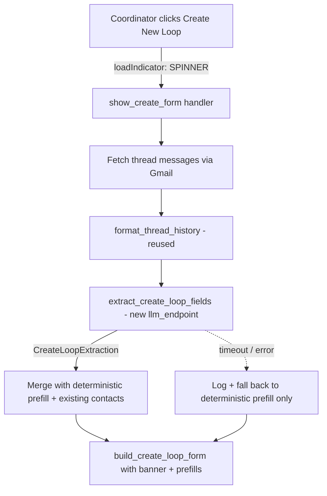

# RFC: Inferred Field Prefill for the Manual Create-Loop Workflow

| Field          | Value                                      |
|----------------|--------------------------------------------|
| **Author(s)**  | Kinematic Labs                             |
| **Status**     | Draft                                      |
| **Created**    | 2026-04-23                                 |
| **Updated**    | 2026-04-23                                 |
| **Reviewers**  | LRP Engineering, LRP Coordinator team      |
| **Decider**    | Nadav Sadeh                                |
| **Issue**      | [#43](https://github.com/nsadeh/lrp-scheduling-agent/issues/43) |

## Context and Scope

When a coordinator clicks **"Create New Loop"** on a Gmail thread that the classifier did not flag as `CREATE_LOOP` — because the thread arrived before the classifier ran, the classifier misclassified it, or the coordinator is building a loop out of a thread that genuinely isn't a new interview request — the sidebar renders a nearly empty form. The only fields pre-filled are the `from_` address of the open message (as the client contact) and the first `cc` entry (as the client manager); everything else — candidate name, client company, recruiter name/email, first stage — is blank. See [`_handle_show_create_form`](services/api/src/api/addon/routes.py:541).

This violates the product's core UX promise — "click, click, click, done". The primary customer POC flagged this directly: asked whether the experience so far matched expectations, his reply was *"From what I can tell we are far away."*

Meanwhile, the classifier already does this kind of extraction for `CREATE_LOOP` suggestions — candidate name, client company, recruiter fields, etc. — and stores the output in a loose `extracted_entities: dict[str, Any]` on [`SuggestionItem`](services/api/src/api/classifier/models.py:74). The machinery works; we're just not running it on the manual path.

This RFC proposes running a lightweight, typed LLM extractor against the full Gmail thread when the coordinator clicks "Create New Loop", pre-filling every field we can infer, and surfacing a clear spinner + message so the coordinator understands what the two-second wait is buying them.

## Goals

- **G1: Manual create-loop workflow opens a pre-filled form.** When the coordinator clicks "Create New Loop" on a thread with no `CREATE_LOOP` suggestion, the resulting form is populated with candidate, client contact, client company, recruiter (best effort), and CM fields inferred from the thread.
- **G2: Clear, communicative loading state.** The click shows a spinner *on the button itself* and the rendered form includes a banner explaining what's happening ("✨ Reading the thread to fill this in for you…"). No silent two-second hangs.
- **G3: One shared Pydantic type for "create-loop fields."** Both the classifier's `CREATE_LOOP` `action_data` and this new manual extractor emit the same typed `CreateLoopExtraction` payload. No more `dict[str, Any]`.
- **G4: Graceful degradation.** If the LLM call times out, errors, or returns nothing usable, the form still renders with today's deterministic prefill (message `from_` → client contact, `cc[0]` → CM). The feature never blocks loop creation.
- **G5: Cheap and fast.** Extraction is a single small LLM call on a formatted thread. Target p95 latency ≤ 3s; target cost ≤ $0.003 per invocation.

## Non-Goals

- **Changing the classifier path.** CREATE_LOOP suggestions flowing through the normal classifier path already pre-fill their inline form from `extracted_entities` (see [`_build_create_loop_suggestion`](services/api/src/api/overview/cards.py:139)). We are **not** rerunning extraction for those — the classifier already has all of the thread context it needs and is assumed to be doing a good job there. If classifier prefill quality turns out to be poor, that's a separate RFC about classifier prompt tuning. *Rationale:* keeps this change small, avoids double-spending LLM cost on the common path, and isolates the blast radius to the manual fallback.
- **Recruiter inference beyond best-effort.** The email thread alone does not reliably identify the recruiter — recruiters own the candidate relationship and are often absent from the client-facing thread. The assumption stated in the issue ("it's impossible to figure out the recruiter from the email thread alone") carries over: we populate recruiter fields *only* when a recruiter is visibly present (e.g., a CC'd LRP employee who is not the coordinator or a known CM). Otherwise we leave the fields blank and let the coordinator use the existing directory autocomplete. *Rationale:* fabricating a recruiter is worse than leaving it blank — a wrong recruiter sends the next draft to the wrong person.
- **Background pre-extraction on thread-open.** Option (c) from the design exploration — firing extraction when the sidebar opens a thread and caching by `thread_id` — would be the best UX but wastes LLM cost on the ~majority of threads where the coordinator never clicks "Create New Loop". We can revisit if latency complaints persist after v1.
- **Two-phase card rendering.** Returning an empty form immediately then auto-refreshing with the extraction result is another viable UX. We are deliberately picking the simpler blocking path for v1 (see Alternatives).
- **Changing the deterministic prefill already present.** Today's `from_`/`cc[0]` logic stays as the fallback and as the "merge with existing contact" anchor — see [`_handle_show_create_form`:587–602](services/api/src/api/addon/routes.py:587). We only *add* to this, never replace.

## Background

### The gap in the manual path

Today's flow when a coordinator clicks "Create New Loop":

1. Sidebar calls `show_create_form` with `gmail_thread_id` and `message_id`.
2. Handler fetches the *single* current message via `svc._gmail.get_message(...)`.
3. Handler copies `msg.from_` → client contact and `msg.cc[0]` → client manager.
4. Handler merges with any existing contact rows (prefer stored name/company).
5. Handler returns `build_create_loop_form(...)` with four prefill kwargs at most.

Missing entirely: `candidate_name`, `client_company` (unless a contact row already stores it), `recruiter_*`, `first_stage`. The coordinator types these from memory — often re-reading the email they just had open to do it.

### The classifier already does this — for its own path

For `CREATE_LOOP` suggestions coming from the classifier hook, [`SuggestionItem.extracted_entities`](services/api/src/api/classifier/models.py:85) carries candidate/client/recruiter fields as a dict. The inline suggestion card reads them via [`_val()`](services/api/src/api/overview/cards.py:152) and pre-fills the form. The quality bar for this extraction already exists — it's the same bar this RFC targets.

What's missing:

- A **typed** payload. `extracted_entities` is `dict[str, Any]`; no schema enforcement, no IDE help, silent field drift.
- A **second entry point** — the classifier only runs on pipeline delivery. Threads that didn't classify into `CREATE_LOOP` never get extraction.

### LangFuse and the `llm_endpoint` factory

The AI infrastructure ([`api.ai.llm_endpoint`](services/api/src/api/ai/endpoint.py)) provides a typed factory: define an input BaseModel, an output BaseModel, a LangFuse prompt name, and get back an async callable. The classifier uses exactly this — see [`classifier/endpoint.py`](services/api/src/api/classifier/endpoint.py). We'll follow the same pattern.

### Card v2 load indicators

The Google Workspace Add-on Card v2 protocol supports a `loadIndicator` field on `Action` with values `"SPINNER"` or `"NONE"`. Our current `OnClickAction` model at [`addon/models.py:116`](services/api/src/api/addon/models.py:116) does not declare this field — it has never been needed. Adding it is a tiny, additive change.

## Proposed Design

### Overview



Four pieces of work:

1. Introduce `CreateLoopExtraction` as a shared Pydantic model, used both by the classifier's `CREATE_LOOP` `action_data` and by the new extractor.
2. Add the `extract_create_loop_fields` typed endpoint and its LangFuse prompt.
3. Wire the extractor into `_handle_show_create_form` behind the spinner + banner.
4. Add `load_indicator` to the `OnClickAction` model and set `SPINNER` on the "Create New Loop" button.

### 1. `CreateLoopExtraction` — the shared typed model

Added to [`services/api/src/api/classifier/models.py`](services/api/src/api/classifier/models.py) alongside `DraftEmailData`:

```python
class CreateLoopExtraction(BaseModel):
    """Fields parsed out of a Gmail thread when proposing or starting a new loop.

    Emitted by the classifier's CREATE_LOOP suggestions (in action_data) AND
    by the on-demand manual-path extractor. Every field is optional — the
    consumer (the create-loop form) tolerates any subset.
    """

    candidate_name: str | None = None
    client_name: str | None = None
    client_email: str | None = None
    client_company: str | None = None
    cm_name: str | None = None
    cm_email: str | None = None
    recruiter_name: str | None = None
    recruiter_email: str | None = None
    first_stage_name: str | None = None
```

**Classifier migration.** The classifier currently writes these fields into `extracted_entities` (a loose dict). It will instead populate `action_data` with a validated `CreateLoopExtraction`, matching how `DraftEmailData` is handled. The downstream readers ([`_build_create_loop_suggestion`](services/api/src/api/overview/cards.py:139), [`_handle_show_create_form`:604–619](services/api/src/api/addon/routes.py:604)) already prefer `action_data` over `extracted_entities` via the `_val()` helper, so the change is largely additive. We'll keep `extracted_entities` written for one release as a compatibility shim and drop it in the next.

*Why in `classifier/models.py` and not a new module?* Because it's a peer of `DraftEmailData` (typed per-action payload) and colocating them keeps the "what types of action_data exist?" question answerable in one file.

### 2. `extract_create_loop_fields` — the typed endpoint

Added to a new `services/api/src/api/classifier/create_loop_extractor.py` (kept adjacent to the classifier since they share the prompt-and-formatters surface):

```python
class ExtractCreateLoopInput(BaseModel):
    thread_history: str  # formatted with classifier.formatters.format_thread_history
    coordinator_email: str  # so the prompt can exclude the coordinator from CM/recruiter candidates

extract_create_loop_fields = llm_endpoint(
    name="extract_create_loop_fields",
    prompt_name="scheduling-create-loop-extractor-v1",
    input_type=ExtractCreateLoopInput,
    output_type=CreateLoopExtraction,
)
```

**Prompt.** New LangFuse prompt `scheduling-create-loop-extractor-v1`. Small, focused:

- System prompt: "Extract structured scheduling-loop fields from the thread. Do not fabricate — return null for any field you cannot identify with high confidence. External senders are typically client contacts; CC'd domain-internal employees are typically client managers; the candidate name is usually in the subject or body; the recruiter is rarely identifiable from the thread alone — leave recruiter fields null unless one is clearly present."
- User prompt: the formatted thread + the coordinator email (so the model knows who to exclude).
- Model: `anthropic/claude-haiku-4-5-20251001`, `temperature: 0.0`, `max_tokens: 512`.

We pick Haiku (not Sonnet, which the classifier uses) because this is a narrower extraction task with strict schema enforcement, and Haiku is ~5x cheaper and ~2x faster. The latency budget is tight (see G5).

**Thread formatting.** Reuses [`format_thread_history`](services/api/src/api/classifier/formatters.py:48) verbatim. No parallel formatter.

### 3. Wiring into `_handle_show_create_form`

```python
async def _handle_show_create_form(body, svc, email, **kwargs):
    # ... existing scope + thread_id/message_id parsing ...

    prefill = CreateLoopExtraction()  # start empty

    # Deterministic prefill from the current message (unchanged behavior)
    if message_id and svc._gmail:
        try:
            msg = await svc._gmail.get_message(email, message_id)
            prefill.client_name = msg.from_.name or None
            prefill.client_email = msg.from_.email
            if msg.cc:
                prefill.cm_name = msg.cc[0].name or None
                prefill.cm_email = msg.cc[0].email
            gmail_subject = msg.subject
        except Exception:
            logger.warning("could not fetch message for deterministic prefill", exc_info=True)

    # AI extraction — overlay on top of deterministic values, never overwriting
    # a non-null deterministic value with a null extraction value.
    if gmail_thread_id and svc._gmail:
        try:
            thread = await svc._gmail.get_thread(email, gmail_thread_id)
            formatted = format_thread_history(thread.messages, coordinator_email=email)
            extracted = await extract_create_loop_fields(
                ExtractCreateLoopInput(thread_history=formatted, coordinator_email=email)
            )
            prefill = _merge_prefill(deterministic=prefill, extracted=extracted)
        except Exception:
            logger.warning("create-loop extractor failed — deterministic prefill only",
                           thread_id=gmail_thread_id, exc_info=True)
            # G4: degrade gracefully

    # Existing-contact merge (unchanged)
    # ... prefer stored names over extracted/deterministic when a contact row matches ...

    return build_create_loop_form(
        ...,
        banner="✨ Filled in from the thread — please review before creating.",
    )
```

**Merge policy** (`_merge_prefill`):

- Extractor value wins *only* if the deterministic value is null.
- Exception: `candidate_name`, `client_company`, `first_stage_name` have no deterministic counterpart — extractor is authoritative.
- Existing-contact lookup (the block at [routes.py:587](services/api/src/api/addon/routes.py:587)) still runs *after* the merge, so a stored contact name always wins over any fresh extraction — matching current behavior.

### 4. Loading state: spinner + banner + form-level message

Three coordinated pieces of feedback:

- **Spinner on the button.** Add `load_indicator: "SPINNER"` to `OnClickAction` (new field) and set it on the "Create New Loop" button declared at [`cards.py:202`](services/api/src/api/scheduling/cards.py:202). The add-on runtime dims the button and shows a spinning indicator for the duration of the HTTP round-trip — no new UI code needed.
- **Post-render banner.** When `build_create_loop_form(...)` is called from the AI-assisted path, it includes a banner `Section` at the top: *"✨ Filled in from the thread — please review before creating."* This is a styled `TextParagraphWidget`, same pattern as the existing `error_message` banner at [`cards.py:245`](services/api/src/api/scheduling/cards.py:245).
- **Form fields themselves communicate.** A field populated by the extractor but *not* by the deterministic path (candidate name, client company, recruiter) is the visible signal that the AI did something. This is the real "loading bar equivalent" — the coordinator sees populated fields and understands the wait paid off.

### Prompt-management convention

The LangFuse prompt `scheduling-create-loop-extractor-v1` is managed identically to existing prompts — reference copy lives at `services/api/src/api/classifier/prompts.py` (appended) with `{{thread_history}}` and `{{coordinator_email}}` template vars. Filled by `format_thread_history` at runtime.

## Alternatives Considered

### A. Two-phase render (return empty form, auto-refresh with filled values)

Return the empty form immediately with a banner, and trigger an async `updateCard` via a timer/refresh action that calls extraction and re-renders the populated form.

**Upside:** feels instant — the coordinator gets a form to look at while extraction runs.
**Downside:** the add-on HTTP protocol has no native "call me back in 2s" primitive. We'd have to either (a) set up a client-side `onRefresh` hook with a delay, (b) use the `refresh` endpoint already in the codebase, or (c) embed a meta-refresh via an OpenLink. All three add meaningful moving parts. Also: the coordinator sees the empty form, mentally starts typing, and then the form mutates under them — that's worse than a known 2s wait.

**Decision:** reject for v1. Revisit if latency exceeds 3s p95.

### B. Background pre-extraction on thread open

Fire `extract_create_loop_fields` when the coordinator opens a thread in the sidebar (contextual trigger), cache by `thread_id` in Redis for e.g. 1 hour, and read from cache on the "Create New Loop" click.

**Upside:** near-zero perceived latency — data is already there.
**Downside:** (a) the majority of opened threads are never used to create a loop, so we'd burn LLM budget for no benefit; (b) cache invalidation across new messages; (c) the cache layer is a new piece of infra on a workflow we're shipping for the first time. Premature.

**Decision:** reject for v1. Revisit after measuring click-through rate on opened threads.

### C. Rule-based extractor only (no LLM)

Parse candidate name from subject via regex, client company from email domain, etc.

**Upside:** zero latency, zero cost.
**Downside:** subjects are unstructured ("Re: FW: Claire / Balyasny — introducing…"), candidate names appear mid-body, client companies don't always map to email domains (Gmail addresses for fund principals are common). Rule-based coverage will be poor and brittle; the LLM will outperform it. The issue itself says the simplest solution is "run a lightweight extractor" — the team has already made this call.

**Decision:** reject.

### D. Leave `extracted_entities` loose, type only the new extractor

Only the new manual-path extractor gets `CreateLoopExtraction`; the classifier keeps writing `dict[str, Any]`.

**Upside:** smaller diff, no classifier-path test churn.
**Downside:** we'd have the shared type already defined, the classifier already emits the same fields, and we'd ship two paths that differ only in schema enforcement. That's the worst of both worlds.

**Decision:** reject. Typing once is cheaper than typing twice.

## Risks and Open Questions

- **R1: Latency overrun.** Haiku + short prompt should be well under 2s, but p99 excursions happen. **Mitigation:** set a hard 10s timeout on the extractor call (LiteLLM-level). If it exceeds, log and fall back to deterministic prefill — the coordinator sees the same form they see today, not an error. The spinner returns control in ≤10s no matter what.
- **R2: Hallucinated recruiter fields (and other extraction errors).** The prompt explicitly instructs "leave recruiter fields null unless clearly present," but models sometimes fabricate. Candidate name can get mis-attributed when multiple people are named in the thread; client company can get inferred from an email signature block rather than the actual employer. **Mitigation:** ship a **supervised eval** for this endpoint as a first-class deliverable of PR 2, not a follow-up. Concretely:
    - **Dataset.** ~30 labeled Gmail threads drawn from staging/prod with the coordinators' help — a mix of (a) recruiter visibly CC'd, (b) recruiter absent, (c) multi-candidate threads, (d) forwarded threads with nested signatures, (e) threads where the client company is ambiguous. Each thread is labeled with the ground-truth `CreateLoopExtraction` (per-field expected value, including explicit nulls). Stored in `services/api/tests/evals/create_loop_extraction/` as `{thread_id}.json` alongside the raw formatted thread.
    - **Graders.** Per-field exact-match for `*_email`. Per-field normalized string match (lowercase, whitespace-collapsed, diacritic-folded) for names/company. **Null-agreement** is a first-class metric: "the model correctly left this field null when the thread doesn't identify it." Recruiter fields get a dedicated **false-positive rate** metric (model-filled but truth was null) since fabricating a recruiter is the most damaging failure mode.
    - **Runner.** Uses the existing LangFuse experiment harness the classifier eval uses. Runs on every prompt version bump and nightly against the pinned prompt in staging. Results persisted in LangFuse so prompt-change PRs can cite the diff.
    - **Ship criteria for PR 3.** Minimum bar before we wire the extractor into the live handler: ≥ 0.85 null-agreement on recruiter fields, ≥ 0.90 exact-match on `client_email` and `cm_email`, ≥ 0.80 normalized match on `candidate_name`. Below any threshold we iterate the prompt rather than ship.
- **R3: Existing-contact merge order.** Current behavior overwrites classifier-provided `client_name` with the stored contact's name when an email match exists (see [routes.py:587](services/api/src/api/addon/routes.py:587)). This must also apply to the new extractor output — tested explicitly.
- **R4: Feature-flag or no?** Per project conventions (see user memory), **no feature flag**. The fallback path is the existing deterministic prefill — if extraction goes wrong, coordinators see today's behavior, not a broken flow. That's a safe enough rollout posture.
- **OQ1: Should `first_stage_name` extraction even be attempted?** The classifier prompt doesn't extract this today; the form defaults to `"Round 1"`. Email threads rarely state the stage explicitly. Recommendation: leave it out of v1 — keep the default — and revisit after we have signal on the other fields.
- **OQ2: Cache the extraction?** A coordinator who clicks "Create New Loop," abandons, and clicks again shouldn't pay twice. A short-lived in-memory `@functools.lru_cache` keyed by `(thread_id, latest_message_id)` on the handler would be ~5 lines. Low priority; include if trivial.

## Rollout

1. **PR 1 — Typing + classifier migration.**
   - Add `CreateLoopExtraction` to `classifier/models.py`.
   - Update classifier prompt + response parser to populate `action_data` with the typed model (keep writing `extracted_entities` temporarily).
   - Tests: classifier integration tests assert `action_data` shape.
2. **PR 2 — Extractor endpoint + LangFuse prompt + supervised eval.**
   - Add `create_loop_extractor.py` + reference prompt copy in `prompts.py`.
   - Publish `scheduling-create-loop-extractor-v1` to LangFuse with `production` label.
   - **Supervised eval shipped in this PR** (see R2): labeled dataset under `services/api/tests/evals/create_loop_extraction/`, per-field graders, LangFuse experiment wiring. This is a blocker for PR 3 — the eval numbers determine whether the extractor is good enough to turn on.
   - No user-visible change yet — endpoint is defined but not called.
3. **PR 3 — Wire into `show_create_form` + loading state.**
   - Extend `OnClickAction` with `load_indicator`.
   - Wire extractor into handler with timeout + graceful degradation.
   - Add banner.
   - Integration tests: success path, timeout path, error path, existing-contact override path.
4. **Post-rollout.**
   - Watch Sentry for timeout rate; watch LangFuse for recruiter-field fabrication.
   - After one release of parallel-write, drop `extracted_entities` from classifier output.

## References

- Issue: [#43 — Infer details for create loop workflow](https://github.com/nsadeh/lrp-scheduling-agent/issues/43)
- Current manual-path handler: [`services/api/src/api/addon/routes.py:541`](services/api/src/api/addon/routes.py:541)
- Classifier models (target of shared-type migration): [`services/api/src/api/classifier/models.py`](services/api/src/api/classifier/models.py)
- Classifier thread formatter (reused): [`services/api/src/api/classifier/formatters.py:48`](services/api/src/api/classifier/formatters.py:48)
- AI endpoint factory: [`services/api/src/api/ai/endpoint.py`](services/api/src/api/ai/endpoint.py)
- Prior art for typed action_data: `DraftEmailData` in [`classifier/models.py:52`](services/api/src/api/classifier/models.py:52)
- Prior RFC on the classifier: [`rfcs/rfc-email-classifier.md`](rfcs/rfc-email-classifier.md)
