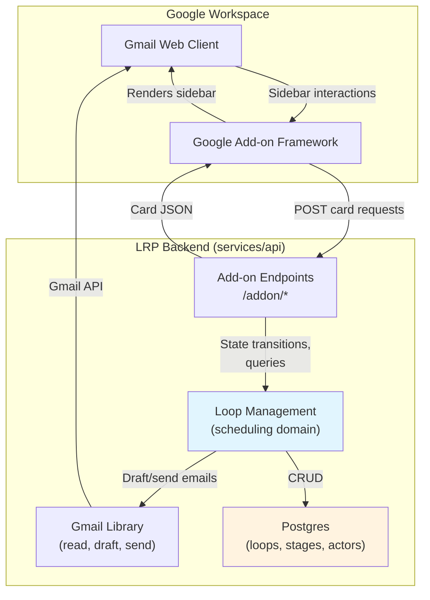
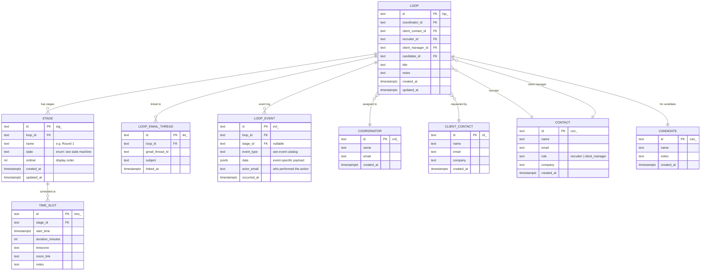
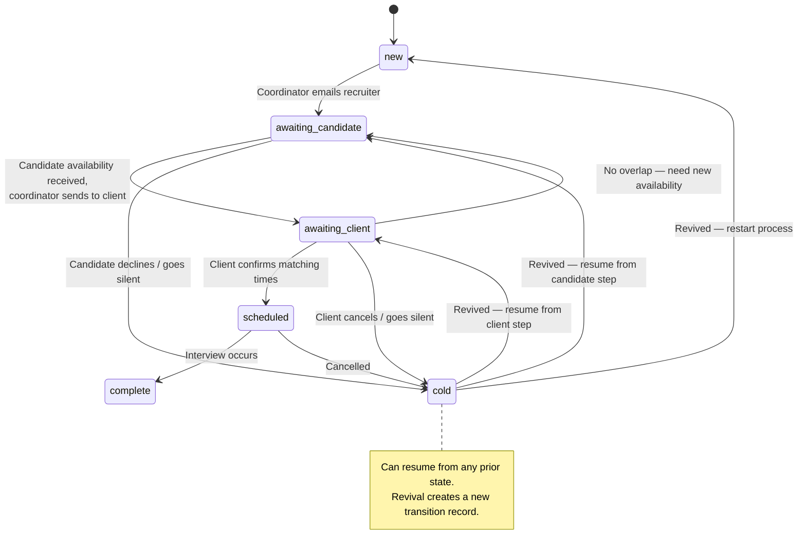

# RFC: Scheduling Loops — Manual Interview Coordination

| Field         | Value                                 |
| ------------- | ------------------------------------- |
| **Author(s)** | Kinematic Labs                        |
| **Status**    | Draft                                 |
| **Created**   | 2026-03-31                            |
| **Updated**   | 2026-03-31                            |
| **Reviewers** | LRP Engineering, LRP Coordinator team |
| **Decider**   | Nim Sadeh                             |

## Context and Scope

Long Ridge Partners coordinators manage interview scheduling across dozens of concurrent processes — each involving a client, a candidate (represented by their recruiter), and a series of interview stages. Today this is done entirely through Gmail, calendar, and memory. There is no structured system tracking the state of each interview process, the next action required, or the history of what happened.

This RFC proposes the data model, state machine, and sidebar UI for **scheduling loops** — the core coordination primitive that tracks an interview process from initial client request through completed interviews. This is the manual, human-driven version of what will later become the AI-powered scheduling agent. The same data model and state machine will be reused when the agent takes over drafting and classification; the difference is that today the coordinator drives every transition explicitly.

## Goals

- **G1: Coordinators can create and manage scheduling loops from Gmail.** A coordinator can create a loop from an email, assign actors (client, recruiter, CM, candidate), and track it through stages — all within the Gmail sidebar.
- **G2: Every loop has a clear "next action."** The sidebar displays what the coordinator needs to do next for each active loop, eliminating the need to mentally track dozens of processes.
- **G3: Stage-level state machine is explicit and auditable.** Each interview stage progresses through defined states (New → Awaiting Candidate → Awaiting Client → Scheduled → Complete / Cold), with every action and transition captured in an event log.
- **G4: Email threads are linked to loops.** Coordinators can associate one or more Gmail threads with a loop, providing context for the scheduling conversation without assuming a 1:1 correspondence.
- **G5: Recruiter and client contact databases build over time.** Actors entered during loop creation are persisted and available for autocomplete in future loops, reducing repetitive data entry.

## Non-Goals

- **AI-powered draft generation or email classification** — this RFC builds the manual coordination tool. The agent will layer on top of this data model in a future phase. _Rationale:_ we need to validate the data model and UX with real coordinator workflows before automating them. Building the manual tool first ensures the abstractions match reality.
- **Candidate email capture or direct candidate communication** — coordinators don't know candidate emails and don't communicate with candidates. The recruiter is the intermediary. _Rationale:_ capturing candidate email would require a workflow with no payoff until ATS integration, and coordinators literally don't have this information.
- **Calendar integration (creating events, Zoom links)** — scheduling loops track the coordination process, not the calendar mechanics. Calendar integration is a separate concern. _Rationale:_ calendar event creation involves Zoom API integration, timezone handling, and invitation management — each a substantial feature. Coordinators already know how to create calendar events; what they lack is process tracking.
- **ATS/Encore updates** — updating candidate records in Encore after interviews is out of scope. _Rationale:_ Encore integration via Cluein is a separate integration surface. The loop model will eventually feed Encore updates, but the data model doesn't depend on it.
- **Reporting or analytics dashboards** — no aggregate views across coordinators or time-based reporting. _Rationale:_ premature until we have real usage data. The data model supports future reporting, but building dashboards before validation is waste.

## Background

### How Interview Scheduling Works Today

A typical interview scheduling process:

1. A **client** (hiring manager at a hedge fund or PE firm) emails their LRP contact: "I'd like to meet Candidate X" or "Round 1 went well — please schedule Round 2 with my partner."
2. The **coordinator** reads this email, identifies the candidate, and emails the **recruiter** (who owns the candidate relationship) to collect the candidate's availability.
3. The recruiter replies with the candidate's available time slots.
4. The coordinator emails the **client point of contact** with the candidate's availability, asking the client to select times.
5. The client replies with their preferred time(s). If times don't overlap, the coordinator loops back to the recruiter.
6. Once times match, the coordinator sends interview details (Zoom link, time, attendees) to the recruiter (who forwards to the candidate) and confirms with the client.
7. The coordinator notifies the recruiter that the interview is scheduled so they can arrange a prep session.

This process repeats for each interview stage (Round 1, Round 2, Final, etc.). Stages are typically sequential — Round 2 only starts after Round 1 completes successfully — but clients sometimes request multiple rounds be scheduled simultaneously.

### Key Complexity: Parallel Stages, Single Emails

When a client requests multiple stages at once ("let's schedule Rounds 1, 2, and 3"), the coordinator doesn't send three separate emails to the recruiter. They send one email covering all stages. This means:

- A single email thread can drive multiple stages forward simultaneously
- When the recruiter replies with availability, it applies to all requested stages
- If an early stage goes poorly (bad Round 1), later stages (Rounds 2 and 3) are cancelled

This coupling between email threads and multiple stages is the core modeling challenge. Email threads relate to **loops**, not individual stages.

### Coordinator's Mental Model

Coordinators think in terms of: "What do I need to do next, and for whom?" They don't think in terms of state machines or data models. The UI must surface **next actions** prominently — not raw state information.

A coordinator managing 30 active processes needs to glance at the sidebar and immediately know: "I'm waiting on 12 candidate replies, I need to send availability to 5 clients, and 3 interviews are scheduled for this week."

## Proposed Design

### Overview

We introduce a **scheduling loop** as the core entity: one loop per candidate-client interview process. Each loop contains **stages** (Round 1, Round 2, etc.) that independently progress through a state machine. Loops are linked to **email threads** and **actors** (coordinator, client, recruiter, client manager, candidate). The sidebar provides views for creating loops, viewing the status board, and performing next actions — all within Google's Card v2 framework.

The data model lives in Postgres. The sidebar UI communicates with the FastAPI backend via the existing add-on POST pattern. No new services are introduced.

### System Context Diagram



### Detailed Design

#### Entity Model

Five core entities, an event log, and supporting tables:



**Design decisions in the entity model:**

**Contacts are shared across loops.** Recruiters and client managers appear in many loops. Storing them as a `contacts` table with autocomplete means coordinators enter details once. Client contacts (hiring managers) get their own table because they have different attributes and relationships (a client contact maps to a company/client). Both tables grow organically as coordinators create loops.

**Candidates are thin.** Just a name and optional notes. No email, no ATS ID — the coordinator doesn't have this information. When ATS integration arrives, we add an `encore_id` column. The candidate table exists primarily so we can associate multiple loops with the same candidate (e.g., same candidate interviewing at two firms).

**Email threads link to loops, not stages.** A single email conversation can advance multiple stages simultaneously. The `loop_email_threads` join table allows multiple threads per loop (for cases where conversations fork) and keeps email association at the right granularity.

**Event-sourced action log, not just state transitions.** Every action — not just state changes — is recorded as an event in `loop_events`. A stage transition like `new → awaiting_candidate` might involve multiple events: `email_drafted`, `email_sent`, `stage_advanced`. Actions that don't change state (adding a note, editing actors, linking a thread) are also captured. This gives the AI agent a complete picture of _what the coordinator did_, not just _what state the stage ended up in_. The `stages.state` column is a denormalized read cache updated on state-changing events; the event log is the source of truth.

#### Stage State Machine



**States:**

| State                | Meaning                                                                 | Coordinator's Next Action                             |
| -------------------- | ----------------------------------------------------------------------- | ----------------------------------------------------- |
| `new`                | Client has requested an interview                                       | Email the recruiter to collect candidate availability |
| `awaiting_candidate` | Waiting for candidate availability (via recruiter)                      | Monitor for recruiter reply                           |
| `awaiting_client`    | Candidate availability sent to client, waiting for client to pick times | Monitor for client reply                              |
| `scheduled`          | Interview time confirmed, details sent                                  | Verify interview occurs                               |
| `complete`           | Interview finished                                                      | None (or create next stage)                           |
| `cold`               | Process stalled — candidate declined, client cancelled, or went silent  | Optionally revive                                     |

**Transition rules:**

- Forward transitions (new → awaiting_candidate → awaiting_client → scheduled → complete) require coordinator actions, each recorded as events. A transition may involve multiple events (e.g., `email_drafted` + `email_sent` + `stage_advanced`).
- Backward transition (awaiting_client → awaiting_candidate) happens when availability doesn't overlap.
- Cold can be entered from any active state. Revival from cold can target any prior state (the coordinator chooses where to resume).
- Complete is terminal. Cold is not — loops/stages can be revived.

**Parallel stage implications:** When multiple stages are created simultaneously (e.g., Rounds 1–3), each gets a `stage_created` event and starts in `new`. They advance together through a shared email thread — a single `email_sent` event on one stage may contextually advance all three. If Round 1 moves to `cold` (bad interview), the coordinator explicitly moves Rounds 2 and 3 to `cold` as well, each generating its own `stage_marked_cold` event. The system does not auto-cascade — the coordinator is the decision-maker. However, the UI should surface a prompt: "Round 1 is cold. Mark Rounds 2 and 3 as cold?"

#### Loop-Level Computed State

While state lives on stages, coordinators need a loop-level summary. The loop's computed state is derived from its stages:

| Loop Status       | Condition                                                                               |
| ----------------- | --------------------------------------------------------------------------------------- |
| **Active**        | At least one stage is in `new`, `awaiting_candidate`, `awaiting_client`, or `scheduled` |
| **All Scheduled** | All stages are `scheduled` (none still in progress)                                     |
| **Complete**      | All stages are `complete`                                                               |
| **Cold**          | All stages are `cold`                                                                   |
| **Mixed**         | Combination (some complete, some cold, etc.) — shown with per-stage breakdown           |

The loop's **next action** is the most urgent next action across its active stages, prioritized by state (closer to `new` = more urgent, because it's earlier in the process and blocking downstream stages).

#### Sidebar UI

The sidebar operates within Google's Card v2 framework — declarative JSON, no custom HTML. The UI is organized around three views accessible via the existing add-on triggers:

**View 1: Status Board (Homepage)**

The default view when the add-on icon is clicked with no message open. Shows all active loops for the coordinator, grouped by next action:

```
┌─────────────────────────────────┐
│ LRP Scheduling Agent            │
│ Long Ridge Partners             │
├─────────────────────────────────┤
│ 📋 ACTION NEEDED (5)           │
│ ┌─────────────────────────────┐ │
│ │ ▸ Smith → Acme Capital      │ │
│ │   Round 1 · Send to client  │ │
│ │ ▸ Jones → Vertex Fund       │ │
│ │   Round 2 · Email recruiter │ │
│ │ ...                         │ │
│ └─────────────────────────────┘ │
│                                 │
│ ⏳ WAITING (12)                 │
│ ┌─────────────────────────────┐ │
│ │ ▸ Chen → BluePeak           │ │
│ │   Round 1 · Awaiting cand.  │ │
│ │ ...                         │ │
│ └─────────────────────────────┘ │
│                                 │
│ ✅ SCHEDULED (3)                │
│ ┌─────────────────────────────┐ │
│ │ ▸ Park → Citadel            │ │
│ │   Round 1 · Thu 4/3 2pm ET  │ │
│ │ ...                         │ │
│ └─────────────────────────────┘ │
│                                 │
│ [+ New Loop]                    │
└─────────────────────────────────┘
```

Implementation: collapsible `CardSection` per group, `DecoratedText` widgets for each loop summary, `ButtonList` for the create action. Tapping a loop pushes a detail card onto the navigation stack.

**View 2: Contextual View (Message Open)**

When a coordinator has an email open, the sidebar shows:

1. **If the email thread is linked to a loop:** The loop detail view with stage states, next actions, and action buttons.
2. **If not linked:** A prompt to create a new loop from this email or link it to an existing loop.

```
┌─────────────────────────────────┐
│ LRP Scheduling Agent            │
├─────────────────────────────────┤
│ This thread is not linked to a  │
│ scheduling loop.                │
│                                 │
│ [Create New Loop from Email]    │
│ [Link to Existing Loop ▾]      │
└─────────────────────────────────┘
```

**View 3: Loop Detail**

Pushed onto the card stack when a loop is tapped from the status board or contextual view:

```
┌─────────────────────────────────┐
│ ← Back                         │
│ Smith → Acme Capital            │
│ Candidate: John Smith           │
├─────────────────────────────────┤
│ ACTORS                          │
│ Client: Jane Doe (Acme)         │
│ Recruiter: Bob Lee              │
│ CM: Sarah Kim                   │
│ [Edit Actors]                   │
├─────────────────────────────────┤
│ STAGES                          │
│ ┌─────────────────────────────┐ │
│ │ Round 1 · awaiting_client   │ │
│ │ Next: waiting on client     │ │
│ │ [Mark Scheduled] [Go Cold]  │ │
│ ├─────────────────────────────┤ │
│ │ Round 2 · new               │ │
│ │ Next: email recruiter       │ │
│ │ [Send Email] [Go Cold]      │ │
│ └─────────────────────────────┘ │
│ [+ Add Stage]                   │
├─────────────────────────────────┤
│ EMAIL THREADS (1)               │
│ ▸ Re: Interview - John Smith    │
│ [+ Link Thread]                 │
├─────────────────────────────────┤
│ TIME SLOTS                      │
│ (none scheduled yet)            │
└─────────────────────────────────┘
```

**View 4: Create Loop**

A form card for creating a new loop. When triggered from a message context, pre-populates fields by parsing the email's From and CC headers:

- **Candidate name**: text input (required)
- **Client contact**: autocomplete from `client_contacts` table, or enter new (name + email + company)
- **Recruiter**: autocomplete from `contacts` table, or enter new (name + email)
- **Client Manager**: autocomplete from `contacts` table, or enter new (name + email). Pre-populated from CC if detected.
- **First stage name**: text input, defaults to "Round 1"

**View 5: Send Email**

A compact compose card for sending terse scheduling emails. The coordinator types a short message and presses Send:

```
┌─────────────────────────────────┐
│ Send Email                      │
│ Smith → Acme · Round 2          │
├─────────────────────────────────┤
│ To: bob.lee@recruiter.com       │
│ Subject: Re: John Smith - Acme  │
│                                 │
│ ┌─────────────────────────────┐ │
│ │ Hi Bob,                     │ │
│ │                             │ │
│ │ Could you please send over  │ │
│ │ John's availability for     │ │
│ │ next week?                  │ │
│ │                             │ │
│ │ Thanks                      │ │
│ └─────────────────────────────┘ │
│                                 │
│ [Send]  [Cancel]                │
└─────────────────────────────────┘
```

This sends via the Gmail Library (per-user OAuth, coordinator's own Gmail). The sent email is threaded into the loop's linked email thread. After sending, the stage auto-advances to the appropriate next state (e.g., `new` → `awaiting_candidate` after emailing the recruiter).

**Creating a loop when the sidebar is closed:**

Google Workspace Add-ons support **contextual triggers** and **universal actions**. We register a universal action ("Create Scheduling Loop") that appears in the add-on's overflow menu when the user right-clicks or accesses the add-on actions on any email. This triggers a POST to our backend with the message context, allowing the coordinator to create a loop without first opening the sidebar. The action opens the sidebar with the Create Loop form pre-populated.

#### API Endpoints

New routes under `/addon/` extending the existing router:

| Route                    | Trigger                          | Purpose                                               |
| ------------------------ | -------------------------------- | ----------------------------------------------------- |
| `POST /addon/homepage`   | Add-on icon clicked (no message) | Status board card                                     |
| `POST /addon/on-message` | Message open                     | Contextual view (linked loop or create/link prompt)   |
| `POST /addon/action`     | Button clicks                    | Dispatches to specific handlers via `invokedFunction` |

The `/addon/action` endpoint uses Google's `invokedFunction` parameter to route to specific handlers:

| invokedFunction | Action                                        |
| --------------- | --------------------------------------------- |
| `create_loop`   | Create a new loop from form inputs            |
| `link_thread`   | Link current email thread to an existing loop |
| `view_loop`     | Push loop detail card                         |
| `advance_stage` | Transition a stage to the next state          |
| `mark_cold`     | Move a stage to cold                          |
| `revive_stage`  | Revive a cold stage to a chosen state         |
| `add_stage`     | Add a new stage to a loop                     |
| `edit_actors`   | Update loop actors                            |
| `compose_email` | Show the email compose card                   |
| `send_email`    | Send email via Gmail API and advance stage    |
| `add_time_slot` | Record a scheduled time slot                  |

Each handler returns a card JSON response (push a new card, update the current card, or pop back).

### Data Storage

#### Schema Sketch

```sql
-- Coordinators (users of the system)
CREATE TABLE coordinators (
    id          TEXT PRIMARY KEY,  -- crd_<nanoid>
    name        TEXT NOT NULL,
    email       TEXT NOT NULL UNIQUE,
    created_at  TIMESTAMPTZ NOT NULL DEFAULT now()
);

-- Client contacts (hiring managers at client firms)
CREATE TABLE client_contacts (
    id          TEXT PRIMARY KEY,  -- cli_<nanoid>
    name        TEXT NOT NULL,
    email       TEXT NOT NULL,
    company     TEXT NOT NULL,
    created_at  TIMESTAMPTZ NOT NULL DEFAULT now()
);

-- Contacts (recruiters, client managers — reusable across loops)
CREATE TABLE contacts (
    id          TEXT PRIMARY KEY,  -- con_<nanoid>
    name        TEXT NOT NULL,
    email       TEXT NOT NULL,
    role        TEXT NOT NULL,     -- 'recruiter' | 'client_manager'
    company     TEXT,
    created_at  TIMESTAMPTZ NOT NULL DEFAULT now()
);

-- Candidates (name only for now)
CREATE TABLE candidates (
    id          TEXT PRIMARY KEY,  -- can_<nanoid>
    name        TEXT NOT NULL,
    notes       TEXT,
    created_at  TIMESTAMPTZ NOT NULL DEFAULT now()
);

-- Scheduling loops
CREATE TABLE loops (
    id                  TEXT PRIMARY KEY,  -- lop_<nanoid>
    coordinator_id      TEXT NOT NULL REFERENCES coordinators(id),
    client_contact_id   TEXT NOT NULL REFERENCES client_contacts(id),
    recruiter_id        TEXT NOT NULL REFERENCES contacts(id),
    client_manager_id   TEXT REFERENCES contacts(id),
    candidate_id        TEXT NOT NULL REFERENCES candidates(id),
    title               TEXT NOT NULL,
    notes               TEXT,
    created_at          TIMESTAMPTZ NOT NULL DEFAULT now(),
    updated_at          TIMESTAMPTZ NOT NULL DEFAULT now()
);

-- Stages within a loop
CREATE TABLE stages (
    id          TEXT PRIMARY KEY,  -- stg_<nanoid>
    loop_id     TEXT NOT NULL REFERENCES loops(id),
    name        TEXT NOT NULL,     -- "Round 1", "Final", etc.
    state       TEXT NOT NULL DEFAULT 'new',
    ordinal     INT NOT NULL DEFAULT 0,
    created_at  TIMESTAMPTZ NOT NULL DEFAULT now(),
    updated_at  TIMESTAMPTZ NOT NULL DEFAULT now()
);

-- Event log (event-sourced — every action, not just state changes)
CREATE TABLE loop_events (
    id              TEXT PRIMARY KEY,  -- evt_<nanoid>
    loop_id         TEXT NOT NULL REFERENCES loops(id),
    stage_id        TEXT REFERENCES stages(id),  -- null for loop-level events
    event_type      TEXT NOT NULL,     -- see event catalog below
    data            JSONB NOT NULL DEFAULT '{}',  -- event-specific payload
    actor_email     TEXT NOT NULL,     -- coordinator who performed the action
    occurred_at     TIMESTAMPTZ NOT NULL DEFAULT now()
);
CREATE INDEX idx_loop_events_loop_id ON loop_events(loop_id, occurred_at);
CREATE INDEX idx_loop_events_stage_id ON loop_events(stage_id, occurred_at);

-- Email threads linked to loops
CREATE TABLE loop_email_threads (
    id              TEXT PRIMARY KEY,  -- let_<nanoid>
    loop_id         TEXT NOT NULL REFERENCES loops(id),
    gmail_thread_id TEXT NOT NULL,
    subject         TEXT,
    linked_at       TIMESTAMPTZ NOT NULL DEFAULT now(),
    UNIQUE(loop_id, gmail_thread_id)
);

-- Scheduled time slots for stages
CREATE TABLE time_slots (
    id              TEXT PRIMARY KEY,  -- tms_<nanoid>
    stage_id        TEXT NOT NULL REFERENCES stages(id),
    start_time      TIMESTAMPTZ NOT NULL,
    duration_minutes INT NOT NULL DEFAULT 60,
    timezone        TEXT NOT NULL,
    zoom_link       TEXT,
    notes           TEXT,
    created_at      TIMESTAMPTZ NOT NULL DEFAULT now()
);
```

#### Event Catalog

Events in `loop_events` use a `event_type` discriminator with a JSONB `data` payload. The catalog is extensible — new event types can be added without schema changes.

**Stage-level events** (have a `stage_id`):

| Event Type          | Data Payload                                          | State Change?            |
| ------------------- | ----------------------------------------------------- | ------------------------ |
| `stage_created`     | `{name, ordinal}`                                     | Sets initial state `new` |
| `stage_advanced`    | `{from_state, to_state}`                              | Yes                      |
| `stage_marked_cold` | `{from_state, reason}`                                | Yes → `cold`             |
| `stage_revived`     | `{to_state}`                                          | Yes, from `cold`         |
| `email_drafted`     | `{to, subject, body, gmail_draft_id}`                 | No                       |
| `email_sent`        | `{to, subject, gmail_message_id, gmail_thread_id}`    | No                       |
| `time_slot_added`   | `{start_time, duration_minutes, timezone, zoom_link}` | No                       |
| `time_slot_removed` | `{time_slot_id}`                                      | No                       |

**Loop-level events** (`stage_id` is null):

| Event Type        | Data Payload                                         | State Change? |
| ----------------- | ---------------------------------------------------- | ------------- |
| `loop_created`    | `{title, candidate_name, client_contact, recruiter}` | N/A           |
| `thread_linked`   | `{gmail_thread_id, subject}`                         | No            |
| `thread_unlinked` | `{gmail_thread_id}`                                  | No            |
| `actor_updated`   | `{field, old_value, new_value}`                      | No            |
| `note_added`      | `{text}`                                             | No            |

**Deriving current state:** The current state of a stage can always be reconstructed by replaying its events in order, filtering for state-changing events (`stage_advanced`, `stage_marked_cold`, `stage_revived`). In practice, `stages.state` is kept in sync as a read optimization — every state-changing event updates the column in the same transaction.

**Why this shape:**

- **Separate `client_contacts` and `contacts` tables** rather than a single polymorphic contacts table: client contacts have `company` as a required field and represent the "demand side" of scheduling. Recruiters and CMs are on the "supply side." They participate differently in loops. A shared table with a `role` discriminator would work but would make queries and autocomplete logic messier — "show me all recruiters" vs "show me all client contacts at Acme" are different queries with different shapes. The cost is two tables instead of one, which is low.

- **`contacts.role` for recruiter vs client_manager** rather than separate tables: Unlike client contacts, recruiters and CMs have identical attributes and often overlap (a person might be a recruiter on one loop and a CM on another, though this is rare). A shared table with a role field is simpler.

- **Event-sourced `loop_events` over simple transition log**: A transition log (recording only state A → state B) loses the intermediate actions. A coordinator advancing a stage from `new` to `awaiting_candidate` actually performs multiple discrete actions: drafting an email, reviewing it, sending it, then advancing the stage. The event log captures all of these. This is critical for the AI agent — it needs to learn the _sequence of actions_ coordinators take, not just the state changes. The `stages.state` column remains as a denormalized read cache for fast queries; `loop_events` is the authoritative history. Events are append-only (never updated or deleted).

- **`time_slots` on stages, not loops**: Each interview stage has its own scheduled time. A loop with three stages might have three different time slots. This also allows a stage to have multiple time slots (e.g., a panel interview with two back-to-back meetings).

### Key Trade-offs

**Event-sourced action log over simple state transition log.** We record every coordinator action (email drafted, email sent, note added, actor updated) as an event, not just the resulting state transitions. This is more complex to implement — we need an event catalog, JSONB payloads per event type, and queries that aggregate events for display. The payoff is substantial: the AI agent will need to understand _how_ coordinators work (the sequence of actions they take), not just _what state things end up in_. A transition log that says "new → awaiting_candidate" tells the agent nothing about the email that was sent or the draft that was revised three times. The event log also captures non-transition actions (notes, actor changes, thread linking) that a transition log would miss entirely. The `stages.state` column stays as a denormalized cache — the event log is the source of truth, but reads don't need to replay events.

**Manual state transitions over automated classification.** The coordinator explicitly clicks "Mark as Awaiting Client" rather than the system parsing email content to infer the state. This is the core trade-off of the manual tool: higher coordinator effort, but zero risk of misclassification. The AI agent will add automated classification later, using the same state machine. Building manual-first means we validate the states and transitions are correct before automating them.

**Ad-hoc stages over predefined interview plans.** Stages are created on-the-fly rather than being defined upfront as a template ("Standard interview: Round 1 → Round 2 → Final"). This matches the coordinator's reality — they often don't know the full interview plan at the start. The downside is that the system can't show a "roadmap" of upcoming stages. If templates prove useful, they can be added later as sugar on top of ad-hoc creation.

**Email threads linked to loops, not stages.** A single email often covers multiple stages. Linking at the loop level is accurate but means we can't automatically associate a specific email reply with a specific stage transition. The coordinator resolves this ambiguity manually. If email content parsing is added later (via the AI agent), per-stage email association could be computed.

**No auto-cascade when a stage goes cold.** When Round 1 goes cold, Rounds 2 and 3 are not automatically cancelled. The coordinator must mark them cold individually (with a UI prompt to make this easy). This respects coordinator agency — sometimes Round 1 going poorly doesn't mean the process is over (the client might want to give the candidate another chance with a different interviewer).

**Coordinator-scoped status board over global view.** Each coordinator sees only their own loops. There's no manager view or cross-coordinator dashboard. This matches the current operating model and avoids permission complexity. If a manager view is needed, it's an additive feature, not a structural change.

## Alternatives Considered

### Alternative 1: Thread-Centric Model (Email Thread as Primary Entity)

Instead of creating a separate "loop" entity, treat the Gmail email thread as the primary scheduling object. Stages, actors, and state hang off the email thread. Creating a "loop" means annotating an email thread with scheduling metadata.

**Trade-offs:**

- **Pro:** More natural mapping to how coordinators work today (they think in email threads). No separate "loop" concept to learn.
- **Pro:** Eliminates the need for manual thread linking — the thread IS the entity.
- **Con:** Breaks when a scheduling process spans multiple email threads (which it sometimes does — the PRD explicitly calls this out). A new email thread would mean a new scheduling entity, requiring a "merge threads" operation.
- **Con:** Tightly couples our data model to Gmail's threading semantics. If a thread forks (Gmail's threading is heuristic-based), our scheduling entity splits.
- **Con:** Cannot model a scheduling process that exists before an email thread does (e.g., a phone-based request that a coordinator enters manually).

**Why not:** The 1:1 assumption between email threads and scheduling processes is explicitly identified as too brittle. While most processes are one thread, the exceptions make a thread-centric model break in confusing ways. A loop entity with thread linking gives us the flexibility to handle both the common case and the exceptions.

### Alternative 2: Kanban Board in External Tool

Instead of building scheduling tracking into the Gmail sidebar, use an existing project management tool (Trello, Asana, Linear) as the coordination surface. Each card represents a loop; columns represent states.

**Trade-offs:**

- **Pro:** Immediate availability — no development required. Rich UI with drag-and-drop, custom fields, integrations.
- **Pro:** Better for reporting and cross-coordinator visibility (built-in dashboards).
- **Con:** Context switching — coordinators must leave Gmail to check status, update states, and manage loops. Their work happens in email; their tracking lives elsewhere. This friction is the core problem we're solving.
- **Con:** No email integration — can't pre-populate loop details from email context, can't send emails from the tool, can't automatically link threads.
- **Con:** Cannot evolve into the AI agent. The agent needs to operate within the coordinator's email workflow, not in an external tool. Building in an external tool means rebuilding the UI when the agent arrives.
- **Con:** Doesn't build the data model the agent will need. External tools have their own data models that may not map to our scheduling domain.

**Why not:** The entire value proposition is that scheduling coordination happens where coordinators already work — in Gmail. An external tool solves the "I need to track things" problem but not the "I need to track things without leaving my email" problem. And it doesn't set up the infrastructure for the AI agent.

### Do Nothing / Status Quo

Coordinators continue managing scheduling mentally, using Gmail search and their memory to track process states. The sidebar add-on exists but only shows placeholder content.

**What happens:** The add-on infrastructure we built (RFC: Gmail Workspace Add-on, RFC: Gmail Integration Library) delivers no user value. Coordinators continue to miss follow-ups, lose track of parallel processes, and spend time reconstructing scheduling state from email threads. The AI agent has no data model to build on — when we eventually build it, we'll need to create this data model anyway, but without the benefit of having validated it through manual use.

The scheduling tool is the bridge between "we have infrastructure" and "coordinators get value." Every week without it is a week where the infrastructure investment has zero ROI.

## Success and Failure Criteria

### Definition of Success

| Criterion               | Metric                                                                         | Target                                                   | Measurement Method                    |
| ----------------------- | ------------------------------------------------------------------------------ | -------------------------------------------------------- | ------------------------------------- |
| Loop creation           | Coordinators can create a loop from an email in the sidebar                    | 100% success for test users                              | Manual testing, user feedback         |
| State tracking accuracy | Stage states match the coordinator's mental model of where each process stands | > 90% agreement (surveyed)                               | Coordinator survey after 2-week pilot |
| Next action clarity     | Coordinators report they can identify their next action from the status board  | > 80% "agree" or "strongly agree"                        | Coordinator survey                    |
| Time saved              | Coordinators report spending less time reconstructing scheduling state         | Qualitative improvement reported by > 50% of pilot users | Post-pilot interviews                 |
| Recruiter DB growth     | Contacts table grows as coordinators create loops                              | > 20 unique contacts after 2-week pilot                  | Database query                        |
| Status board load time  | Homepage status board renders in sidebar                                       | < 3 seconds                                              | Backend request latency logs          |
| Email send from sidebar | Coordinator can compose and send a scheduling email from the sidebar           | Works for all test users                                 | Manual testing                        |

### Definition of Failure

- **Coordinators don't use it.** After two weeks of availability, fewer than 50% of pilot coordinators have created a loop. Indicates the tool adds friction rather than removing it — the UI is too complex, the state machine doesn't match their workflow, or the sidebar is too slow.
- **State machine doesn't match reality.** Coordinators frequently encounter scheduling situations that don't fit the state model (missing states, wrong transitions, ambiguous classifications). Would require a fundamental redesign of the state machine.
- **Sidebar is too slow for daily use.** Status board or loop detail views consistently take > 5 seconds to render. The Card v2 framework has a ~30s timeout, but anything over 5s makes the tool unusable for coordinators managing dozens of loops.
- **Email thread linking is too cumbersome.** If coordinators need to manually link threads more than ~20% of the time (most loops should auto-link from creation context), the overhead negates the tracking benefit.

### Evaluation Timeline

- **T+1 week:** Verify all sidebar views render correctly. Confirm create, advance, email, and cold flows work end-to-end. Collect qualitative feedback from 2 coordinators.
- **T+2 weeks:** Pilot with all available coordinators. Survey on state accuracy, next action clarity, and overall usefulness. Measure loop creation rate and status board usage frequency.
- **T+1 month:** Evaluate whether the data model and state machine are stable or need revision. Decision point: proceed to AI agent or iterate on the manual tool.

## Observability and Monitoring Plan

### Metrics

| Metric                            | Source                               | Dashboard/Alert    | Linked Criterion           |
| --------------------------------- | ------------------------------------ | ------------------ | -------------------------- |
| Status board latency (p95)        | FastAPI request logs                 | Sentry Performance | Status board < 3s          |
| Loop creation rate                | Application logs                     | PostHog            | Coordinator adoption       |
| Loop events per day (by type)     | Application logs / loop_events table | PostHog            | State tracking usage       |
| Email sends from sidebar          | Application logs                     | PostHog            | Email send functionality   |
| Error rate on /addon/\* endpoints | Sentry                               | Sentry Issues      | All views render correctly |
| Contact autocomplete hit rate     | Application logs                     | PostHog            | Recruiter DB growth        |

### Logging

All loop operations are logged with:

- Coordinator email
- Operation type (create_loop, advance_stage, send_email, etc.)
- Loop ID, stage ID (when applicable)
- Response time
- Success/failure

Logs are structured JSON, consistent with existing API logging.

### Alerting

- **Any 5xx on /addon/\* endpoints**: Sentry alert → dev team. The sidebar should never error.
- **p95 latency > 5s on /addon/homepage**: Sentry alert → dev team. Status board is the primary view.

During pilot, alerts go to the dev team via Sentry. No on-call — coordinators fall back to manual scheduling.

### Dashboards

**PostHog dashboard: "Scheduling Loop Adoption"**

- Daily active coordinators using the sidebar
- Loops created per day
- Loop events per day (by type)
- Emails sent from sidebar per day
- Distribution of active stage states (how many in each state)

Audience: product team, to evaluate whether the tool is being adopted and whether the state distribution looks healthy.

## Cross-Cutting Concerns

### Security

**Data sensitivity:** Loop data contains names, email addresses, company names, and scheduling details for active hiring processes at hedge funds and PE firms. This is sensitive business intelligence — knowledge of who is interviewing where could move markets.

**Access control:** The add-on is scoped to a Google Group of authorized coordinators (established in RFC: Gmail Workspace Add-on). Each coordinator sees only their own loops. The backend verifies the coordinator's identity via Google ID token on every request. There is no API endpoint that returns loops for a different coordinator.

**Email sending:** Emails are sent using the coordinator's own OAuth credentials (per-user model from RFC: Gmail Integration Library). The system cannot send email as anyone other than the authenticated coordinator. This is enforced by Google's auth infrastructure.

### Privacy

Loop data (candidate names, client contacts, scheduling details) is stored in Postgres. No data is sent to Anthropic or any third party in this phase. When the AI agent is added, message content will be sent to Claude for classification — that will require its own privacy review.

Coordinator email addresses are stored as identifiers. Contact emails are stored for communication. No data is shared outside the LRP organization.

### Rollout and Rollback

**Rollout:** Database migrations add new tables (no changes to existing tables). The sidebar views are added to the existing add-on endpoints. The rollout is transparent to coordinators — the sidebar goes from "placeholder content" to "scheduling tool" in a single deployment.

**Rollback:** If the tool needs to be pulled back, the add-on endpoints revert to the placeholder cards. The database tables remain (data is preserved) but are unused. Since no external systems depend on the loop data, rollback has no cascading effects. This can also be gated by a feature flag (if coordinator email is in a "scheduling_loops_enabled" set, show the tool; otherwise, show the placeholder).

## Open Questions

- **How should "next action" be determined when multiple stages are active?** If a loop has Round 1 in `awaiting_client` and Round 2 in `new`, which is the "next action"? Proposed: prioritize earlier stages (Round 1 before Round 2) and earlier states (states closer to `new` are more actionable). — **Validate with coordinators during pilot.**

- **Should the create-loop form try to parse candidate name from the email body?** Client emails often say "I'd like to meet John Smith." Basic regex or NLP could pre-populate the candidate field. Risk: false positives confuse more than they help. — **Decide during implementation; start without parsing, add if coordinators request it.**

- **How should duplicate candidates be handled?** If a coordinator creates "John Smith" for one loop and "J. Smith" for another, we have duplicates. Options: fuzzy matching with "did you mean?", or let duplicates exist and merge later. — **Start with exact match only; revisit after observing real usage patterns.**

- **What's the right UX for linking an email thread to an existing loop?** Options: dropdown of active loops (might be long), search by candidate name, or recent loops list. — **Prototype during implementation, validate with coordinators.**

- **Should time slots support recurring patterns?** Some interview processes have regular slots ("every Tuesday at 2pm"). For now, each slot is individually entered. — **Defer; not needed for pilot.**

## Milestones and Timeline

| Phase   | Description                                                                                                             | Estimated Duration |
| ------- | ----------------------------------------------------------------------------------------------------------------------- | ------------------ |
| Phase 1 | Database migrations for all new tables. Pydantic models for loops, stages, contacts, candidates. Basic CRUD operations. | 1 week             |
| Phase 2 | Status board card (homepage view). Loop detail card. Stage state machine with transition logging.                       | 1 week             |
| Phase 3 | Create loop form with actor autocomplete. Contextual view (message open). Email thread linking.                         | 1 week             |
| Phase 4 | Email compose and send from sidebar. Stage auto-advance on send. Time slot entry.                                       | 1 week             |
| Phase 5 | Coordinator pilot (2 weeks). Feedback collection, iteration.                                                            | 2 weeks            |
