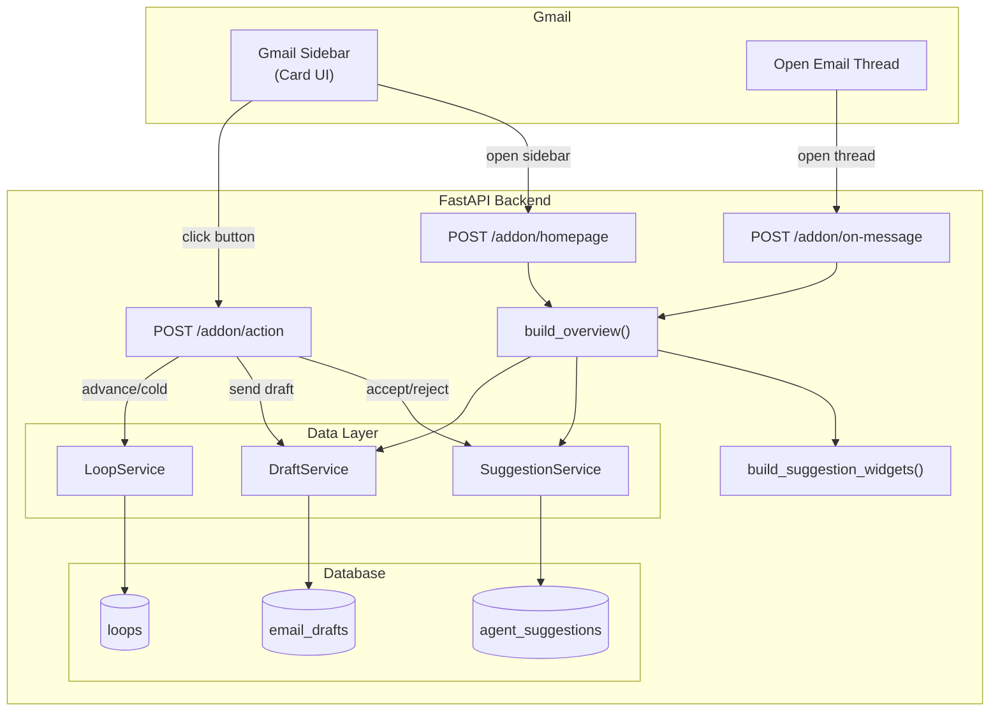
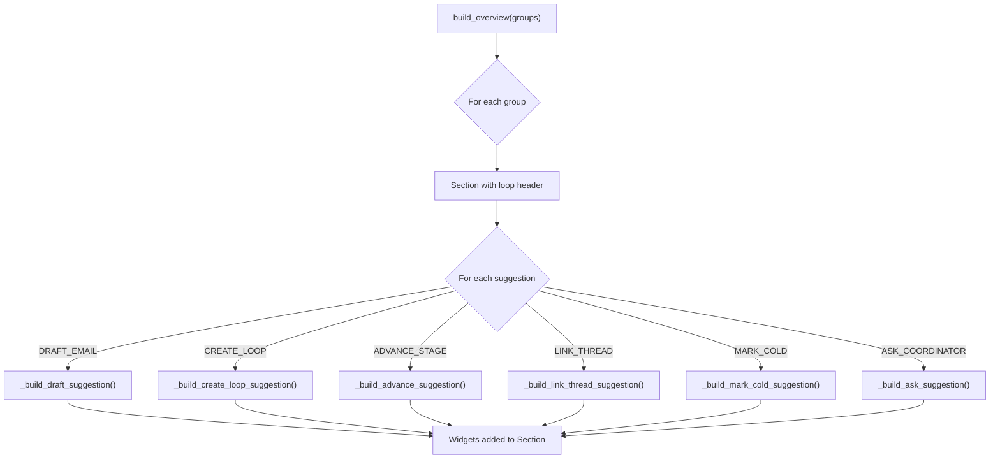
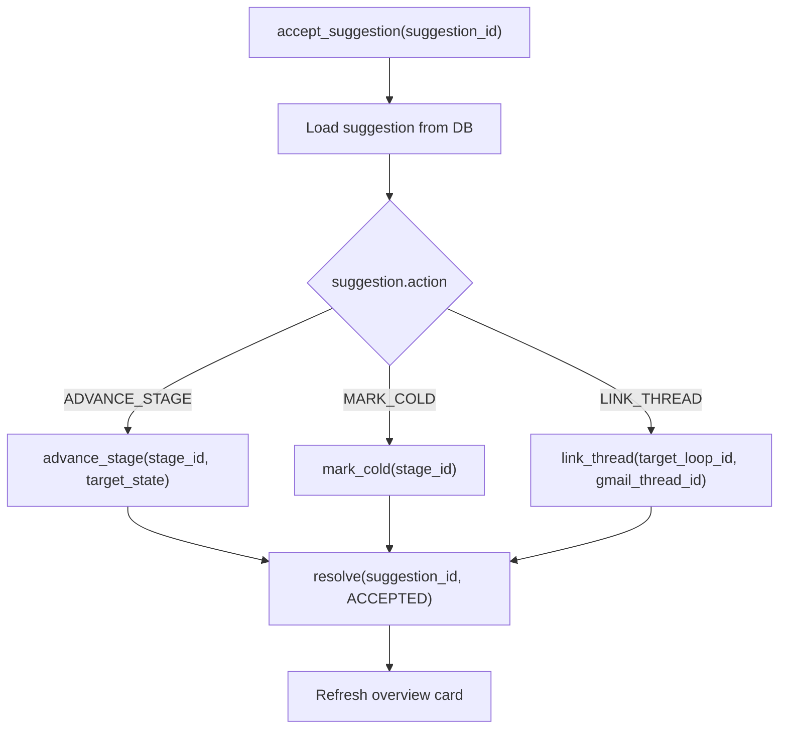
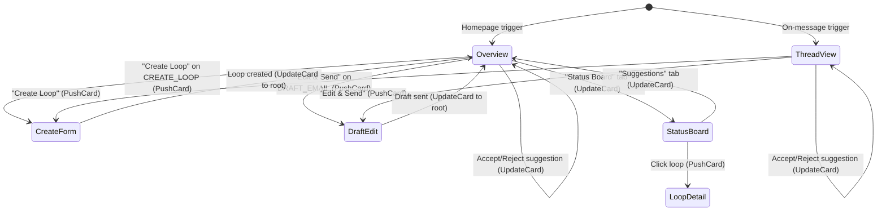
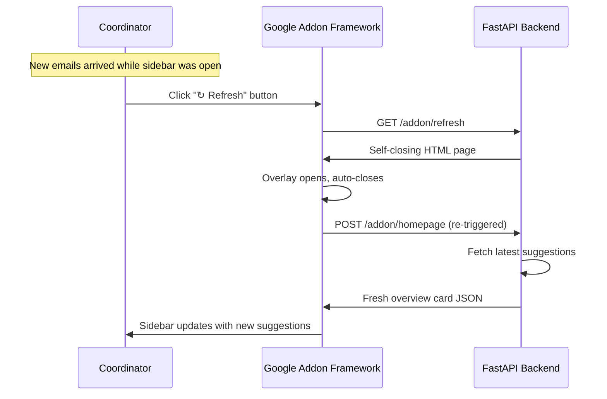

# RFC: Sidebar UI for Agent Suggestions

| Field          | Value                                      |
|----------------|--------------------------------------------|
| **Author(s)**  | Kinematic Labs                             |
| **Status**     | Draft                                      |
| **Created**    | 2026-04-16                                 |
| **Updated**    | 2026-04-16                                 |
| **Reviewers**  | LRP Engineering, LRP Coordinator team      |
| **Decider**    | Nadav Sadeh                                |
| **Issue**      | #21                                        |

## Context and Scope

The backend agent pipeline is functionally complete: the classifier processes incoming emails, generates structured suggestions (`agent_suggestions` table), and when appropriate triggers AI draft generation (`email_drafts` table). But the Gmail sidebar UI was built for a manual workflow — it shows loops grouped by stage state, with hard-coded action buttons tied to loop states rather than AI suggestions. The coordinator's experience today is: open sidebar, see a status board, manually decide what to do next. The agent's intelligence doesn't reach the UI.

This RFC proposes a complete rewrite of the sidebar homepage and contextual (thread-open) views. The new UI is **suggestion-centric**: it shows the agent's pending suggestions grouped by their parent scheduling loop, each with a custom UI for its action type and a one-click accept path. The design target is the "tab key" UX: open sidebar, approve, approve, approve, done.

## Goals

- **G1: Suggestions are the primary unit of UI.** The homepage and thread views show pending AI suggestions, not loop status. Each suggestion has a type-appropriate card (email draft, create loop, advance stage, etc.) with a single-click accept button.
- **G2: Suggestions are organized by loop.** Suggestions that belong to the same loop appear in a single visual group with the loop title as header. Loop-less suggestions (e.g., CREATE_LOOP) appear in a standalone section.
- **G3: One-click accept for all action types.** Every suggestion can be accepted with a single button press. For DRAFT_EMAIL, this means "Send" (with the draft body visible and editable inline). For ADVANCE_STAGE, this means "Accept." For CREATE_LOOP, this means "Create" (opening a pre-filled form).
- **G4: Thread view shows only thread-relevant suggestions.** When a coordinator opens a Gmail thread, the sidebar filters to suggestions associated with that thread's `gmail_thread_id`.
- **G5: Dismiss path for every suggestion.** Every suggestion has a "Dismiss" button that resolves it as REJECTED and removes it from the UI.

## Non-Goals

- **Loop status board** — the existing Status Board tab is not being redesigned in this RFC. It remains accessible as a secondary view. *Rationale:* the PRD explicitly excludes the loop status view. The status board serves a monitoring function ("where are my loops?") that is orthogonal to the action queue ("what should I do next?").
- **ASK_COORDINATOR backend** — the UI for ASK_COORDINATOR suggestions will be rendered (question display + text input), but the backend handler for storing and acting on coordinator responses is out of scope. *Rationale:* the classifier doesn't reliably produce ASK_COORDINATOR yet. We'll build the response pipeline when it does. The UI renders now so we can test the visual design.
- **Draft regeneration** — there is no "Regenerate" button on email drafts. The coordinator edits the draft manually or discards it. *Rationale:* regeneration requires a round-trip to the LLM and a diff UI. This can be added later if coordinators request it.
- **True server-push updates** — we are not implementing WebSocket/SSE-style push from the backend to the sidebar. *Rationale:* the Card API has no push mechanism. We implement a polling workaround instead (see "Auto-Refresh via OpenLink Overlay Polling" in Detailed Design).
- **Marketplace publishing** — this remains a developer test deployment. *Rationale:* same as the original addon RFC — premature before coordinator feedback.

## Background

### Current UI Architecture

The sidebar is an HTTP-based Google Workspace Add-on. Google POSTs to our FastAPI backend, we return card JSON, Google renders it. Three endpoints serve the sidebar:

| Endpoint | Trigger | Current Behavior |
|----------|---------|-----------------|
| `POST /addon/homepage` | User opens Gmail / clicks add-on icon | Shows `build_drafts_tab(board)` — loops grouped by urgency, with hard-coded stage-based action buttons |
| `POST /addon/on-message` | User opens a Gmail thread | If thread is linked to a loop: shows `build_loop_detail(loop)`. If unlinked: shows "Create New Loop" prompt |
| `POST /addon/action` | User clicks any button | Dispatches to one of 20+ handlers in `_ACTION_HANDLERS` dict |

### Card API Constraints

The Google Workspace Add-on Card API (v1) is a server-rendered, single-column widget system. Every user interaction triggers an HTTP round-trip to our backend. There is no client-side JavaScript, no CSS, no hover events, and no dynamic show/hide.

Key constraints relevant to this design:

1. **No hover cards or tooltips.** We use collapsible sections (`Section.collapsible=True` with `uncollapsibleWidgetsCount=0`) as the closest alternative.
2. **No nested cards.** Suggestions "inside" a loop are achieved by rendering multiple widgets within one Section (loop = section header, suggestions = widgets).
3. **No onChange handlers.** Form values (text inputs, selections) are only transmitted when the user clicks a button. No real-time validation.
4. **No server-push updates.** The sidebar has no WebSocket/SSE channel. However, the `OpenLink` widget supports `onClose: "RELOAD"` which re-fires the add-on's trigger (homepage or contextual) when an opened overlay closes. This is our auto-refresh mechanism (see below).
5. **Navigation stack.** `PushCard` pushes onto a back-navigable stack; `UpdateCard` replaces in-place. Initial triggers (homepage, on-message) must use `PushCard`.
6. **~3 button limit per row.** `ButtonList` renders horizontally; more than 3 buttons truncate on the narrow sidebar.
7. **No client-side JS in card-based add-ons.** Apps Script HTML sidebars support `setInterval` and `google.script.run` for client-server communication, but this is only available for Editor add-ons (Docs/Sheets/Slides). Workspace add-ons (Gmail, Calendar) use the card framework exclusively — no custom HTML, no client-side JS, no `UrlFetchApp` from the card context. The HTTP runtime (our FastAPI backend) has no Apps Script bridge.

### Suggestion Data Model

The classifier produces `Suggestion` rows in `agent_suggestions`:

```
id, coordinator_email, gmail_message_id, gmail_thread_id,
loop_id, stage_id, classification, action, confidence, summary,
target_state, extracted_entities, questions, action_data,
reasoning, status, created_at
```

Key fields for the UI:
- `action` — one of: `advance_stage`, `create_loop`, `link_thread`, `draft_email`, `mark_cold`, `ask_coordinator`, `no_action`
- `loop_id` — FK to `loops` table. NULL for CREATE_LOOP and some LINK_THREAD suggestions.
- `summary` — human-readable one-liner (e.g., "Share Claire's availability with the client")
- `extracted_entities` — JSON with availability slots, phone numbers, zoom links, contact info
- `action_data` — typed per action (e.g., `DraftEmailData` for DRAFT_EMAIL with `directive` and `recipient_type`)
- `reasoning` — LLM's reasoning chain for the suggestion
- `status` — `pending` | `accepted` | `rejected` | `expired` | `auto_applied` | `superseded`

For DRAFT_EMAIL suggestions, there is an associated `EmailDraft` row in `email_drafts`:

```
id, suggestion_id, loop_id, stage_id, coordinator_email,
to_emails, cc_emails, subject, body, gmail_thread_id,
status, created_at
```

## Proposed Design

### Overview

The new sidebar replaces the loop-centric homepage with a suggestion-centric action queue. On open, the backend fetches all pending suggestions for the coordinator, pairs each DRAFT_EMAIL suggestion with its `EmailDraft`, groups by `loop_id`, and renders a card where each loop is a Section containing its suggestion widgets. The coordinator scrolls through, clicking "Send," "Accept," or "Create" on each suggestion. After each action, the card refreshes with the remaining suggestions.

The thread view uses the same rendering logic but filters to suggestions matching the current thread's `gmail_thread_id`. Loop-less suggestions (CREATE_LOOP, LINK_THREAD) that reference the thread appear at the top.

### System Context Diagram



### Detailed Design

#### Data Layer: Overview Query

The current data access pattern is fragmented: `SuggestionService.get_pending_for_coordinator` returns flat suggestions, `DraftService.get_pending_drafts` returns flat drafts, and `LoopService.get_status_board` returns loop summaries with no suggestion data. The new UI needs all three joined.

**New SQL query: `get_pending_suggestions_with_context`**

```sql
SELECT
    s.id, s.coordinator_email, s.gmail_message_id, s.gmail_thread_id,
    s.loop_id, s.stage_id, s.classification, s.action, s.confidence,
    s.summary, s.target_state, s.extracted_entities, s.questions,
    s.action_data, s.reasoning, s.status, s.created_at,
    -- Loop context (nullable for CREATE_LOOP)
    l.title AS loop_title,
    cand.name AS candidate_name,
    cc.company AS client_company,
    -- Draft context (nullable for non-DRAFT_EMAIL)
    d.id AS draft_id, d.to_emails, d.cc_emails,
    d.subject AS draft_subject, d.body AS draft_body,
    d.status AS draft_status
FROM agent_suggestions s
LEFT JOIN loops l ON s.loop_id = l.id
LEFT JOIN candidates cand ON l.candidate_id = cand.id
LEFT JOIN client_contacts cc ON l.client_contact_id = cc.id
LEFT JOIN email_drafts d ON d.suggestion_id = s.id
    AND d.status IN ('generated', 'edited')
WHERE s.coordinator_email = :coordinator_email
    AND s.status = 'pending'
    AND s.action != 'no_action'
ORDER BY s.created_at ASC;
```

This single query returns everything the overview card needs. No N+1. The LEFT JOINs handle CREATE_LOOP (no loop) and non-draft suggestions (no draft) gracefully.

**New model: `SuggestionView`**

```python
class SuggestionView(BaseModel):
    """Denormalized suggestion for UI rendering — one row per pending suggestion."""
    suggestion: Suggestion
    loop_title: str | None = None
    candidate_name: str | None = None
    client_company: str | None = None
    draft: EmailDraft | None = None
```

**New model: `LoopSuggestionGroup`**

```python
class LoopSuggestionGroup(BaseModel):
    """A group of suggestions sharing the same loop, for rendering as one Section."""
    loop_id: str | None = None
    loop_title: str | None = None
    candidate_name: str | None = None
    client_company: str | None = None
    suggestions: list[SuggestionView]
    oldest_created_at: datetime  # For sort ordering
```

**Grouping logic** (in Python, not SQL):

```python
def group_by_loop(views: list[SuggestionView]) -> list[LoopSuggestionGroup]:
    groups: dict[str | None, LoopSuggestionGroup] = {}
    for v in views:
        key = v.suggestion.loop_id
        if key not in groups:
            groups[key] = LoopSuggestionGroup(
                loop_id=key,
                loop_title=v.loop_title,
                candidate_name=v.candidate_name,
                client_company=v.client_company,
                suggestions=[],
                oldest_created_at=v.suggestion.created_at,
            )
        groups[key].suggestions.append(v)
    return sorted(groups.values(), key=lambda g: g.oldest_created_at)
```

The same query with a `WHERE s.gmail_thread_id = :gmail_thread_id` filter powers the thread view.

#### Card Builder: Overview

**`build_overview(groups: list[LoopSuggestionGroup]) -> CardResponse`**

The overview renders one `Section` per loop group. Within each section, suggestions are rendered by a dispatcher that calls the appropriate per-type builder.



**Section header format:** `"{candidate_name}, {client_company}"` for groups with a loop. No header for standalone suggestions (CREATE_LOOP, unlinked LINK_THREAD). If `loop_title` exists, use it directly (it's already in this format).

**Empty state:** When no pending suggestions exist, show `"All caught up — no actions needed."` with a button to the Status Board tab.

#### Per-Action-Type Card Widgets

Each builder returns a `list[Widget]` that gets appended to the section. All builders also include a "Dismiss" button that calls `reject_suggestion(suggestion_id=...)`.

**1. DRAFT_EMAIL — inline editable draft**

```
┌─────────────────────────────────┐
│ ✉ Share availability with ACME  │  ← summary (TextParagraph, bold)
│ To: haley@acmecorp.com          │  ← DecoratedText (topLabel="To")
│ CC: bob@acmecorp.com            │  ← DecoratedText (topLabel="CC"), if cc_emails
│ Subject: Re: Jane Doe, ACME     │  ← DecoratedText (topLabel="Subject")
│ ─────────────────────────────── │  ← Divider
│ ┌─────────────────────────────┐ │
│ │ Hi Haley,                   │ │  ← TextInput (MULTIPLE_LINE, pre-filled)
│ │ Claire is available (ET)... │ │
│ └─────────────────────────────┘ │
│  [Send]  [Edit & Send]  [✕]    │  ← ButtonList
└─────────────────────────────────┘
```

- "Send" calls `send_draft(draft_id=...)` with `required_widgets=["draft_body_{sug_id}"]` to capture any inline edits
- "Edit & Send" pushes to the full `build_draft_edit` view (existing card)
- "✕" calls `reject_suggestion(suggestion_id=...)` which also discards the draft

**Trade-off: inline body vs. click-to-expand.** Showing the draft body inline makes the overview card longer but eliminates a click. Since the PRD explicitly targets one-click accept, inline wins. Coordinators who want to read but not act can scroll past.

**Widget name collision:** Multiple DRAFT_EMAIL suggestions may appear on the same card. Each TextInput must have a unique `name` — we use `draft_body_{suggestion_id}`.

**2. ADVANCE_STAGE — cardless one-liner**

```
┌─────────────────────────────────┐
│ ↑ Advance to Awaiting Client    │  ← DecoratedText (summary)
│  [Accept]  [✕]                  │  ← ButtonList
└─────────────────────────────────┘
```

- "Accept" calls `accept_suggestion(suggestion_id=...)` which internally calls `advance_stage(stage_id, target_state)` and resolves the suggestion
- Minimal vertical footprint — one DecoratedText + one ButtonList

**3. CREATE_LOOP — extracted entities + create button**

```
┌─────────────────────────────────┐
│ + New loop detected             │  ← TextParagraph (bold)
│ Candidate: Claire Thompson      │  ← DecoratedText
│ Client: Haley @ ACME Corp       │  ← DecoratedText
│ Recruiter: Bob Smith            │  ← DecoratedText
│ ─── More details ─────────── ▼ │  ← Collapsible section
│ │ CM: Jane Doe                │ │     (uncollapsibleWidgetsCount=0)
│ └─────────────────────────────┘ │
│  [Create Loop]  [✕]            │  ← ButtonList
└─────────────────────────────────┘
```

- "Create Loop" pushes `build_create_loop_form` pre-filled with `extracted_entities` values AND passes `suggestion_id` so that `_handle_create_loop` can resolve the suggestion after creation
- "More details" uses a collapsible sub-section for client manager and any other optional extracted entities

**Data requirement:** The classifier must populate `extracted_entities` with keys: `candidate_name`, `client_name`, `client_email`, `client_company`, `recruiter_name`, `recruiter_email`, and optionally `client_manager_name`, `client_manager_email`. This is already the expected contract per the classifier prompt.

**4. LINK_THREAD — target loop + reasoning**

```
┌─────────────────────────────────┐
│ 🔗 Link to: Jane Doe, ACME     │  ← DecoratedText (loop title)
│  ─── Why? ─────────────────  ▼ │  ← Collapsible section
│  │ Thread mentions ACME and  │ │     for reasoning
│  │ candidate availability... │ │
│  └───────────────────────────┘ │
│  [Link]  [✕]                   │  ← ButtonList
└─────────────────────────────────┘
```

- "Link" calls `accept_suggestion(suggestion_id=...)` which internally calls `link_thread(target_loop_id, gmail_thread_id)` and resolves the suggestion
- Reasoning is in a collapsible section (starts collapsed) — the alternative to the impossible hover card

**5. MARK_COLD — reasoning + one-click**

```
┌─────────────────────────────────┐
│ ❄ Mark as cold                  │  ← DecoratedText (summary)
│  ─── Why? ─────────────────  ▼ │  ← Collapsible reasoning
│  │ No response in 5 days...  │ │
│  └───────────────────────────┘ │
│  [Mark Cold]  [✕]              │  ← ButtonList
└─────────────────────────────────┘
```

- "Mark Cold" calls `accept_suggestion(suggestion_id=...)` which internally calls `mark_cold(stage_id)` and resolves the suggestion
- Identical structure to LINK_THREAD

**6. ASK_COORDINATOR — question + disabled response**

```
┌─────────────────────────────────┐
│ ❓ Agent needs clarification    │  ← TextParagraph (bold)
│ "Should we propose morning or   │  ← TextParagraph (question text)
│  afternoon slots for this       │
│  candidate?"                    │
│ ┌─────────────────────────────┐ │
│ │ Your response...            │ │  ← TextInput (MULTIPLE_LINE)
│ └─────────────────────────────┘ │
│  [Respond (coming soon)]  [✕]  │  ← Button (disabled) + Dismiss
└─────────────────────────────────┘
```

- "Respond" button is rendered but `disabled=True`. The backend handler for processing coordinator responses is out of scope per Non-Goals.
- "✕" dismiss works normally — resolves as REJECTED.

#### Action Handler: `accept_suggestion`

A new generic handler that reads the suggestion, performs the appropriate action, resolves the suggestion, and returns the refreshed overview.



For DRAFT_EMAIL, the existing `send_draft` / `discard_draft` handlers already resolve the parent suggestion — no changes needed.

For CREATE_LOOP, the existing `create_loop` handler needs a small modification: accept an optional `suggestion_id` parameter and resolve it on success.

#### Action Handler: `reject_suggestion`

A simple handler that resolves the suggestion as REJECTED and returns the refreshed overview.

```python
async def _handle_reject_suggestion(body, svc, email, **kwargs):
    suggestion_id = _get_param(body, "suggestion_id")
    suggestion_svc = SuggestionService(db_pool=svc._pool)
    suggestion = await suggestion_svc.get_suggestion(suggestion_id)

    # If the suggestion has a draft, discard it too
    if suggestion and suggestion.action == SuggestedAction.DRAFT_EMAIL:
        draft_svc = _get_draft_service(kwargs.get("request"))
        if draft_svc:
            draft = await draft_svc.get_draft_for_suggestion(suggestion_id)
            if draft:
                await draft_svc.mark_discarded(draft.id)

    await suggestion_svc.resolve(suggestion_id, SuggestionStatus.REJECTED, email)
    # Refresh overview
    return await _build_refreshed_overview(svc, email, kwargs.get("request"))
```

#### Navigation Model



**Key decisions:**
- Accept/reject refreshes in-place (UpdateCard) — no navigation, no jarring transitions
- Complex forms (create loop, edit draft) push onto the stack — back button returns to overview
- After completing a pushed action (creating a loop, sending an edited draft), we update the root card to the refreshed overview

**Tab switching:** The tab buttons change from "Drafts / Status Board" to "Suggestions / Status Board." The "Suggestions" tab is the new default.

#### Thread View Filtering

The thread view uses the same `build_overview` card builder but with filtered data:

```python
async def _build_thread_overview(svc, email, gmail_thread_id, request):
    """Build overview filtered to suggestions for a specific thread."""
    views = await overview_svc.get_suggestions_for_thread(gmail_thread_id, email)
    groups = group_by_loop(views)
    return build_overview(groups)
```

**Edge case: thread with no pending suggestions.** If the thread is linked to a loop but has no pending suggestions, show a lightweight loop summary with a "View Loop" button (pushes to `build_loop_detail`). If the thread is unlinked and has no suggestions, show the existing "Create New Loop" prompt (`build_contextual_unlinked`).

**Edge case: thread linked to multiple loops.** The suggestion data already carries `loop_id`, so multiple loops render as separate sections naturally. No special handling needed.

#### Auto-Refresh via OpenLink Overlay Polling

The sidebar has no server-push channel, but the agent processes emails in real-time and creates suggestions asynchronously. Without auto-refresh, a coordinator who leaves the sidebar open while emails arrive would see stale data until they click something. This defeats the "open sidebar, approve everything" UX.

**Mechanism: `OpenLink` with `onClose: "RELOAD"`**

The Card API supports an `OpenLink` widget that opens a URL in an overlay window. When the overlay closes, if `onClose` is set to `"RELOAD"`, Google re-fires the add-on's trigger function (homepage or contextual), which causes our backend to serve a fresh card with the latest suggestions.

We exploit this by building a lightweight **refresh endpoint** that our backend serves as a self-closing HTML page:

```
GET /addon/refresh → returns minimal HTML:
  <html><body>
    <script>setTimeout(() => window.close(), 100);</script>
    Refreshing...
  </body></html>
```

The sidebar includes a "Refresh" button implemented as:

```python
Button(
    text="↻ Refresh",
    on_click=OnClick(
        open_link=OpenLink(
            url=f"{base_url}/addon/refresh",
            open_as="OVERLAY",
            on_close="RELOAD",
        )
    ),
)
```

**Flow:**
1. Coordinator clicks "↻ Refresh"
2. Google opens `/addon/refresh` in a small overlay
3. The HTML page auto-closes via `setTimeout`
4. Google detects the overlay closed and re-fires the homepage/contextual trigger
5. Our backend returns a fresh overview card with any new suggestions



**Trade-offs:**
- **Visual flicker:** The overlay briefly appears (~100ms) before auto-closing. This is a known UX cost. The overlay is small and fast enough that it reads as a loading indicator rather than a distraction.
- **Not truly automatic:** The coordinator must click "Refresh." We cannot implement a `setInterval`-style auto-poll because the card framework has no client-side JS execution for Workspace add-ons (only Editor add-ons support HTML sidebars with JS). This is an SDK limitation with no workaround.
- **COOP header caveat:** The refresh endpoint must NOT set the `Cross-Origin-Opener-Policy` header, or Google won't detect the window closure. FastAPI doesn't set COOP by default, so this should work out of the box.

**Future improvement:** If coordinators report that manual refresh is too much friction, we can explore a second mechanism: including a timestamp or suggestion count in the card, so coordinators can see at a glance whether the data might be stale (e.g., "Last refreshed: 2 min ago · 3 pending"). This at least tells them *when* to click refresh.

**Why not Apps Script with `setInterval`?** Apps Script HTML sidebars support `setInterval` + `google.script.run` for client-server polling — but this is only available for **Editor add-ons** (Docs, Sheets, Slides). Gmail Workspace add-ons use the card framework exclusively. There is no hybrid: an HTTP-based add-on cannot access Apps Script services, and a card-based Gmail add-on cannot render custom HTML sidebars. The OpenLink overlay approach is the only available mechanism within the Gmail card framework.

### Data Storage

No new tables. The design uses the existing `agent_suggestions` and `email_drafts` tables. Changes:

1. **New SQL query** in `queries/suggestions.sql`: `get_pending_suggestions_with_context` (the JOIN query described above).
2. **New SQL query** in `queries/suggestions.sql`: `get_pending_suggestions_for_thread_with_context` — same query with `AND s.gmail_thread_id = :gmail_thread_id`.
3. **Minor schema addition** to `_handle_create_loop`: reads optional `suggestion_id` from action parameters to resolve the suggestion after loop creation.
4. **Extend `OpenLink` model** in `addon/models.py`: add `open_as: str | None` (values: `"FULL_SIZE"`, `"OVERLAY"`) and `on_close: str | None` (values: `"NOTHING"`, `"RELOAD"`) fields to support the auto-refresh mechanism. These are existing Card API fields we haven't modeled yet.
5. **New endpoint** `GET /addon/refresh`: returns a self-closing HTML page for the overlay-based refresh mechanism. No auth required (it's a static page).

### Key Trade-offs

**Inline draft body vs. click-to-expand.** Showing the full draft body inline on the overview makes the card long when multiple drafts are pending. We chose inline because: (a) the PRD targets one-click accept — an expand step adds a click; (b) the sidebar is scrollable; (c) coordinators want to visually verify the draft before sending, so hiding it defeats the purpose. If coordinators report the overview feels too long, we can switch to a collapsed preview (first line of body + "Expand" button) in a follow-up.

**Generic `accept_suggestion` vs. per-type handlers.** A single `accept_suggestion` handler that dispatches internally is simpler than adding `accept_advance_stage`, `accept_link_thread`, `accept_mark_cold` as separate entries in `_ACTION_HANDLERS`. The trade-off: a generic handler has more branching logic internally. We chose generic because: (a) it keeps the action handler count manageable; (b) the dispatch logic is a simple match on `suggestion.action`; (c) the dismiss action (`reject_suggestion`) is identical across all types.

**Single JOIN query vs. multiple service calls.** The overview query JOINs across 4 tables (suggestions, loops, candidates, client_contacts, email_drafts). An alternative is to fetch suggestions first, collect unique `loop_id`s, then batch-fetch loop metadata. We chose the JOIN because: (a) it's one round-trip; (b) the data is read-only for rendering; (c) the denormalized result maps cleanly to our `SuggestionView` model. The trade-off is coupling the UI query to the schema — if we rename columns, this query breaks. We accept this because the query lives in a dedicated `.sql` file alongside the other suggestion queries.

## Alternatives Considered

### Alternative 1: Apps Script Frontend with Client-Side Polling

Build the sidebar UI in Apps Script instead of the HTTP backend. Apps Script supports `UrlFetchApp` for HTTP requests (server-side) and, for Editor add-ons (Docs/Sheets/Slides), HTML sidebars with `setInterval` + `google.script.run` for client-server polling. The appeal: an Apps Script sidebar could theoretically poll our backend for new suggestions and re-render the card automatically.

**Trade-offs:** The polling capability is real — but only for Editor add-ons. Gmail Workspace add-ons use the card framework, not HTML sidebars. An Apps Script Gmail add-on uses `CardService` which has the same constraints as our HTTP card approach: no client-side JS, no `setInterval`, no HTML. `UrlFetchApp` is available server-side (in trigger functions and action callbacks), but it can't run on a timer in the card context — it can only run when the user clicks something.

Beyond the auto-refresh question: (a) all business logic must be duplicated in JavaScript; (b) no access to our database, LLM service, or Python libraries; (c) every RFC, tool, and convention in this project is built around the FastAPI backend pattern; (d) Apps Script has a 6-minute execution limit and no async/await.

**Why not:** Apps Script doesn't actually solve the auto-refresh problem for Gmail add-ons. And even if it did, the architecture cost is too high — we'd need to maintain two backend languages, duplicate data access, and lose our LangFuse observability chain. The `OpenLink.onClose.RELOAD` approach in the proposed design achieves manual refresh without leaving the HTTP backend architecture.

### Alternative 2: Separate "Suggestions" Endpoint (Not Reusing Overview)

Instead of rewriting the homepage, add a new `/addon/suggestions` endpoint that returns a dedicated suggestions card. The homepage continues to show the existing drafts tab, and the suggestions view is reached via a button or tab.

**Trade-offs:** Lower blast radius — existing views are untouched. But: (a) it violates the PRD's core requirement that suggestions are the primary view on sidebar open; (b) coordinators would need to click into the suggestions view before they can act, adding a step to every interaction; (c) maintaining two parallel views (legacy drafts tab + new suggestions tab) adds long-term complexity.

**Why not:** The PRD is clear: the overview IS the suggestions view. The existing drafts tab and status board were built for a manual workflow that the agent replaces. A separate endpoint is a half-measure that preserves a UI nobody wants.

### Alternative 3: Thin Suggestion Cards with Click-to-Expand

Instead of showing full suggestion details inline (especially draft bodies), show a one-line summary per suggestion with a click action that pushes a detail card.

**Trade-offs:** The overview is compact and scannable — more suggestions fit on screen. But: (a) every suggestion requires at least two clicks (expand + accept) instead of one; (b) the coordinator can't visually verify draft content before acting; (c) the PRD explicitly says "each suggestion has a single-click path to accept."

**Why not:** This is a reasonable alternative if the inline approach proves too long in practice. We're starting with inline (matching the PRD) and can fall back to click-to-expand if coordinators report the overview is overwhelming. The per-type builders are structured as `list[Widget]` returns, making this switch localized to the dispatcher — not a rewrite.

### Do Nothing / Status Quo

Keep the current drafts tab and status board. Coordinators use the status board to see loop states, manually decide what to do, and use the inline action buttons (Forward to Recruiter, Mark Scheduled, etc.) to act.

**What happens:** The classifier generates suggestions that nobody sees. AI drafts pile up in the database. The agent's intelligence is wasted. Coordinators continue doing the same manual work they did before the agent existed.

**Why not:** The entire agent pipeline — classifier, drafter, suggestion persistence — was built to power this UI. Without it, those components have no value. The scheduling agent is a product that only works if the UI surfaces the agent's output.

## Success and Failure Criteria

### Definition of Success

| Criterion | Metric | Target | Measurement Method |
|-----------|--------|--------|--------------------|
| Suggestion acceptance rate | % of pending suggestions accepted (not dismissed or expired) | > 60% within 2 weeks of launch | Query `agent_suggestions` for status distribution |
| One-click accept rate | % of accepted suggestions resolved with a single button press (no edit, no push navigation) | > 50% | Log `accept_suggestion` vs `send_draft` (edited) calls on LangFuse |
| Overview load time | p95 time from POST to card response | < 800ms | LangFuse span on `/addon/homepage` |
| Coordinator task time | Mean time from sidebar open to all suggestions processed | < 60 seconds for 5 or fewer pending suggestions | Measure via timestamp delta between homepage call and last accept/reject in session |
| Suggestion dismissal without replacement | % of dismissed suggestions where coordinator takes a manual action instead | < 20% | Manual review of dismiss events + subsequent manual actions |

### Definition of Failure

- **Suggestion acceptance rate below 30% after 4 weeks.** This means the agent is suggesting the wrong things and coordinators are ignoring it. Root cause investigation into classifier quality, not UI iteration.
- **p95 overview load time exceeds 2 seconds.** The JOIN query or card rendering is too slow. The sidebar feels sluggish and coordinators stop using it.
- **Coordinators revert to manual email composition for > 50% of emails.** The draft-inline UI is not trusted. Either draft quality is poor or the edit/send flow is too friction-heavy.

### Evaluation Timeline

- **T+1 week:** Check overview load time (p95) and error rates. Fix any rendering bugs or action handler failures. Interview 1-2 coordinators on first impressions.
- **T+2 weeks:** Measure suggestion acceptance rate and one-click accept rate. If acceptance is below 40%, investigate whether the problem is UI (hard to use) or classifier (bad suggestions).
- **T+1 month:** Full evaluation against all success criteria. Decide whether to iterate on the inline approach or switch to click-to-expand.

## Observability and Monitoring Plan

### Metrics

| Metric | Source | Dashboard | Threshold for Alert |
|--------|--------|-----------|-------------------|
| Overview load time (p95) | LangFuse span on `build_overview` | Addon Performance | > 2s for 5 min |
| Action handler error rate | Sentry + LangFuse | Addon Errors | > 5% of action calls |
| Suggestion accept/reject rate | `agent_suggestions` table query | Agent Effectiveness | Acceptance < 30% (weekly check) |
| One-click accept rate | LangFuse action type logging | Agent UX | N/A (tracked, no alert) |
| Pending suggestion age | `agent_suggestions.created_at` for status=pending | Suggestion Freshness | Suggestions pending > 48 hours |

### Logging

- Every `accept_suggestion` and `reject_suggestion` call logs: `suggestion_id`, `action` type, `coordinator_email`, `time_since_creation`.
- Every overview render logs: `coordinator_email`, `suggestion_count`, `group_count`, `render_time_ms`.
- Draft sends log: `draft_id`, `was_edited` (boolean), `edit_delta_chars` (how much the body changed).
- Log level: INFO for all action handler calls. WARNING for stale suggestion access (already resolved/expired when acted upon).

### Alerting

- **p95 latency > 2s for 5 minutes** → alert to on-call via Sentry. Likely cause: slow JOIN query or large suggestion count.
- **Action handler error rate > 5%** → alert to on-call. Likely cause: stale suggestions, missing drafts, or DB connection issues.
- No alerting on acceptance rates — these are business metrics reviewed weekly, not operational alerts.

### Dashboards

- **Addon Performance** (engineering): Load times, error rates, action handler distribution.
- **Agent Effectiveness** (product): Acceptance rates, dismissal rates, one-click vs. edited sends, suggestion age distribution. Audience: product team + engineering.

## Cross-Cutting Concerns

### Security

No new attack surfaces. The suggestion data is already stored in our database and accessed via the same authenticated add-on endpoints. The `accept_suggestion` handler validates that the suggestion belongs to the requesting coordinator (via `coordinator_email` match) before acting. The existing `verify_google_addon_token` dependency continues to authenticate all add-on requests.

### Privacy

Suggestion data contains email addresses, names, and scheduling context (availability, phone numbers, Zoom links) — all existing PII categories that the system already handles. The new UI renders this data in the sidebar but doesn't introduce new PII storage or transmission paths. The sidebar runs within Gmail's security context; card JSON is transmitted over HTTPS between Google's servers and our backend.

### Rollout and Rollback

**Rollout:** The new overview replaces the existing homepage card builder. Since the add-on is a developer test deployment with 2-3 coordinators, this is a direct replacement — no feature flag needed.

**Rollback:** If the new UI has critical bugs, swap `build_overview` back to `build_drafts_tab` in the homepage and on-message handlers. The old card builders are not deleted; they're just no longer called from the entry points. This is a one-line change in `addon_homepage` and `addon_on_message`.

**Data safety:** The new UI is purely a rendering change. No data is written differently. The same `agent_suggestions` and `email_drafts` tables are used with the same status transitions. Rollback doesn't lose data.

## Open Questions

1. **Should "Edit & Send" on DRAFT_EMAIL push to the existing `build_draft_edit` card, or should we inline the edit experience?** Inline means the TextInput is always editable on the overview (current proposal). Push-to-edit means the overview shows a read-only preview, and "Edit" navigates to a dedicated edit view. The PRD suggests inline. — *Coordinator feedback needed after first prototype.*

2. **How should we handle stale suggestions?** If a suggestion is PENDING but the underlying state has changed (e.g., stage was manually advanced), the suggestion is stale. Options: (a) show it with a "stale" warning; (b) auto-expire on render if the action is no longer valid; (c) ignore and let the action handler fail gracefully. — *Engineering decision, propose (b) during implementation.*

3. **Should clicking a loop header in the overview do anything?** Options: (a) no-op — it's just a section title; (b) push to loop detail view; (c) open the thread in a new Gmail tab via OpenLink. The PRD says "clicking on a loop opens the related thread" — we resolved this as OpenLink to Gmail URL. But the loop header is a Section header, and Section headers in the Card API are not clickable. We would need a separate clickable widget. — *Propose adding a small "Open in Gmail" link button per group if the loop has a linked thread.*

4. **Is the OpenLink overlay refresh flicker acceptable?** The auto-refresh mechanism opens a self-closing overlay that briefly flickers (~100ms). If coordinators find this jarring, we may need to add a "Last refreshed: X min ago" timestamp instead and rely on natural interaction (clicking any button) to refresh. — *Coordinator feedback needed after first prototype.*

5. **Should the refresh button be always-visible or in a collapsed header?** It needs to be accessible without scrolling, but it also shouldn't compete with suggestion action buttons. Options: (a) fixed in the tab bar section alongside "Suggestions / Status Board"; (b) in the card header subtitle area; (c) as a floating-style button at the bottom. — *UI decision during implementation.*

## Milestones and Timeline

| Phase | Description | Estimated Duration |
|-------|-------------|--------------------|
| Phase 1: Data layer | New SQL query, `SuggestionView` / `LoopSuggestionGroup` models, `get_overview_data` service method | 1 day |
| Phase 2: Card builders | `build_overview`, per-type suggestion widget builders, thread view variant | 2 days |
| Phase 3: Action handlers | `accept_suggestion`, `reject_suggestion`, wire up homepage/on-message, modify `create_loop` for suggestion_id, `GET /addon/refresh` endpoint | 1 day |
| Phase 4: Polish + testing | Collapsible reasoning, empty states, stale suggestion handling, sort order, refresh button placement, manual QA with test suggestions | 1 day |
